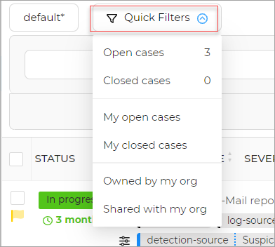

# Manage Views

In this section, you can find information about managing views.  

To manage views: 

1. Click on the default button. 
1. Click on the **Manage Views** from the list. 

A new page opens. It has the **Name of the view** and the corresponding **Actions**. 

1. Click the **...**. 
1. Select the action. e.g. Delete

## Manage Tasks

There are various option available for the user to apply on the tasks. 

### Quick Filters

To apply Quick filter:

1. Click the **quick filter** option. 
2. The list displays options to select from. 

### Auto refresh

The auto-refresh option allows the user to automatically refresh a page. 

To perform Auto refresh:

1. On the page, in the tab, switch on the Auto refresh button. 

### Show tasks as groups

To view tasks as groups: 

1. On the tasks list page, switch on the **tasks as groups** toggle button, the task groups will be displayed. 

### Filters

To apply filter:

1. On the page, in the tab, switch on the Filters toggle button.

1. Click Add filters.

Apply Filter to the required field.

   

1. Select the filters from the list.
1. Click Apply filters.
1. (Optional) Click Clear filters to clear all applied filters.

### Sorting

Sorting can be performed on any field values.  

To Sort:

1. On the page, in the tab, click on the small arrow that points upwards/downwards to sort on a particular filed name. 

