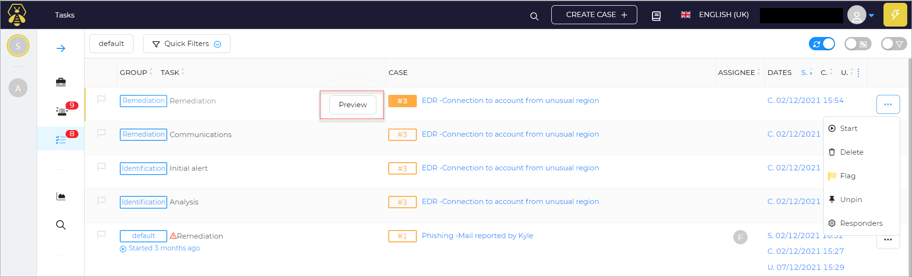

# Preview Tasks

To preview the task details:

On the list of tasks page, there is a **Preview** button corresponding to the specific task name.

1. Click on the **Preview** option. 

The task details preview window opens.

You can see details like the id, created by, created at date, updated date, title, flag, status, group, assignee, start date, due date, description, activity, responder reports of the task. 

The user can click the [`Actions Button` ](../preview-task-details/actions.md) to start, delete, pin/unpin, flag/unflag the tasks or to [`Run Responders`](../preview-task-details/run-responders.md). 

The user can add activities/task logs by clicking on the **+**. Refer to [`Create a task log`](../preview-task-details/create-a-task-log.md).

## Go To Details 

The user can view more details of the task by clicking on **Go to details** button.

### Go to details menu 

The user can view more details of the task by clicking on the menu: 

On the top of the page, there are many task options available such as flag, merge, export, close, delete, responders. 

