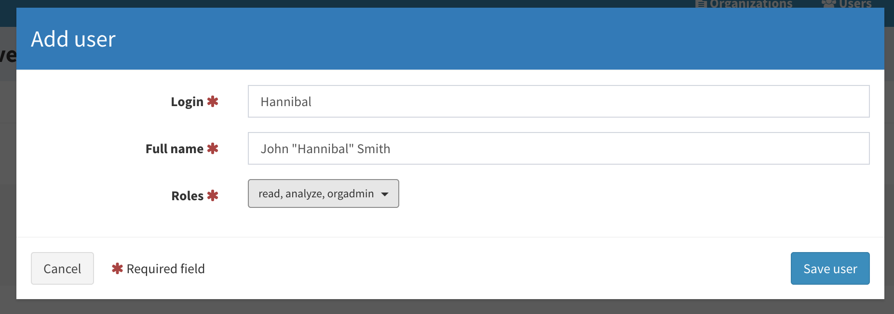

# Quick Start Guide

This is the quick start guide for Cortex 3. It assumes that Cortex [has been installed](../installation-and-configuration/step-by-step-guide.md), and that [the analyzers](../installation-and-configuration/analyzers-responders.md) have been installed as well.

## Step 1: Connect to Cortex
One Cortex is installed and configured, open your web browser and connect to http://cortexaddress:9001. 

## Step 2: Update the database
Cortex uses ElasticSearch to store users, organizations and analyzers configuration. The first time you connect to the Web UI (`http://<CORTEX_IP>:9001` by default), you have to create the database by clicking the `Update Database` button.

## Step 3: Create the Cortex Super Administrator
You are then invited to create the first user. This is a Cortex global administration user or `superAdmin`. This user account will be able to create Cortex organizations and users.

You will then be able to log in using this user account. You will note that the default `cortex` organization has been created and that it includes your user account, a Cortex global admininistrator.

## Step 4: Create an organization

The default `cortex` organization cannot be used for any other purpose than managing global administrators (users with the `superAdmin` role), organizations and their associated users. It cannot be used to enable/disable or configure analyzers. To do so, you need to create your own organization inside Cortex by clicking on the `Add organization`  button.

## Step 5: Create a organization Administrator

Create the organization administrator account (user with an `orgAdmin` role).

Then, specify a password for this user. After doing so,  log out and log in with that new user account.

## Step 6: Enable and configure Analyzers
Enable the analyzers you need, configure them using the **Organization** > **Configuration** and **Organization** > **Analyzers** tabs. All analyzer configuration is done using the Web UI, including adding API keys and configuring rate limits.

## Step 7 (Optional): Create an account for TheHive integration

If you are using TheHive, create a new account inside your organization with the `read, analyze` role and generate an API key that you will need to add to TheHive's configuration.

