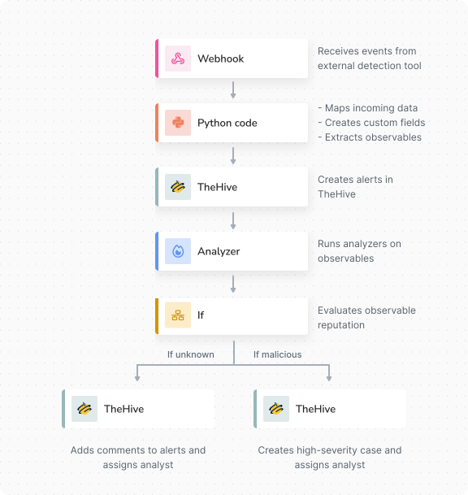

# About TheHive Flow

<!-- md:version 6.0 --> <!-- md:license One -->

Security operations involve repetitive and time-sensitive tasks: creating alerts from external events, triaging alerts, enriching observables, and notifying teams. TheHive Flow is the workflow orchestrator integrated with TheHive: it automates these tasks so your team focuses on investigation, not manual coordination. Using a visual editor, you connect trigger, flow, transformation, action, and integration nodes into automated pipelines that run when events occur.



## Managing workflows

Workflows are organized within [organizations](../../thehive/administration/organizations/about-organizations.md) and displayed in the **Flow** view. They're shared across the organization and visible to all members with sufficient permissions. There's no personal or user-isolated workspace. You can attach tags to workflows for categorization and control their status:

* *Enabled*: runs automatically when triggered and on demand from the workflow editor or a case or alert page.
* *Disabled*: never runs. Its triggers are ignored and manual runs are unavailable, so it can be edited without affecting production. Deactivating a workflow doesn't delete it. Its configuration is fully preserved, making it the recommended approach for pausing a workflow during maintenance or testing.



Workflows from other TheHive instances or organizations can be [imported](import-export-workflows.md). To start from a working example instead of building from scratch, import one of the ready-made [workflow templates](workflow-templates.md) covering common security automation scenarios.

## Workflow components

Every workflow follows the same structure: it starts with a trigger, optionally passes through flow and transformation nodes to route and reshape data, and ends with action or integration nodes that produce results.

* [Trigger](#trigger-nodes): Starts the workflow when an event occurs. Every workflow has exactly one trigger node.
* [Flow](#flow-nodes): Controls execution paths by branching on conditions, looping over lists, or pausing.
* [Transformation](#transformation-nodes): Processes data between steps by setting [local variables](#variables) or running Python or JavaScript scripts.
* [Action](#action-nodes): Performs generic operations such as sending HTTP requests, emails, or chat messages, running Cortex analyzers and responders, or calling an LLM.
* [Integration](#integration-nodes): Performs operations in TheHive or a third-party product through its API.

Each node receives input from the previous step and passes output to the next. Outputs are JSON values, so they can be reused anywhere downstream as [output variables](#variables) and read or reshaped with [jq expressions](https://jqlang.org/){target=_blank}.

!!! example "Example: Automated alert creation and triage"

    { width="50%", style="display: block; margin: 0 auto;" }

### Trigger nodes

Every workflow requires a trigger node. TheHive automatically creates one when creating a workflow. Only one trigger node exists per workflow, but multiple triggers can be configured within this node to provide different entry points for workflow execution. Multiple triggers work as `OR` conditions: any one of them independently starts the workflow.

Available triggers are:

* [*Webhook*](add-trigger.md#add-a-webhook-trigger): Listens for incoming HTTP requests from external systems or TheHive itself, automatically starting the workflow when the webhook URL receives a request. Accepts the `GET`, `POST`, `PUT`, `DELETE`, `PATCH`, `HEAD`, and `OPTIONS` methods unless you restrict the accepted methods. As the webhook URL is reachable without signing in to TheHive, the trigger carries its own authentication method.
* [*Scheduler*](add-trigger.md#add-a-scheduler-trigger): Starts the workflow on a recurring schedule. A trigger node can carry multiple scheduler blocks, each running independently on its own schedule.

!!! tip "Calling a workflow from another workflow"
    Workflows can't call each other directly. To chain workflows, use an [*HTTP request* action node](#action-nodes) in the first workflow to send a request to the webhook URL of the second workflow.

Regardless of trigger configuration, enabled workflows can always be [executed manually directly from the workflow editor](manually-run-workflow.md) or from a case or alert page in TheHive.

### Flow nodes

Flow nodes control how workflows branch, loop, process multiple items, or pause.

Available flows are:

* [*For each*](configure-flow-node.md#configure-a-for-each-flow-node): Iterates over each item in an array or object that matches a [jq expression](https://jqlang.org/){target=_blank}, executing the same sequence of nodes for each entry. Supports sequential or parallel execution modes. In sequential mode, the loop stops on the first error. In parallel mode, iterations run concurrently up to a configurable limit, and the node waits for the running iterations to settle before reporting the errors from all failed iterations together.
* [*If*](configure-flow-node.md#configure-an-if-flow-node): Evaluates a [jq expression](https://jqlang.org/){target=_blank} and directs execution down two branches based on the boolean result: `true` or `false`. An output is produced after one branch finishes, allowing the workflow to continue after the conditional logic.
* [*Sleep*](configure-flow-node.md#configure-a-sleep-flow-node): Pauses the execution path for a specified duration, then continues with the next node.

An execution path ends when it reaches a node with no next step.

### Transformation nodes

Transformation nodes process or manipulate data within workflows. They allow users to perform custom operations that modify, extract, or format information as it moves through the workflow.

Available transformations are:

* [*Set local variable*](configure-transformation-node.md#configure-a-set-local-variable-node): Creates [local variables](#variables). Returns the assigned value as an output.
* [*Python code*](configure-transformation-node.md#configure-a-python-code-node): Executes Python scripts within the workflow. Returns the script output, exit code, and any variables you expose with `flow.set()` as outputs.
* [*JavaScript code*](configure-transformation-node.md#configure-a-javascript-code-node): Executes JavaScript scripts within the workflow. Returns the script output, exit code, and any variables you expose with `flow.set()` as outputs.

### Action nodes

Action nodes perform operations that interact with TheHive or external systems. They represent the workflow's actions, creating changes in the environment or triggering downstream processes.

Available actions are:

* [*HTTP request*](configure-action-node.md#configure-an-http-request-action-node): Sends HTTP requests to external APIs, or to [TheHive API](https://docs.strangebee.com/thehive/api-docs/) for endpoints the [*TheHive* integration node](#integration-nodes) doesn't cover, using any standard HTTP method. Returns the response body, status code, and headers as outputs.
* [*Send email*](configure-action-node.md#configure-a-send-email-action-node): Sends emails using the [SMTP configuration](../../thehive/administration/smtp/about-smtp.md) from TheHive.
* [*Slack - Send message*](configure-action-node.md#configure-a-slack-send-message-action-node): Sends messages to Slack.
* [*Teams - Send message*](configure-action-node.md#configure-a-teams-send-message-action-node): Sends messages to Microsoft Teams.
* [*Analyzer*](configure-action-node.md#configure-an-analyzer-action-node): Triggers [Cortex analyzers](../../thehive/administration/cortex/about-cortex.md) on observables. Lists analyzers available across all configured Cortex instances for the organization, automatically filtered by [observable type](../../thehive/user-guides/analyst-corner/cases/observables/about-observables.md#type). If the observable's [TLP](https://www.misp-project.org/taxonomies.html#_tlp){target=_blank}/[PAP](https://www.misp-project.org/taxonomies.html#_pap){target=_blank} levels aren't compatible with the analyzer, Cortex returns an error at execution. Returns analyzer reports as outputs.
* [*Responder*](configure-action-node.md#configure-a-responder-action-node): Triggers [Cortex responders](../../thehive/administration/cortex/about-cortex.md) on [alerts](../../thehive/user-guides/analyst-corner/alerts/about-alerts.md), [cases](../../thehive/user-guides/analyst-corner/cases/about-cases.md), [observables](../../thehive/user-guides/analyst-corner/cases/observables/about-observables.md), [tasks](../../thehive/user-guides/analyst-corner/tasks/about-tasks.md), or [task logs](../../thehive/user-guides/analyst-corner/tasks/about-task-logs.md). Lists responders available across all configured Cortex instances for the organization, automatically filtered by entity type. If the entity's [TLP](https://www.misp-project.org/taxonomies.html#_tlp){target=_blank}/[PAP](https://www.misp-project.org/taxonomies.html#_pap){target=_blank} levels aren't compatible with the responder, Cortex returns an error at execution. Returns responder execution reports as outputs.
* [*AI*](configure-action-node.md#configure-an-ai-action-node): Sends a message to a large language model (LLM) using one of the [LLM providers configured in TheHive](../../thehive/administration/manage-llm-providers.md) by an administrator, and returns its response, optionally constrained to a structured output schema. Returns the response text, structured result, finish reason, and token usage as outputs.

### Integration nodes

Integration nodes perform operations in TheHive or third-party products. Each integration node targets one product API and exposes its operations as dedicated actions selected within the node.

Available integrations are:

* [*TheHive*](configure-integration-node.md#configure-a-thehive-integration-node): Performs operations in TheHive through TheHive API, such as creating, updating, querying, or deleting cases, alerts, tasks, and observables, managing comments and task logs, or starting a Cortex job. Returns the response body, status code, and headers as outputs. To perform an operation this node doesn't manage, use the [*HTTP request*](configure-action-node.md#configure-an-http-request-action-node) action node instead.
* [*Splunk*](configure-integration-node.md#configure-a-splunk-integration-node): Performs operations through the Splunk REST API, such as creating and following search jobs, running searches, listing indexes and fired alerts, submitting events, and updating Splunk Enterprise Security findings and investigations. Returns the response body, status code, and headers as outputs.
* [*Microsoft Defender for Endpoint*](configure-integration-node.md#configure-a-microsoft-defender-for-endpoint-integration-node): Performs operations through the Microsoft Defender for Endpoint API, such as listing, retrieving, and updating alerts, running response actions on devices, and creating indicators. Returns the response body, status code, and headers as outputs.
* [*Microsoft Defender (Graph Security API)*](configure-integration-node.md#configure-a-microsoft-defender-graph-security-api-integration-node): Performs operations through the Microsoft Graph security API, such as listing, retrieving, and updating Microsoft Defender XDR alerts and incidents. Returns the response body, status code, and headers as outputs.
* [*Microsoft Entra ID*](configure-integration-node.md#configure-a-microsoft-entra-id-integration-node): Performs operations through the Microsoft Graph API, such as looking up users, sign-ins, audit logs, devices, and risk detections, and taking account actions such as disabling a user or forcing a password reset. Returns the response body, status code, and headers as outputs.
* [*Microsoft Sentinel*](configure-integration-node.md#configure-a-microsoft-sentinel-integration-node): Performs operations through the Microsoft Sentinel REST API, such as listing, retrieving, and updating incidents, managing incident comments, and listing or writing watchlists. Returns the response body, status code, and headers as outputs.
* [*Recorded Future*](configure-integration-node.md#configure-a-recorded-future-integration-node): Performs operations through the Recorded Future API, such as enriching and triaging indicators in bulk, looking up domains, IP addresses, hashes, and URLs, and searching analyst notes and threat maps. Returns the response body, status code, and headers as outputs.
* [*VirusTotal*](configure-integration-node.md#configure-a-virustotal-integration-node): Performs operations through the VirusTotal API, such as scanning URLs and files, and retrieving domain, IP address, file, and analysis reports. Returns the response body, status code, and headers as outputs.
* [*CrowdStrike Falcon*](configure-integration-node.md#configure-a-crowdstrike-falcon-integration-node): Performs operations through the CrowdStrike Falcon APIs, such as querying devices and vulnerabilities, running response actions on hosts, querying and updating alerts, looking up threat intelligence indicators, managing custom indicators of compromise, and detonating file samples in the Falcon sandbox. Returns the response body, status code, and headers as outputs.
* [*Elastic Security*](configure-integration-node.md#configure-an-elastic-security-integration-node): Performs operations through the Elasticsearch API, such as searching and indexing documents, running ES|QL queries, and listing Elastic Security detection alerts. Returns the response body, status code, and headers as outputs.
* [*HarfangLab EDR*](configure-integration-node.md#configure-a-harfanglab-edr-integration-node): Performs operations through the HarfangLab API, such as searching and isolating endpoints, managing alerts, running jobs on agents, searching telemetry, managing IOC rules, and listing Sigma rules. Returns the response body, status code, and headers as outputs.
* [*Jira Cloud v3*](configure-integration-node.md#configure-a-jira-cloud-v3-integration-node): Performs operations through the Jira Cloud platform REST API, such as creating, editing, transitioning, and searching issues, managing comments, attachments, worklogs, watchers, and votes, and browsing projects and issue metadata. Returns the response body, status code, and headers as outputs.
* [*Slack*](configure-integration-node.md#configure-a-slack-integration-node): Performs operations through the Slack Web API, such as posting, updating, and deleting messages, managing reactions, reading threads and channel history, and looking up channels and users. Returns the response body, status code, and headers as outputs.

## Variables

Workflows in TheHive Flow support seven types of variables:

| Type | Scope | Displayed reference | Description |
| --- | --- | --- | --- |
| Entry variables | Single workflow | `$input.<field_name>` | Input values passed into the workflow when it starts. Each entry variable is declared in [workflow settings](manage-entry-exit-variables.md), then assigned a field of the webhook payload with a jq expression in the **Input mapping** section when [configuring a *Webhook* trigger](add-trigger.md#add-a-webhook-trigger). A [run from a case or alert page](manually-run-workflow.md#run-a-workflow-from-a-case-or-alert) assigns the entity identifier to the `case_id` or `alert_id` entry variable when the workflow declares it. |
| Trigger payload | Single workflow | `$input.payload` | Built-in variable automatically available in every run, carrying the data received by the trigger that started the run, such as the JSON body, headers, and query parameters of a webhook request. Requires no declaration and no input mapping. See [Access the Trigger Payload](access-trigger-payload.md) for the available fields. |
| Exit variables | Single workflow | — | Output values the workflow returns to its caller when it completes. Declared in [workflow settings](manage-entry-exit-variables.md) as named [jq expressions](https://jqlang.org/){target=_blank} that are evaluated at the end of the run. |
| Local variables | Single workflow | `$<node_name>.<field_name>` | User-defined values scoped to a single workflow run, created during execution with a [*Set local variable* transformation node](configure-transformation-node.md#configure-a-set-local-variable-node). |
| Output variables | Single workflow | `$<node_name>.<output_name>` | Values a node produces automatically when it runs, available to every later node. The available outputs depend on the node type. See each node's configuration page for details. In a [*For each* loop](configure-flow-node.md#configure-a-for-each-flow-node), the current item and its key are available as the `item` and `idx` outputs of the loop node, within the `Loop` branch only. |
| Loop output variables | Single workflow | `$<node_name>.<variable_name>` | Values declared on a [*For each* node](configure-flow-node.md#configure-a-for-each-flow-node) to collect results across iterations. Each is a named [jq expression](https://jqlang.org/){target=_blank} evaluated after every iteration, and the values are aggregated across all iterations and available in the nodes that follow the loop. |
| Global variables | Organization | Visible: `$global.<variable_name>` / Secret: `$secret.<variable_name>` | Values defined once at the [organization level](manage-global-variables.md) and shared across all workflows. Managed from the **Global variables** tab and can't be modified within workflows. They can be visible or secret. Secret variables hold sensitive data such as API keys, passwords, or SSL/TLS certificates. Their values are never displayed in the interface and never appear in execution logs or API responses. |

Insert variables with the **$var** button, or type `$` in a field and start typing the variable name to filter the suggestions. In both cases, select one of the suggestions to insert the reference: it can't be typed in full manually.

An inserted variable is highlighted in the field. How you read a nested field from it depends on its type:

* A direct variable (green): appears in the condition of an *If* node and the collection of a *For each* node. Read a nested field by typing `.<field_name>` right after the reference, directly in the field.
* A jq expression (blue): the variable wrapped in a [jq expression](https://jqlang.org/){target=_blank}. To read a nested field or transform the value, select the expression and edit the jq inside it. Always add fields inside the expression itself: text typed after it in the field is treated as literal text, not as part of the expression, and the node fails at execution with a type mismatch. You can also use the **+** button to write the variable and the field together in one step.

## Files

Workflows pass JSON values between nodes. Some values don't fit that model well: a large API response, a binary download, or a document uploaded to a webhook. TheHive Flow stores these values as files and passes a file reference between nodes instead of the content itself. In most workflows, this is invisible: reading a variable returns its value whether it's stored inline or as a file.

A value is stored as a file in the following cases:

* **Large node outputs**: By default, any node output whose content reaches 1 MiB is automatically stored as a file. Below that size, the value is stored inline.
* **Binary or multipart HTTP responses**: An [*HTTP request* node](configure-action-node.md#configure-an-http-request-action-node) response body that isn't valid text is stored as a file regardless of its size. Parts of a `multipart/*` response body that are large or not JSON are stored as files too.
* **Files uploaded to a webhook**: A file sent with the HTTP request that triggers a [*Webhook* trigger](add-trigger.md#add-a-webhook-trigger) is stored as a file and available for input mapping as `$request.files.<field>` in the trigger configuration.
* **Files written by code nodes**: A file registered with `flow.set_file()` in a [*Python code*](configure-transformation-node.md#configure-a-python-code-node) or [*JavaScript code*](configure-transformation-node.md#configure-a-javascript-code-node) node.

Stored files are capped at 25 MiB by default. A value above that limit is rejected.

Reading a variable whose value is stored as a file works the same way as reading any other variable, within a size limit:

* If the file content is JSON and doesn't exceed 1.5 MiB, the default limit, referencing the variable returns its content transparently. Nested fields can be read as usual, for example `$<node_name>.body.<field_name>`.
* If the file content is larger than 1.5 MiB or isn't JSON, referencing the variable returns the file reference itself, a small object describing the file, instead of the content. In that case, read the file in a [code node](configure-transformation-node.md#configure-a-python-code-node) with `flow.get_file()`, or forward the reference as is to a node that accepts files, such as the **Multipart parts** field of an [*HTTP request* node](configure-action-node.md#configure-an-http-request-action-node).

### File metadata

Every value stored as a file exposes its metadata through the read-only `$files` namespace, which mirrors the node outputs and entry variables:

* `$files.<node_name>.<output_name>`: metadata of a node output stored as a file.
* `$files.input.<field_name>`: metadata of an entry variable stored as a file.

The metadata contains the following fields:

| Field | Type | Description |
| --- | --- | --- |
| `name` | string | The file name. |
| `size` | number | The file size in bytes. |
| `content_type` | string | The MIME type of the file content. |
| `sha256sum` | string | The SHA-256 checksum of the file content. |
| `created_at` | string | When the file was stored. |
| `created_by` | string | The node that produced the file. |

The `$files` namespace never holds file content. Reading content goes through the regular variable reference, as described above.

In the variable suggestions, these metadata references appear in a dedicated **Files** group. The group lists an entry for every output that could be stored as a file. Whether a value is stored as a file is only decided when the workflow runs, based on the size and format of the real value.

!!! warning "Files entries resolve to nothing for inline values"
    A `$files` reference returns metadata only when the value is stored as a file. For a value stored inline, the common case for small JSON, the same reference resolves to nothing. To read the value itself, always pick the suggestion from the node's own group, not from the **Files** group.

## Timeout, retry, and backoff configuration

* A timeout defines the maximum duration an operation is allowed to run before it's automatically stopped and marked as timed out. Timeouts can be configured at both the [workflow level](manage-workflows.md#create-a-workflow) and the node level. When both levels define a timeout, the shortest duration is applied.

* A retry defines the number of times a failed node execution is attempted again. A retry delay specifies the wait time between retry attempts: without a delay, retries run 1 second apart by default. Retry can be configured only at the node level.

* A backoff defines the coefficient applied to the retry delay to increase the wait time after each failed attempt. Backoff can be configured only at the node level.

## Execution mode

When several branches converge on the same node, its execution mode controls whether the node runs for each branch or once for all of them:

* *Execute once per branch*: the node runs once for each incoming branch. This is the default when the execution mode isn't configured.
* *Wait for all branches*: the node waits for all incoming branches to complete, then runs once.

Execution mode is configured in the node's **Add options**, under **Execution configuration**. It's available on most action, integration, and transformation nodes.

## Execution tracking

Executions are asynchronous: triggering a workflow doesn't block TheHive interface.

Each workflow execution generates an execution record that captures the status of the workflow and each of its nodes. [Execution logs](display-execution-logs.md) are available in three places:

* The **Execution logs** tab in the **Flow** view lists the executions of every workflow in the organization from the past 30 days, giving an overview to spot failures and open a specific run.
* The **Executions** tab inside a workflow shows that workflow's runs in detail. Selecting a node displays its start and end dates, duration, status, and input and output data.
* The **Automation** tab of a case or alert in TheHive lists the runs launched on that case or alert.

## Permissions

* Only users with the `manageOrchestrator/readWorkflows` permission can access the **Flow** view and see workflows.
* Only users with the `manageOrchestrator/writeWorkflows` permission can create, modify, or run workflows in TheHive Flow.
* Only users with the `manageOrchestrator/deleteWorkflows` permission can delete workflows in TheHive Flow.
* Only users with the `manageOrchestrator/readVariables` permission can access the **Global variables** tab and see global variables.
* Only users with the `manageOrchestrator/writeVariables` permission can create or modify global variables in TheHive Flow.
* Only users with the `manageOrchestrator/deleteVariables` permission can delete global variables in TheHive Flow.

Reaching any tab of the **Flow** view requires the `manageOrchestrator/readWorkflows` permission.

<h2>Next steps</h2>

* [Build your First Workflow](build-your-first-workflow.md)
* [Workflow Templates](workflow-templates.md)
* [Flow Glossary](glossary-flow.md)
