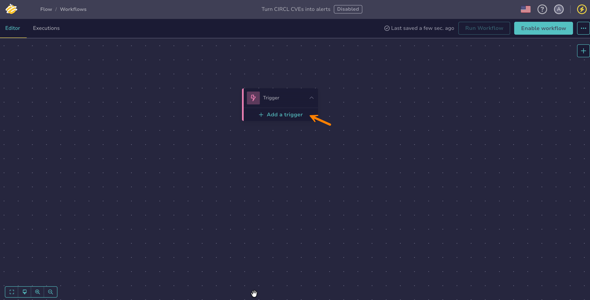

# Add a Trigger

<!-- md:version 6.0 --> <!-- md:permission `manageOrchestrator/writeWorkflows` --> <!-- md:license One -->

Define how your workflow automatically starts in [TheHive Flow](about-flow.md). A workflow can have multiple triggers configured simultaneously, working as `OR` conditions: any one of them independently starts the workflow.



## Add a *Webhook* trigger

Configure a *Webhook* trigger that starts the workflow automatically when the webhook URL receives an HTTP request, from an external system or TheHive itself.

1. 

2. Select a workflow from the list.

3. In the trigger node, select **Add a trigger**.

    

4. In the **Select a trigger** drawer, select **Webhook**.

5. Optional: In the **Allowed HTTP methods** field, select the methods the webhook accepts: `GET`, `POST`, `PUT`, `DELETE`, `PATCH`, `HEAD`, or `OPTIONS`.

    Leave the field empty to accept any of these methods. Once you restrict the list, the webhook rejects every other method with a `403` response.

6. Copy the URL path displayed in the drawer.

7. Configure the webhook URL in the appropriate location:

    * For external systems events: Paste the copied webhook path into your external system following its documentation.
    * For TheHive events: [Create a notification](../../thehive/user-guides/organization/configure-organization/manage-notifications/create-a-notification.md) with a [*Webhook* notifier](../../thehive/user-guides/organization/configure-organization/manage-notifications/notifiers/webhook.md). When configuring the notifier, [add a webhook endpoint](../../thehive/user-guides/organization/configure-organization/manage-endpoints/add-webhook-endpoint.md) and paste the copied webhook path into the **URL** field.

8. Optional: To assign values to the workflow's [entry variables](manage-entry-exit-variables.md), go to the **Input mapping** section and select :fontawesome-solid-plus:.

    !!! info "Prerequisite"
        Entry variables must be [declared in the workflow settings](manage-entry-exit-variables.md) beforehand. If none exist, select **Configure Playbook Inputs** in the **Input mapping** section to open the workflow settings.

    In the **JQ expression** field, define what value to assign from the incoming request:

    * `$request.body`: the entire request body
    * `$request.body.<field>`: a specific field
    * `$request.headers["<header_name>"]`: a specific HTTP header from the request. Write the header name with a capital letter at the start of each hyphen-separated part, for example `X-Api-Key`.
    * `$request.query.<parameter_name>`: a specific query string parameter from the webhook URL
    * `$request.method`: the HTTP method of the request
    * `$request.form.<field>`: a specific form field, for a request sent as `multipart/form-data`
    * `$request.files.<field>`: a file uploaded with the request, as a file reference

    Once mapped, reference entry variables in workflow nodes with the **$var** button, or by typing `$` and selecting the variable from the suggestions. An inserted reference is displayed as `$input.<variable_name>`.

    !!! tip "Accessing the request without input mapping"
        Every run also exposes the incoming request through the built-in [`$input.payload`](access-trigger-payload.md) variable, with no declaration or mapping required. The name `payload` is reserved for this variable and can't be used in an input mapping.

9. Recommended: In the **Authentication** section, select a **Method \*** to control who can start the workflow.

    The webhook URL is reachable without signing in to TheHive, and the endpoint applies no other authentication. The method you select here is what protects the workflow. Regardless of the method, each client IP address can send up to 120 requests per minute by default. Requests beyond that limit are rejected with a `429` response.

    *Fields marked with \* are mandatory.*

    | Method | Fields | Description |
    | --- | --- | --- |
    | *None* | — | No authentication. Anyone who knows the webhook URL can start the workflow. This is the default. |
    | *Basic Auth* | **Username \***, **Password \*** | The caller sends the credentials in an `Authorization` header using the HTTP Basic scheme. |
    | *Key / Header Auth* | **Header name \***, **Header value \*** | The caller sends the header you define, with an exact, case-sensitive value. Use it for a shared secret or an API key, for example an `X-Api-Key` header. |
    | *JWT Token* | **Secret key \***, **Algorithm \***, **Require token expiration** | The caller sends a signed token in an `Authorization` header using the Bearer scheme. TheHive validates the token against the secret key and the algorithm, tolerating a clock difference of 30 seconds. In **Algorithm**, enter the HMAC algorithm the token is signed with, for example `HS256`, `HS384`, or `HS512`. Turn on **Require token expiration** to reject tokens that carry no expiration claim. It's turned off by default, so tokens that never expire are accepted. |

    !!! warning "Leaving the method set to *None*"
        With *None*, the webhook URL is the only secret protecting the workflow. The URL can't be rotated without recreating the trigger, and it leaks through access logs, proxy logs, the `Referer` header, and browser history. Select another method for any webhook reachable from outside your network.

    !!! tip "Keeping credentials out of the configuration"
        Credential fields accept a reference to a [secret global variable](manage-global-variables.md) instead of a literal value. The reference resolves on every incoming request, so rotating the variable takes effect on the next call without editing the trigger.

## Add a *Scheduler* trigger

Configure a *Scheduler* trigger that starts the workflow automatically on a recurring schedule. A trigger node can carry multiple scheduler blocks, each with its own independent schedule.

1. 

2. Select a workflow from the list.

3. In the trigger node, select **Add a trigger**.

    

4. In the **Select a trigger** drawer, select **Scheduler**.

5. Select an interval type, then enter an interval time and any additional fields that appear.

    Available interval types and their fields:

    | Interval type | Interval value | Additional fields |
    | --- | --- | --- |
    | Seconds | 10–60 | — |
    | Minutes | 1–60 | — |
    | Hours | 1–24 | Trigger at minute (0–59) |
    | Days | 1–31 | Trigger at hour (0–23), Trigger at minute (0–59) |
    | Weeks | Fixed at 1 | Trigger on day of the week, Trigger at hour (0–23), Trigger at minute (0–59) |
    | Months | 1–12 | Trigger at day of the month (1–31), Trigger at hour (0–23), Trigger at minute (0–59) |

<h2>Next steps</h2>

* [Manage Global Variables](manage-global-variables.md)
* [Manage Entry and Exit Variables](manage-entry-exit-variables.md)
* [Configure a Flow Node](configure-flow-node.md)
* [Configure a Transformation Node](configure-transformation-node.md)
* [Configure an Action Node](configure-action-node.md)
* [Configure an Integration Node](configure-integration-node.md)
* [Manually Run a Workflow](manually-run-workflow.md)