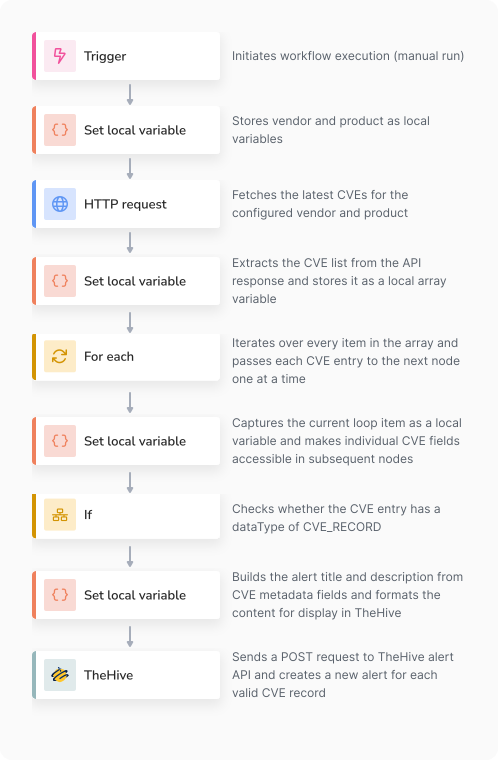
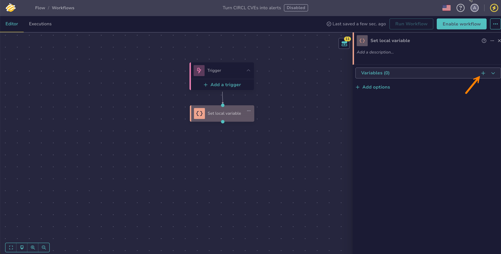
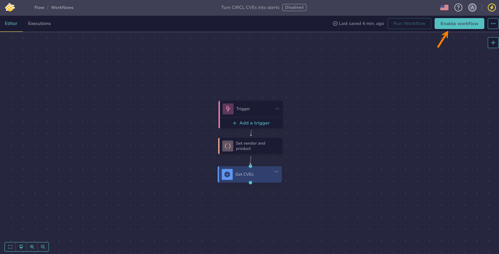
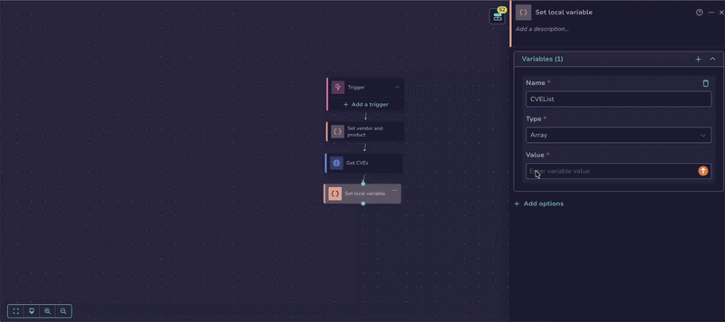
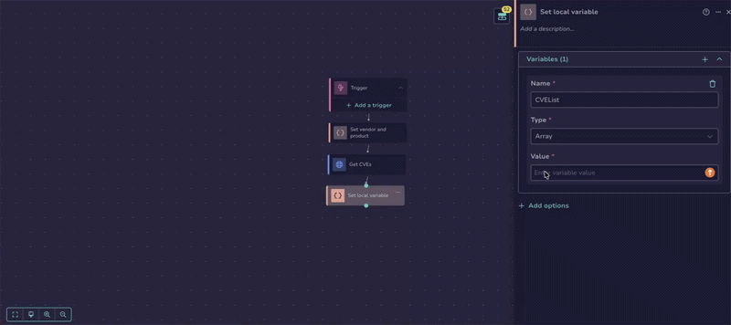
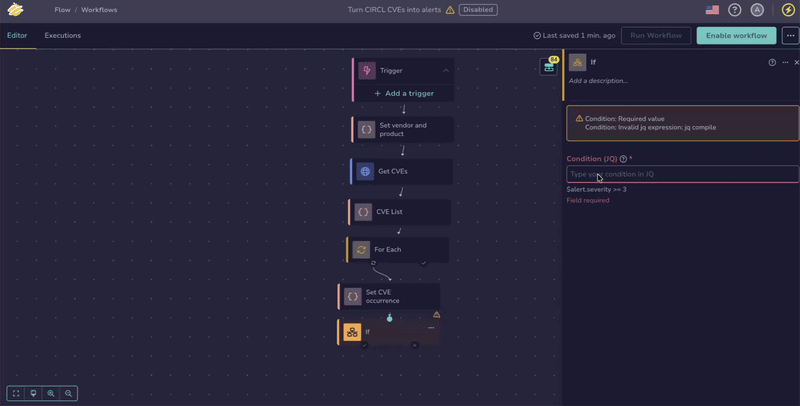
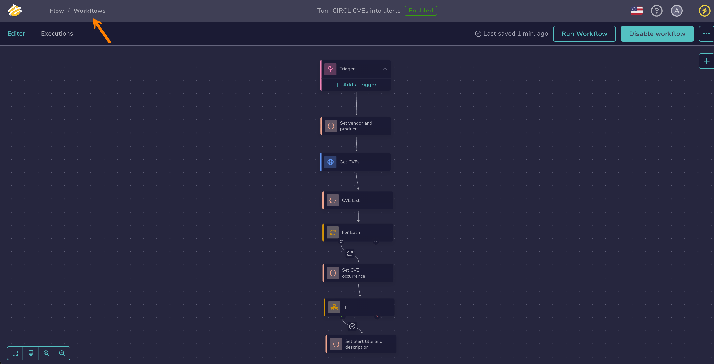
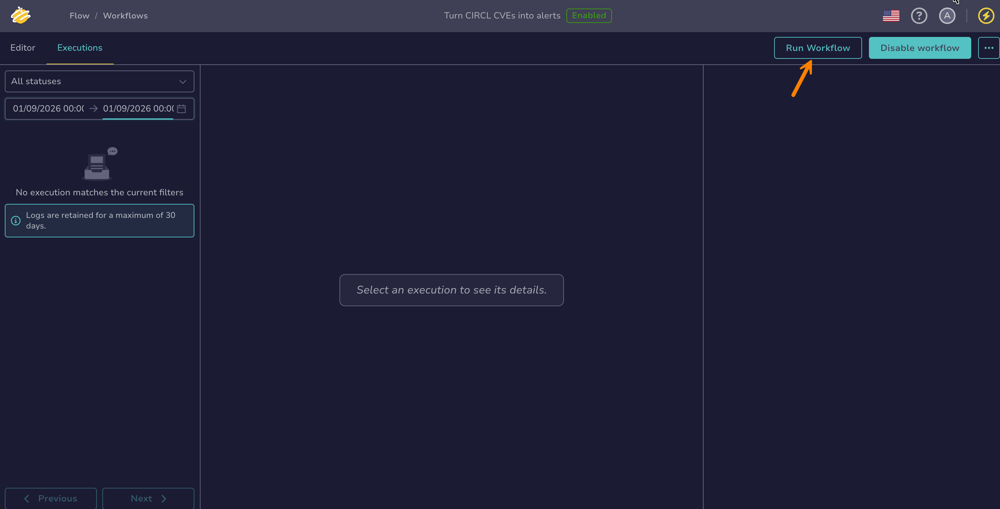

# Build Your First Workflow

<!-- md:version 6.0 --> <!-- md:permission `manageOrchestrator/writeWorkflows` --> <!-- md:permission `manageOrchestrator/writeVariables` --> <!-- md:license One -->

Ready to see [TheHive Flow](about-flow.md) in action? In this exercise, you'll build a complete workflow from scratch—and understand why each piece works the way it does.

By the end, you'll have a working workflow that automatically converts [CVEs from CIRCL](https://cve.circl.lu/recent){target=_blank} for a specific vendor and product into alerts in TheHive. Along the way, you'll get hands-on with the core concepts you'll reuse in every workflow you build:

* Connecting nodes to pass data from one action to the next
* Fetching data from an external API using HTTP requests
* Using variables to store and transform data throughout a workflow
* Building loops to process multiple items automatically
* Using conditions to filter and validate data
* Creating alerts in TheHive from external data sources

You don't need any prior knowledge or access to external tools. You'll use publicly available CVE data throughout.

This exercise takes approximately 30 minutes to complete.

{ width="40%", style="display: block; margin: 0 auto;" }

## Step 1: Create a workflow

Start by setting up a new workflow in TheHive Flow.

1. 

2. Select :fontawesome-solid-plus:.

3. In the **Workflow information** drawer, enter the following information:

    **- Name**: `Turn CIRCL CVEs into alerts`

    **- Description**: `Automatically fetch the latest CVEs from CIRCL and create security alerts in TheHive`

    **- Tags**: `cve`

    **- Timeout**: `15 minutes`

    The timeout defines the maximum allowed execution time for the entire workflow. You can also set a timeout at the node level. When both are defined, the shortest value applies.

4. Select **Save**.

You'll arrive directly in the workflow editor. You can see that TheHive has created your workflow in a *Disabled* state with a default trigger node. The trigger node is the entry point that initiates workflow execution. Two triggers are available: *Webhook*, which starts the workflow when its URL receives an HTTP request, and *Scheduler*, which starts it on a recurring schedule. You can also run a workflow manually, from the workflow editor or from a case or alert page in TheHive, regardless of its trigger configuration.

For this exercise, skip the trigger configuration. You'll run the workflow manually later.

## Step 2: Set the vendor and product

You'll fetch CVEs for Apple macOS. Rather than hardcoding these values directly into the API request, store them as local variables. They're scoped to a single workflow and available to all subsequent nodes.

1. In the workflow editor, drag the trigger node connector to an empty area of the canvas.

    The layout is entirely free: drag nodes anywhere on the canvas.

    

2. In the **What is the next step?** drawer, select *Set local variable*.

3. Select :fontawesome-solid-plus: in the **Variables** section.

    

4. In the **Set local variable** drawer, enter the following information:

    **- Name**: `vendor`

    **- Type**: `string`

    **- Value**: `apple`

    Then still in the drawer, select :fontawesome-solid-plus: to add a second variable.

    **- Name**: `product`

    **- Type**: `string`

    **- Value**: `macos`

5. Select the node title and rename it to `Set vendor and product`.

    Renaming nodes is optional but recommended. Descriptive names make your workflow easier to read at a glance. You can also add a description to a node, but it appears only in the node configuration drawer, not on the canvas.

6. Select an empty space in the workflow editor to exit the node configuration or select :fontawesome-solid-xmark:.

    Notice that the workflow configuration is automatically saved at each step.

You now have two local variables that scope the CIRCL API query to a specific vendor and product.

## Step 3: Fetch the latest CVEs

Add an *HTTP request* node to fetch the latest CVEs for the vendor and product you set in the previous step.

1. Add an *HTTP request* node by dragging the `Set vendor and product` node's connector to an empty area of the canvas and selecting *HTTP request* in the **What is the next step?** drawer.

2. In the **HTTP request** drawer, enter the following information:

    **- Method**: `GET`

    **- URL**: `https://cve.circl.lu/api/search/`

    Position the cursor at the end of the URL, select the **$var** button, then select **Set vendor and product > vendor**.

    Type `/` and select the **$var** button again to select **Set vendor and product > product**.

    !!! tip "Inserting variables"
        Instead of the **$var** button, you can type `$` directly in the field and start typing the variable name to filter the suggestions. Then select one of the suggestions to insert the reference: it can't be typed in full manually.

    The final URL should look like this: `https://cve.circl.lu/api/search/$set_vendor_and_product.vendor/$set_vendor_and_product.product`

3. Rename the node to `Get CVEs`.

4. Select :fontawesome-solid-diagram-next: to view the available outputs.

    

    | Output    | Type   | Description                                      |
    |-----------|--------|--------------------------------------------------|
    | `body`    | object | The response body returned by the API. Not set for a multipart response: use `parts` instead. |
    | `code`    | number | The HTTP status code returned by the server.     |
    | `headers` | object | The response headers returned by the server.     |
    | `parts`   | object | The parts of a multipart response body, keyed by part name. Each part carries its `filename`, `content_type`, `size`, and `content`. Empty when the response isn't multipart. |

    These outputs are JSON values, automatically available as output variables in subsequent nodes. Since the workflow hasn't run yet, hovering over an output shows an example value. Once the workflow has run, it shows the result from the last execution.

The HTTP request is now configured to fetch CVE data from CIRCL for Apple macOS. Before continuing, test what you've built so far.

## Step 4: Test the CVE retrieval

Testing as you build is a good habit in TheHive Flow. It helps you catch errors early and know exactly where they occurred. [Execution logs](display-execution-logs.md) are also available to help you understand why a workflow isn't working as expected. You'll use them in the final step of this exercise.

1. To test a workflow, you need to enable it first. In the workflow editor, select **Enable workflow**.

    

2. Select **Run workflow**.

3. Select the `Get CVEs` node and then select :fontawesome-solid-diagram-next:.

4. Hover over the `body` output to see if data was received.

    Hovering over the output lets you inspect the data and its structure, which will be useful when referencing specific fields of the corresponding output variable in the next step.

If you see a list of CVE objects, your request is working correctly! You've successfully fetched and stored the latest CVEs from CIRCL.

## Step 5: Extract the CVE list

Next, create another local variable to store the CVE list from the `body` response. While you could reference the `body` output variable from the `Get CVEs` *HTTP request* node directly, assigning it to a named local variable makes the intent explicit and the workflow easier to follow.

1. Add a *Set local variable* node from the `Get CVEs` node.

2. In the **Set local variable** drawer, select :fontawesome-solid-plus: in the **Variables** section, then enter the following information:

    **- Name**: `CVEList`

    **- Type**: `array`

    **- Value**: Select the **+** button, type `$`, select the **Get CVEs > body** variable, and add `.results.nvd` while still inside the jq expression.

    Pick the suggestion from the **Step variables** group, not from the **Files** group. Files entries expose file metadata such as the file name and size, not the value itself, and resolve to nothing when the value isn't stored as a file.

    Take care to add `.results.nvd` inside the inserted reference, not after it: select the reference to edit inside it. Text typed after the reference isn't part of the jq expression and makes the node fail at execution.

    

    You can also insert the variable with the **$var** button, then select the inserted reference to add a field.

    

    !!! warning "Add fields inside the reference"
        For blue references, which are jq expressions, always add fields by editing the inserted reference, as described above. Text typed directly after a blue reference in the field value is treated as literal text, not as part of the jq expression, and the node fails at execution with a type mismatch.

    !!! note "Case-sensitive field names"
        Field names within variables are case-sensitive. Make sure to use the exact casing, or the expression won't work.

    The final value should look like this: `$get_cves.body.results.nvd`.

3. Rename the node to `CVE List`.

Perfect! You've now set up the data pipeline: the workflow fetches CVEs from CIRCL and stores them as a local array variable.

## Step 6: Process each CVE and filter by record type

Now loop over the CVE array and filter out entries that aren't valid CVE records before creating alerts in TheHive.

1. Add a *For each* node from the `CVE List` node.

2. In the **For each** drawer, select the **CVE List > CVEList** variable in the **Field to iterate over** field.

    Iterations run sequentially by default. For this exercise, leave them sequential and don't enable the **Parallel execution** toggle.

    The **Loop output variables** section aggregates values produced inside the loop across all iterations, so nodes placed after the loop can use them. This exercise creates the alerts inside the loop itself and doesn't need them.

3. Add a *Set local variable* node from the `For Each` node.

    The *For each* node has two branches: the `Loop` branch and the `Done` branch. Use the `Loop` branch: :fontawesome-solid-arrows-rotate:.

4. In the **Set local variable** drawer, select :fontawesome-solid-plus: in the **Variables** section, then enter the following information:

    **- Name**: `CVE`

    **- Type**: `json`

    **- Value**: Select the **+** button, type `$`, select the **For Each > item** variable, and add `[1]` while still inside the jq expression.

    The final value should look like this: `$for_each.item[1]`.

    In a *For each* node, `item` is the current iteration value and `idx` is its key. Here, CIRCL returns each entry as a two-element `[id, CVE]` pair, so `item[0]` is the CVE ID and `item[1]` is the CVE object you need.

5. Rename the node to `Set CVE occurrence`.

6. Add an *If* node from the `Set CVE occurrence` node.

7. In the **If** drawer, select the **Set CVE occurrence > CVE** variable, then type `.dataType == "CVE_RECORD"` directly after it.

    In an *If* node condition, the inserted reference is green because it's a direct variable. Unlike with blue references, text typed after a green reference isn't literal: it extends the expression, so typing directly after it is the correct gesture here.

    

    The final value should look like this: `$set_cve_occurrence.CVE.dataType == "CVE_RECORD"`.

You've set up the loop and filter logic for the workflow. Only CVEs with a `dataType` of `CVE_RECORD` will move forward to the next step, where they'll be created as alerts in TheHive.

## Step 7: Create alerts in TheHive

To complete the workflow, you'll store your TheHive API key as a global variable, prepare the alert content from the CVE data, and create the alert in TheHive with a *TheHive* node.

!!! tip "Have your TheHive API key ready"
    To find it, see [Manage User Accounts](../../thehive/user-guides/organization/configure-organization/manage-user-accounts/manage-user-accounts.md#manage-a-user-account-api-key).

1. From the workflow editor, select **Workflows** to go back to the workflow list.

    

2. Select the **Global variables** tab.

    This is where you can manage global variables. Unlike local variables, global variables are defined once and shared across all workflows. They can be visible or secret.

3. Select :fontawesome-solid-plus:.

4. In the **Create a variable** drawer, enter the following information:

    **- Name**: `api_key_thehive`

    **- Secret**: `On`

    **- Value**: `string` and paste your TheHive API key.

5. Select **Save**.

6. Select the **Workflows** tab and select your `Turn CIRCL CVEs into alerts` workflow.

7. Add a *Set local variable* node from the `If` node.

    The *If* node has two branches: `true` and `false`. Use the `true` branch: :fontawesome-solid-check:.

8. In the **Set local variable** drawer, select :fontawesome-solid-plus: in the **Variables** section, then enter the following information:

    **- Name**: `alertTitle`

    **- Type**: `string`

    **- Value**: Write `New CVE: `, then select the **+** button, type `$`, select **Set CVE occurrence > CVE**, and add `.cveMetadata.cveId` while still inside the jq expression.

    The final value should look like this: `New CVE: $set_cve_occurrence.CVE.cveMetadata.cveId`

    Then still in the drawer, select :fontawesome-solid-plus: to add a second variable.

    **- Name**: `alertDescription`

    **- Type**: `string`

    **- Value**: Select the **+** button, type `$`, select **Set CVE occurrence > CVE**, and add `.containers.cna.descriptions[0].value` while still inside the jq expression.

    The final value should look like this: `$set_cve_occurrence.CVE.containers.cna.descriptions[0].value`

9. Rename the node to `Set alert title and description`.

10. Add a *TheHive* node from the `Set alert title and description` node.

11. In the **TheHive** drawer, enter the following information:

    **- Base URL**: `https://<thehive_host>`

    Replace `<thehive_host>` with the host name or IP address of your TheHive instance.

    **- Bearer token**: In the **Authentication** section, select the `api_key_thehive` global variable.

    **- Organization**: Enter the name of TheHive organization where the alert is created. If left empty, the API key account's [default organization](../../thehive/administration/organizations/modify-default-organization-user-account.md) is used.

    **- Action**: Select *Create Alert*.

    Then fill the fields for the action:

    **- Type**: `CVE`

    **- Source**: `flow`

    **- Source ref**: Select the **+** button, type `$`, select **Set CVE occurrence > CVE**, and add `.cveMetadata.cveId` while still inside the jq expression.

    **- Title**: Select the **$var** button and select **Set alert title and description > alertTitle**.

    **- Description**: Select the **$var** button and select **Set alert title and description > alertDescription**.

    The *Create Alert* action offers more fields, but these are all you need for this exercise.

12. Rename the node to `Create alert`.

Your workflow is now complete. Each CVE that passes the CVE_RECORD filter will be sent to TheHive as a new alert, with a structured title and description pulled directly from the CVE data.

## Step 8: Run the workflow

With the workflow fully built, run it and verify that alerts are created in TheHive.

After Step 4, your workflow should still be enabled. If you turned it off, re-enable it before continuing.

1. Go to the **Executions** tab and select **Run workflow**.

    

2. Follow the execution of each node in real time.

    

    Nodes turn purple while running, green on success, red on failure, and remain grey if not reached due to an upstream interruption. Select a red node to read the error message and fix the issue.

    Nodes that run more than once inside the loop display a badge with the number of iterations. When some iterations succeed and others fail, two badges appear, one count for each. A loop node turns red as soon as one iteration fails, even if the others succeeded.

3. Once the execution completes, go to the **Alerts** view and look for new alerts with the type `CVE` and the source `flow`.

If alerts appear in TheHive, your workflow is working end to end. You've built your first workflow in TheHive Flow!

!!! info "Running the workflow more than once"
    TheHive [rejects an alert when one with the same type, source, and source reference already exists](../../thehive/user-guides/analyst-corner/alerts/about-alerts.md#uniqueness) in the organization. If you run the workflow again, the `Create alert` node fails with a `400` error for each CVE already imported. To run the exercise again, [delete the previously created alerts in TheHive first](#step-9-clean-up).

!!! tip "Run a workflow on a case or an alert"
    Workflows can also be [run from a case or alert page in TheHive](manually-run-workflow.md#run-a-workflow-from-a-case-or-alert). The run passes the case or alert identifier to the workflow as the `case_id` or `alert_id` entry variable, so a workflow can act on the entity it was launched from, for example to enrich a case or triage an alert.

## Step 9: Clean up

This exercise creates real alerts in TheHive. If you ran it on a shared or production instance, close the alerts you no longer need and deactivate the workflow.

1. In the **Alerts** view, filter on the source `flow` to isolate the alerts created by the workflow.

2. Select :fontawesome-regular-square: in the column header to select all the alerts on the page, then select :fontawesome-solid-xmark: above the list.

3. In the **Change the alert status** drawer, select a status such as `Ignored`, then select **Confirm**.

4. Go back to the **Flow** view, select the workflow, then select **Disable workflow**.

    No trigger is configured, so the workflow only runs when started manually. Turning it off prevents an accidental run from creating new alerts.

<h2>Next steps</h2>

* [About TheHive Flow](about-flow.md)
* [Manage Workflows](manage-workflows.md)
* [Manually Run a Workflow](manually-run-workflow.md)
* [Manage Global Variables](manage-global-variables.md)
* [Display Workflow Execution Logs](display-execution-logs.md)
* [Export or Import a Workflow](import-export-workflows.md)
* [Workflow Templates](workflow-templates.md)