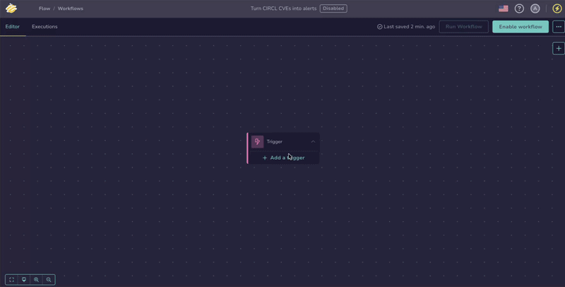
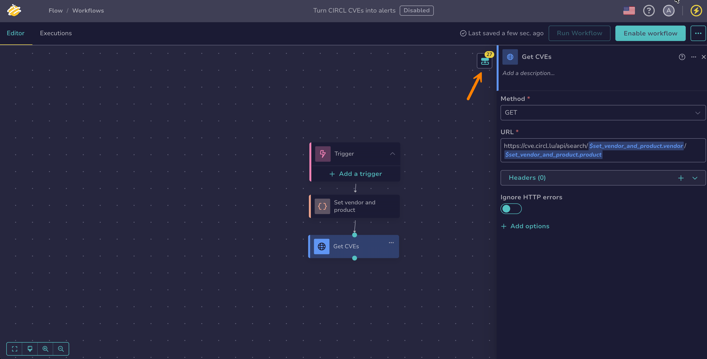
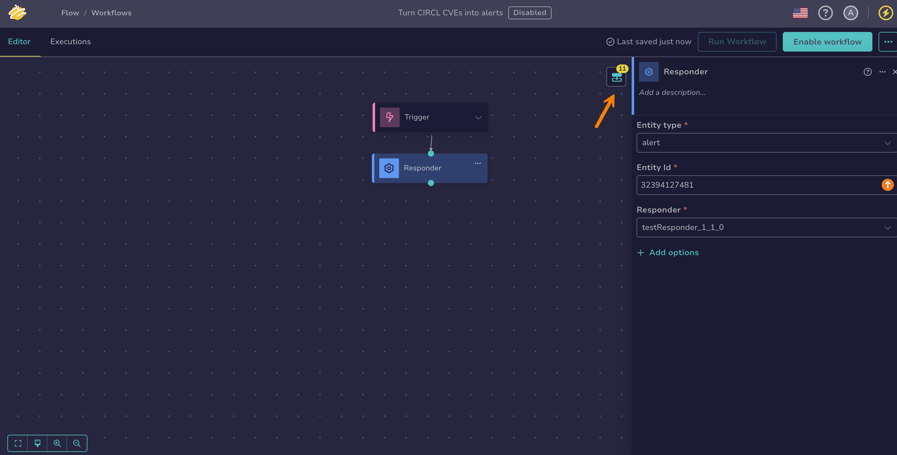
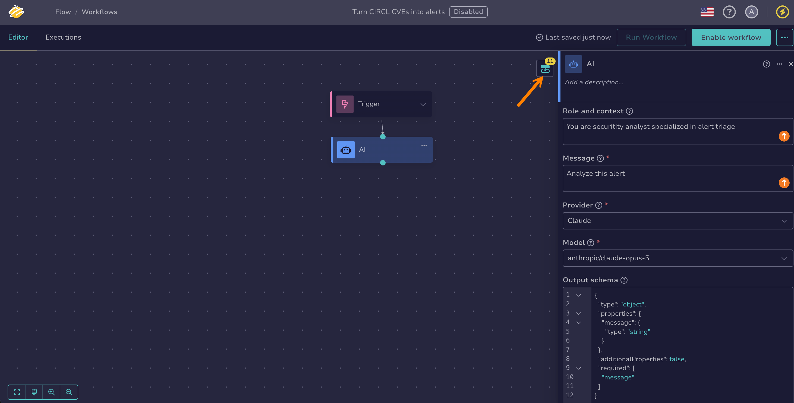

# Configure an Action Node

<!-- md:version 6.0 --> <!-- md:permission `manageOrchestrator/writeWorkflows` --> <!-- md:license One -->

Action nodes perform operations that interact with TheHive or external systems in [TheHive Flow](about-flow.md). They represent the workflow's output, creating changes in the environment or triggering downstream processes.

## Configure an *HTTP request* action node

An *HTTP request* action node sends HTTP requests to any API accessible from TheHive instance:

* ITSM tools
* Threat intelligence platforms
* Cloud services
* Another TheHive Flow workflow with its *Webhook* trigger
* [TheHive API](https://docs.strangebee.com/thehive/api-docs/), for endpoints not covered by the [*TheHive* integration node](configure-integration-node.md#configure-a-thehive-integration-node)

!!! tip "Working with TheHive"
    To create, update, or query objects in TheHive, use the [*TheHive* integration node](configure-integration-node.md#configure-a-thehive-integration-node), which exposes TheHive operations directly. Use an *HTTP request* node for TheHive API endpoints that the *TheHive* node doesn't cover, or for any other external API.

1. 

2. Select a workflow from the list.

3. Drag the previous node connector to an empty area of the canvas.

    

4. In the **What is the next step?** drawer, select **Actions**.

5. Select *HTTP request*.

6. In the **HTTP request** drawer, enter the following information:

    

    *Fields marked with \* are mandatory.*

    **- Method \***

    The HTTP method used for the request.

    **- URL \***

    The full endpoint URL.

    Examples:

    * `https://<thehive_host>/api/v1/user`
    * `https://api.abuseipdb.com/api/v2/check?ipAddress=<ip_address>`

    **- Headers**

    

    **- Body**

    

    The request body. Available for POST, PUT, PATCH, and DELETE methods.

    **- Multipart parts**

    Key-value pairs sent as a `multipart/form-data` request, one part per pair. Leave **Body** empty when using this field. A value that is a [file reference](about-flow.md#files) is streamed as a file part, and any other value is sent as a plain form field. Available for POST, PUT, PATCH, and DELETE methods.

7. Optional: Select **Add options** to configure the following settings.

    **- Authentication**

    Configure how the node authenticates when calling the API.

    !!! tip "Calling TheHive API"
        If the HTTP request targets TheHive itself, ensure that your [TheHive authentication settings](../../thehive/administration/authentication/configure-authentication.md) are compatible with the method you select in this node.

    

    **- Proxy**

    

    **- SSL**

    

    **- Timeout & retry**

    Configure how the node handles execution time limits and failure recovery.

    

    **- Execution configuration**

    

8. Optional: Turn on **Ignore HTTP errors** to make the node succeed regardless of the response status code.

    By default, the node fails when the response returns a `4xx` or `5xx` error status code. With the option on, handle errors in the workflow, for example with an [*If* flow node](configure-flow-node.md#configure-an-if-flow-node) evaluating the `code` output. Transport failures, such as DNS, connection, TLS, or timeout errors, still fail the node.

!!! info "Execution outputs"

    When executed, the node returns the following outputs. Each output is a JSON value:

    | Output    | Type   | Description                                      |
    |-----------|--------|--------------------------------------------------|
    | `body`    | object | The response body returned by the API. Not set for a multipart response: use `parts` instead. |
    | `code`    | number | The HTTP status code returned by the server.     |
    | `headers` | object | The response headers returned by the server.     |
    | `parts`   | object | The parts of a multipart response body, keyed by part name. Each part carries its `filename`, `content_type`, `size`, and `content`. Empty when the response isn't multipart. |

    A `body` that is large or binary, and a part `content` that is large or not JSON, are [stored as files](about-flow.md#files) and returned as file references. A part stored as a file also carries a `sha256sum` field, and a part name reused across parts is suffixed with `_2`, `_3`, and so on.

    To access outputs, select your *HTTP request* node and then select :fontawesome-solid-diagram-next: in the top-right corner of the screen. Hover over each output name to view its details.

    

    These outputs can then be reused as output variables in subsequent nodes, using the **$var** button or by typing `$` and selecting the output from the suggestions. Inserted references are displayed in the following form:
    
    * `$<node_name>.body.<field_name>`: to get a nested value from the response body
    * `$<node_name>.code`: to get the HTTP status code, for example to check whether the request succeeded
    * `$<node_name>.headers.<header_name>`: to get a specific response header
    * `$<node_name>.parts.<part_name>.content`: to get the content of one part of a multipart response

## Configure a *Send email* action node

A *Send email* action node sends an email using [the SMTP configuration defined in TheHive](../../thehive/administration/smtp/about-smtp.md).

!!! warning "Prerequisite"
    Before using a *Send email* action node, you must [configure an SMTP server in TheHive](../../thehive/administration/smtp/configure-smtp-server.md). The node can't send emails without a working SMTP configuration.

1. 

2. Select a workflow from the list.

3. Drag the previous node connector to an empty area of the canvas.

    

4. In the **What is the next step?** drawer, select **Actions**.

5. Select *Send email*.

6. In the **Send email** drawer, enter the following information:

    

    *Fields marked with \* are mandatory.*

    **- From \***

    The email address used as the sender.

    **- To \***

    One or more recipient addresses, separated by commas.

    **- Cc**

    Additional recipients.

    **- Bcc**

    Hidden recipients.

    **- Subject**

    The email subject.

    **- Body format**

    Choose how the message body is sent:  

    * *Text*  
    * *HTML*  
    * *Both*: Sends both versions. This is the default, and it's recommended for maximum compatibility with email clients.

    **- Text body**

    The plain text content of the email.

    **- HTML body**

    The HTML content of the email.

7. Optional: Select **Add options** to configure the following settings.

    **- Timeout & retry**

    Configure how the node handles execution time limits and failure recovery.

    

    **- Execution configuration**

    

## Configure a *Slack Send message* action node

A *Slack - Send message* action node sends a message to a Slack channel using a Slack authentication token.

1. 

2. Select a workflow from the list.

3. Drag the previous node connector to an empty area of the canvas.

    

4. In the **What is the next step?** drawer, select **Actions**.

5. Select *Slack - Send message*.

6. In the **Slack - Send message** drawer, enter the following information:

    

    *Fields marked with \* are mandatory.*

    **- Token \***

    The Slack authentication token used to send the message. You may provide either a bot token or a user token, as long as it includes the `chat:write` permission. See the [Slack token documentation](https://docs.slack.dev/authentication/tokens/){target=_blank} for details on token types and required scopes.

    **- Channel \***

    The Slack channel where the message is posted. Enter the channel ID or name.

    **- Markdown**

    Enable this option to format your message using Markdown. When turned off, the message is sent as plain text.

    **- Text \***

    The content of the message.

7. Optional: Select **Add options** to configure the following settings.

    **- Proxy**

    

    **- Timeout & retry**

    Configure how the node handles execution time limits and failure recovery.

    

    **- Execution configuration**

    

## Configure a *Teams Send message* action node

A *Teams - Send message* action node sends a message to a Microsoft Teams channel using an incoming webhook URL.

1. 

2. Select a workflow from the list.

3. Drag the previous node connector to an empty area of the canvas.

    

4. In the **What is the next step?** drawer, select **Actions**.

5. Select *Teams - Send message*.

6. In the **Teams - Send message** drawer, enter the following information:

    

    *Fields marked with \* are mandatory.*

    **- Webhook URL \***

    The Microsoft Teams incoming Webhook URL associated with the target channel. To create one, see [Microsoft official documentation on configuring incoming webhooks](https://learn.microsoft.com/en-us/microsoftteams/platform/webhooks-and-connectors/how-to/add-incoming-webhook?tabs=newteams%2Cdotnet){target=_blank}.

    **- Message \***

    The text content of the message to send. Supports a Markdown subset: `**bold**`, `*italics*`, and line breaks.

7. Optional: Select **Add options** to configure the following settings.

    **- Proxy**

    

    **- Timeout & retry**

    Configure how the node handles execution time limits and failure recovery.

    

    **- Execution configuration**

    

## Configure an *Analyzer* action node

An *Analyzer* action node triggers a [Cortex analyzer](../../thehive/administration/cortex/about-cortex.md) on a specific observable and makes the resulting report available as an output variable for use in subsequent workflow steps.

!!! warning "Prerequisite"
    To use an *Analyzer* action node, a Cortex server must already be connected to TheHive. If no Cortex instance is configured, follow the instructions in [Add a Cortex Server](../../thehive/administration/cortex/add-a-cortex-server.md) before proceeding.

1. 

2. Select a workflow from the list.

3. Drag the previous node connector to an empty area of the canvas.

    

4. In the **What is the next step?** drawer, select **Actions**.

5. Select *Analyzer*.

6. In the **Analyzer** drawer, enter the following information:

    

    *Fields marked with \* are mandatory.*

    **- Observable type \***

    The type of observable to analyze. Two input modes are available:

    * *Form*: Select the type from a list.
    * *Raw*: Provide the type with a [variable](about-flow.md#variables), when it's only known at runtime from a previous node's output.

    **- Observable ID \***

    The identifier of the observable to analyze.

    **- Analyzer \***

    Choose the Cortex analyzer to run.

    Only analyzers compatible with the selected [observable type](../../thehive/user-guides/analyst-corner/cases/observables/about-observables.md#type) are shown. The observable's [TLP](https://www.misp-project.org/taxonomies.html#_tlp){target=_blank} and [PAP](https://www.misp-project.org/taxonomies.html#_pap){target=_blank} levels are checked at execution time: if they aren't compatible with the analyzer, Cortex returns an error and the node fails.

    The list covers the analyzers of every Cortex instance connected to the organization. You don't select the instance: the node derives it from the analyzer you choose. When several instances host the same analyzer, the node uses the first one and gives no way to choose another. To target a specific instance, use the [*TheHive*](configure-integration-node.md#configure-a-thehive-integration-node) integration node with the *Run Analyzer on Observable* action, which takes the Cortex instance identifier as a value.

7. Optional: Select **Add options** to configure the following settings.

    **- Timeout & retry**

    Configure how the node handles execution time limits and failure recovery.

    

    **- Execution configuration**

    

!!! info "Execution output"

    When executed, the node runs the selected analyzer on the observable. The analyzer’s report is available as an output object.

    To access the output, select your *Analyzer* node and then select :fontawesome-solid-diagram-next: in the top-right corner of the screen. Hover over the output name to view its details.

    

    This output can then be reused as an output variable in subsequent nodes, using the **$var** button or by typing `$` and selecting the output from the suggestions. The inserted reference is displayed as `$<node_name>.analyzer_report`.
    
    It contains the full report returned by Cortex, in the format specific to the analyzer that was run. Use a [*Set local variable*](configure-transformation-node.md#configure-a-set-local-variable-node) node, a [*JavaScript code*](configure-transformation-node.md#configure-a-javascript-code-node) node, or a [*Python code*](configure-transformation-node.md#configure-a-python-code-node) node to extract specific fields from it.

## Configure a *Responder* action node

A *Responder* action node triggers a [Cortex responder](../../thehive/administration/cortex/about-cortex.md) on a specific [alert](../../thehive/user-guides/analyst-corner/alerts/about-alerts.md), [case](../../thehive/user-guides/analyst-corner/cases/about-cases.md), [observable](../../thehive/user-guides/analyst-corner/cases/observables/about-observables.md), [task](../../thehive/user-guides/analyst-corner/tasks/about-tasks.md), or [task log](../../thehive/user-guides/analyst-corner/tasks/about-task-logs.md). When the node runs, it executes the selected responder and makes the resulting report available as an output variable for use in subsequent workflow steps.

!!! warning "Prerequisite"
    To use a *Responder* action node, a Cortex server must already be connected to TheHive. If no Cortex instance is configured, follow the instructions in [Add a Cortex Server](../../thehive/administration/cortex/add-a-cortex-server.md) before proceeding.

1. 

2. Select a workflow from the list.

3. Drag the previous node connector to an empty area of the canvas.

    

4. In the **What is the next step?** drawer, select **Actions**.

5. Select *Responder*.

6. In the **Responder** drawer, enter the following information:

    

    *Fields marked with \* are mandatory.*

    **- Entity type \***

    The type of entity on which the responder should run: an [alert](../../thehive/user-guides/analyst-corner/alerts/about-alerts.md) (`alert`), a [case](../../thehive/user-guides/analyst-corner/cases/about-cases.md) (`case`), an [observable](../../thehive/user-guides/analyst-corner/cases/observables/about-observables.md) (`case_artifact`), a [task](../../thehive/user-guides/analyst-corner/tasks/about-tasks.md) (`case_task`), or a [task log](../../thehive/user-guides/analyst-corner/tasks/about-task-logs.md) (`case_task_log`).

    Two input modes are available:

    * *Form*: Select the type from a list. The list is built from the entity types declared by the responders of the connected Cortex instances, so a type appears only when at least one enabled responder supports it.
    * *Raw*: Enter the type directly or provide it with a [variable](about-flow.md#variables), when it's only known at runtime from a previous node's output or missing from the list.

    **- Entity ID \***

    The identifier of the entity to process.

    **- Responder \***

    Choose the Cortex responder to execute.

    Only responders compatible with the selected entity type are shown. The entity's [TLP](https://www.misp-project.org/taxonomies.html#_tlp){target=_blank} and [PAP](https://www.misp-project.org/taxonomies.html#_pap){target=_blank} levels are checked at execution time: if they aren't compatible with the responder, Cortex returns an error and the node fails.

7. Optional: Select **Add options** to configure the following settings.

    **- Timeout & retry**

    Configure how the node handles execution time limits and failure recovery.

    

    **- Execution configuration**

    

!!! info "Execution output"

    When executed, the node runs the selected responder on the selected alert, case, observable, or task. The responder’s report is available as an output object.

    To access the output, select your *Responder* node and then select :fontawesome-solid-diagram-next: in the top-right corner of the screen. Hover over the output name to view its details.

    

    This output can then be reused as an output variable in subsequent nodes, using the **$var** button or by typing `$` and selecting the output from the suggestions. The inserted reference is displayed as `$<node_name>.responder_report`.
    
    It contains the full report returned by Cortex, in the format specific to the responder that was run. Use a [*Set local variable*](configure-transformation-node.md#configure-a-set-local-variable-node) node, a [*JavaScript code*](configure-transformation-node.md#configure-a-javascript-code-node) node, or a [*Python code*](configure-transformation-node.md#configure-a-python-code-node) node to extract specific fields from it.

## Configure an *AI* action node

An *AI* action node sends a message to a large language model (LLM) and returns its response. Use it to triage alerts, summarize case data, classify observables, or draft content as part of a workflow. The node calls an OpenAI-compatible [LLM provider configured by your administrator](../../thehive/administration/manage-llm-providers.md).

!!! warning "Prerequisite"
    An administrator must [configure at least one LLM provider](../../thehive/administration/manage-llm-providers.md) before using an *AI* action node.

1. 

2. Select a workflow from the list.

3. Drag the previous node connector to an empty area of the canvas.

    

4. In the **What is the next step?** drawer, select **Actions**.

5. Select *AI*.

6. In the **AI** drawer, enter the following information:

    

    *Fields marked with \* are mandatory.*

    **- Role and context**

    Defines the posture and context the AI adopts. For example: `You are a security analyst specialized in alert triage.`

    **- Message \***

    The concrete instruction to execute. Phrase the request here and inject the data to analyze from upstream nodes, for example `Analyze this alert and decide whether to escalate or discard: $input.alert`.

    **- Provider \***

    The LLM provider to use. Available providers depend on the [configuration set by your administrator](../../thehive/administration/manage-llm-providers.md).

    **- Model \***

    The model that generates the response, selected from the models available for the chosen provider.

    **- Output schema**

    A JSON schema describing the expected output structure. When set, the AI constrains its response to match the schema, so downstream nodes can consume the fields individually. The field opens pre-filled with a schema declaring a single `message` string field. You can clear it: when the field is empty, no `result` output is produced and only the raw `response` text is available.

7. Optional: Select **Add options** to configure the following sections.

    **- Model parameters**

    **Temperature**: Controls how random the response is, from `0` to `2`. Lower values make the response more focused and deterministic. Higher values make it more varied. Leave empty to use the model default.

    **Max tokens**: The maximum number of tokens in the response. Leave empty to use the provider default.

    **Reasoning effort**: How much reasoning the model spends before answering: *None*, *Minimal*, *Low*, *Medium*, *High*, *Extra high*, or *Max*. *None* turns reasoning off, and the levels a model accepts depend on the provider. Leave empty to use the configuration default, then the provider default.

    **- Timeout & retry**

    Configure how the node handles execution time limits and failure recovery.

    

    **- Execution configuration**

    

!!! info "Execution outputs"

    When executed, the node returns the following outputs. Each output is a JSON value:

    | Output          | Type   | Description                                                                 |
    |-----------------|--------|-----------------------------------------------------------------------------|
    | `response`      | string | The raw text response from the LLM.                                         |
    | `result`        | object | The parsed structured output. Present only when an output schema is set. |
    | `message`       | object | The raw assistant message returned by the LLM, including reasoning content when the model provides it. |
    | `tool_calls`    | array  | The tool calls requested by the model, when the LLM answers with tool calls instead of text. |
    | `finish_reason` | string | The reason the LLM stopped generating, for example `stop`, `length`, `tool_calls`, or `content_filter`. |
    | `usage`         | object | Token usage for the call: `prompt_tokens`, `completion_tokens`, and `total_tokens`. |

    To access outputs, select your *AI* node and then select :fontawesome-solid-diagram-next: in the top-right corner of the screen. Hover over each output name to view its details.

    

    These outputs can then be reused as output variables in subsequent nodes, using the **$var** button or by typing `$` and selecting the output from the suggestions. Inserted references are displayed in the following form:

    * `$<node_name>.response`: to get the text response
    * `$<node_name>.result.<field_name>`: to get a field from the structured output when an output schema is set
    * `$<node_name>.finish_reason`: to check why the LLM stopped generating, for example in an *If* condition
    * `$<node_name>.usage.total_tokens`: to get the total token usage of the call

<h2>Next steps</h2>

* [Manage Global Variables](manage-global-variables.md)
* [Add a Trigger](add-trigger.md)
* [Configure an Integration Node](configure-integration-node.md)
* [Configure a Transformation Node](configure-transformation-node.md)
* [Configure a Flow Node](configure-flow-node.md)
* [Manually Run a Workflow](manually-run-workflow.md)