# Configure an Integration Node

<!-- md:version 6.0 --> <!-- md:permission `manageOrchestrator/writeWorkflows` --> <!-- md:license One -->

Integration nodes perform operations in TheHive or third-party products in [TheHive Flow](about-flow.md). Each integration node targets one product API and exposes its operations as dedicated actions selected within the node.

## Configure a *TheHive* integration node

A *TheHive* integration node performs operations in TheHive through [TheHive API](https://docs.strangebee.com/thehive/api-docs/): it can create, retrieve, update, and delete cases, alerts, tasks, observables, comments, and task logs, merge an alert into a case, or run a custom query. Each operation is a dedicated action selected within the node. The node can target the local TheHive instance or any other reachable TheHive instance.

1. 

2. Select a workflow from the list.

3. Drag the previous node connector to an empty area of the canvas.

    

4. In the **What is the next step?** drawer, select **Integrations**.

5. Select *TheHive*.

6. In the **TheHive** drawer, enter the following information:

    

    *Fields marked with \* are mandatory.*

    **- Base URL \***

    The URL of TheHive instance to call, for example `https://<thehive_host>`.

    **- Authentication (bearer token) \***

    In the **Authentication** section, provide the [API key](../../thehive/user-guides/organization/configure-organization/manage-user-accounts/manage-user-accounts.md#manage-a-user-account-api-key) used to authenticate the request.

    **- Organization**

    The organization the action runs in, sent as the `X-Organisation` header with every action. If left empty, the action runs in the default organization of the user.

    **- Headers**

    

    **- Action \***

    The operation to perform in TheHive. Available actions:

    | Family | Actions |
    | --- | --- |
    | Cases | *Create Case*, *Get Case*, *Update Case*, *Close Case*, *Delete Case* |
    | Alerts | *Create Alert*, *Get Alert*, *Update Alert*, *Delete Alert*, *Merge Alert with Case* |
    | Tasks | *Create Task in Case*, *Get Task*, *Update Task*, *Delete Task* |
    | Observables | *Create Observable in Case*, *Create Observable in Alert*, *Get Observable*, *Update Observable*, *Delete Observable* |
    | Comments | *Create Comment in Case*, *Create Comment in Alert*, *Update Comment*, *Delete Comment* |
    | Task Logs | *Create Task Log*, *Update Task Log* |
    | Queries | *Post Query* |
    | Cortex | *Run Analyzer on Observable*, *Run Responder* |

    After you select an action, the drawer displays the fields specific to that action. For the meaning and format of each field, see [TheHive API documentation](https://docs.strangebee.com/thehive/api-docs/).

    !!! tip "The Cortex actions compared to the *Analyzer* and *Responder* nodes"
        The *Run Analyzer on Observable* and *Run Responder* actions start a Cortex job through TheHive API. *Run Analyzer on Observable* requires the analyzer, Cortex instance, and observable identifiers. *Run Responder* requires the responder identifier and the entity's type and identifier. Both return the API response rather than the Cortex report.

        To pick an analyzer or a responder from a list filtered by observable or entity type, and to get the report itself as an output, use the [*Analyzer*](configure-action-node.md#configure-an-analyzer-action-node) or [*Responder*](configure-action-node.md#configure-a-responder-action-node) action node instead.

    **- Editor mode**

    For actions that send a request body, choose how to provide it:

    * *Form*: Fill in one field per body parameter.
    * *Raw*: Provide the whole request body in the **Request body (raw)** field.

    **- Query parameters**

    Optional query parameters sent with the request, entered as key-value pairs. Select :fontawesome-solid-plus: to add a parameter. This section appears only for actions that accept query parameters.

    !!! note "The *Post Query* action"
        The *Post Query* action runs a TheHive query: an array of chained operations that search, filter, sort, and paginate data across any entity type. A pipeline starts with a primary operation that defines the initial set of entities, then optionally chains a related object operation to navigate to associated entities, filter and sort steps to narrow and order the results, and a page step to paginate. Provide the pipeline in the **Query** field as a JSON array.
        
        For example, this query returns the first five in-progress tasks of case `~1234`, sorted by due date from earliest to latest, with the assigned case template and the total count:

        ```json
        [
          {"_name": "getCase", "idOrName": "~1234"},
          {"_name": "tasks"},
          {
            "_name": "filter",
            "_eq": {"_field": "status", "_value": "InProgress"}
          },
          {
            "_name": "sort",
            "_fields": [{"dueDate": "asc"}]
          },
          {
            "_name": "page",
            "from": 0,
            "to": 5,
            "extraData": ["caseTemplate", "total"]
          }
        ]
        ```

        For the full list of operations, filters, and computed fields, see [Query and Export](https://docs.strangebee.com/thehive/api-docs/#tag/Query-and-Export){target=_blank} in TheHive API documentation.

7. Optional: Configure the following settings.

    **- SSL/TLS**

    

    **- Proxy**

    

    **- Error handling**

    

8. Optional: Select **Add options** to configure the following settings.

    **- Timeout & retry**

    Configure how the node handles execution time limits and failure recovery.

    

    **- Execution configuration**

    

!!! info "Execution outputs"

    When executed, the node returns the following outputs. Each output is a JSON value:

    | Output    | Type   | Description                                          |
    |-----------|--------|--------------------------------------------|
    | `body`    | object | The response body returned by TheHive API. |
    | `code`    | number | The HTTP status code returned by TheHive.  |
    | `headers` | object | The response headers returned by TheHive.  |

    To access outputs, select your *TheHive* node and then select :fontawesome-solid-diagram-next: in the top-right corner of the screen. Hover over each output name to view its details.

    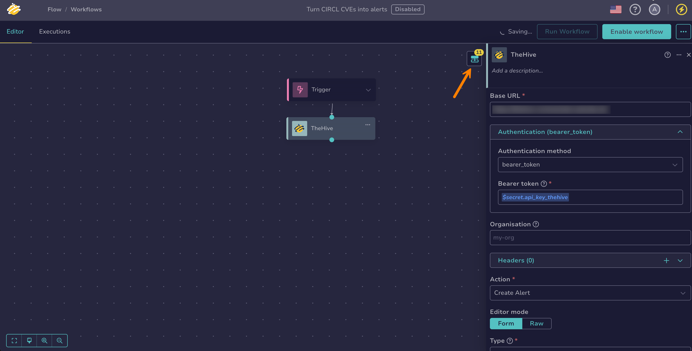

    These outputs can then be reused as output variables in subsequent nodes, using the **$var** button or by typing `$` and selecting the output from the suggestions. Inserted references are displayed in the following form:

    * `$<node_name>.body.<field_name>`: to get a value from the response body, for example the identifier of a created case
    * `$<node_name>.code`: to get the HTTP status code, for example to check whether the request succeeded
    * `$<node_name>.headers.<header_name>`: to get a specific response header

## Configure a *Splunk* integration node

A *Splunk* integration node runs operations against the [Splunk REST API](https://help.splunk.com/en/splunk-enterprise/leverage-rest-apis/rest-api-reference){target=_blank}: it can create and follow search jobs, run searches, list indexes, list fired alerts, submit events, and update Splunk Enterprise Security findings and investigations. Each operation is a dedicated action selected within the node.

1. 

2. Select a workflow from the list.

3. Drag the previous node connector to an empty area of the canvas.

    

4. In the **What is the next step?** drawer, select **Integrations**.

5. Select *Splunk*.

6. In the **Splunk** drawer, enter the following information:

    

    *Fields marked with \* are mandatory.*

    **- Base URL \***

    The URL of the Splunk management API.

    **- Authentication \***

    In the **Authentication** section, select the **Authentication method** and provide its credentials. The *Splunk* node supports two methods:

    | Authentication method | Fields |
    | --- | --- |
    | *basic_auth* (default) | **Username \***, **Password** |
    | *bearer_token* | **Bearer token \*** |

    Use *bearer_token* with a Splunk authentication token or session key.

    **- Headers**

    

    **- Action \***

    The operation to perform in Splunk. Available actions:

    | Family | Actions |
    | --- | --- |
    | Search Jobs | *Create Search Job*, *Get Search Job Status*, *Get Search Results*, *Cancel Search Job* |
    | Search | *Run Search (Export)*, *Parse Search* |
    | Indexes | *List Indexes* |
    | Alerts | *List Fired Alerts* |
    | Events | *Submit Event* |
    | Enterprise Security | *Edit Finding*, *Update Investigation*, *Edit Notable Event (ES 7.x classic)* |

    After you select an action, the drawer displays the fields specific to that action. For the meaning and format of each field, see the [Splunk REST API reference](https://help.splunk.com/en/splunk-enterprise/leverage-rest-apis/rest-api-reference){target=_blank}.

    !!! note "Enterprise Security actions"
        *Edit Finding* and *Update Investigation* target the Splunk Enterprise Security 8.x Mission Control public API. *Edit Finding* updates a finding, formerly called a notable event, so the change appears in the Analyst Queue.

        *Edit Notable Event (ES 7.x classic)* updates notable events on Splunk Enterprise Security 7.x and earlier. Splunk can reject individual events inside a successful response, so the node succeeds even when an update is rejected: check the `success` field of the `body` output.

    **- Editor mode**

    For actions that send a request body, choose how to provide it:

    * *Form*: Fill in one field per body parameter.
    * *Raw*: Provide the whole request body in the **Request body (raw)** field.

    **- Query parameters**

    Optional query parameters sent with the request, entered as key-value pairs. Select :fontawesome-solid-plus: to add a parameter. This section appears only for actions that accept query parameters.

7. Optional: Configure the following settings.

    **- Proxy**

    

    **- SSL/TLS**

    

    **- Error handling**

    

8. Optional: Select **Add options** to configure the following settings.

    **- Timeout & retry**

    Configure how the node handles execution time limits and failure recovery.

    

    **- Execution configuration**

    

!!! info "Execution outputs"

    When executed, the node returns the following outputs. Each output is a JSON value:

    | Output    | Type   | Description                                      |
    |-----------|--------|--------------------------------------------------|
    | `body`    | object | The response body returned by Splunk. For the search actions, select `json` in the **Output format** field: an XML or CSV body is a single string that downstream nodes can't navigate. |
    | `code`    | number | The HTTP status code returned by Splunk.         |
    | `headers` | object | The response headers returned by Splunk.         |

    To access outputs, select your *Splunk* node and then select :fontawesome-solid-diagram-next: in the top-right corner of the screen. Hover over each output name to view its details.

    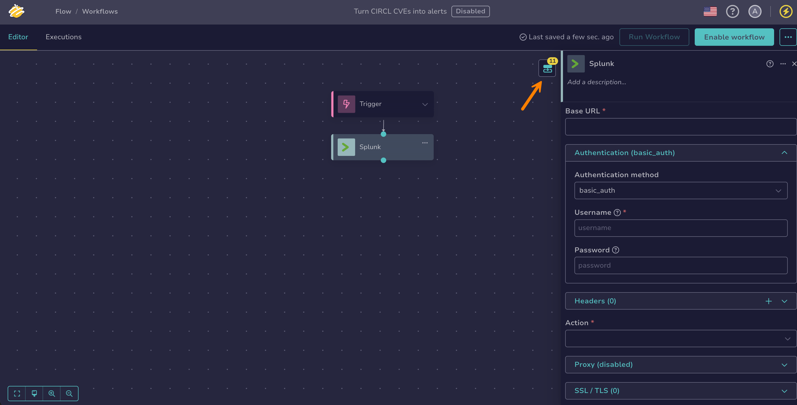

    These outputs can then be reused as output variables in subsequent nodes, using the **$var** button or by typing `$` and selecting the output from the suggestions. Inserted references are displayed in the following form:

    * `$<node_name>.body.<field_name>`: to get a value from the response body, for example the search job identifier returned by *Create Search Job*
    * `$<node_name>.code`: to get the HTTP status code, for example to check whether the request succeeded
    * `$<node_name>.headers.<header_name>`: to get a specific response header

## Configure a *Microsoft Defender for Endpoint* integration node

A *Microsoft Defender for Endpoint* integration node runs operations against the [Microsoft Defender for Endpoint API](https://learn.microsoft.com/en-us/defender-endpoint/api/apis-intro){target=_blank}: it can list, retrieve, and update alerts, run response actions on devices, and create indicators. Each operation is a dedicated action selected within the node.

!!! tip "Choosing between the two Defender nodes"
    Use this node for device response actions and indicators, which the Graph security API doesn't cover. For alerts, prefer the [*Microsoft Defender (Graph Security API)*](#configure-a-microsoft-defender-graph-security-api-integration-node) node: it exposes the `alerts_v2` surface that supersedes the alerts endpoint of this node, along with incidents, which this node doesn't cover.

1. 

2. Select a workflow from the list.

3. Drag the previous node connector to an empty area of the canvas.

    

4. In the **What is the next step?** drawer, select **Integrations**.

5. Select *Microsoft Defender for Endpoint*.

6. In the **Microsoft Defender for Endpoint** drawer, enter the following information:

    

    *Fields marked with \* are mandatory.*

    **- Base URL \***

    The URL of the Defender for Endpoint API: `https://api.security.microsoft.com`. The legacy host `https://api.securitycenter.microsoft.com` is also accepted.

    **- Authentication \***

    In the **Authentication** section, provide the Microsoft Entra ID application credentials. The node authenticates with the OAuth 2.0 client credentials flow, so **Authentication method** is set to *oauth2_client_credentials*:

    | Field | Example |
    | --- | --- |
    | Client ID \* | `$global.defender_client_id` |
    | Client secret \* | `$secret.defender_client_secret` |
    | Token URL \* | `https://login.microsoftonline.com/<tenant>/oauth2/v2.0/token` |
    | Token scopes | `https://api.securitycenter.microsoft.com/.default` |

    !!! warning "The token scope differs from the base URL"
        Request the token for the `https://api.securitycenter.microsoft.com/.default` scope even when the **Base URL** is `https://api.security.microsoft.com`. Defender rejects tokens issued for another resource with a `401` or `403` response.

    **- Headers**

    

    **- Action \***

    The operation to perform in Defender for Endpoint. Available actions:

    | Family | Actions |
    | --- | --- |
    | Alerts | *List Alerts*, *Get Alert by ID*, *Update Alert* |
    | Machine Actions | *Isolate Machine*, *Release Machine from Isolation*, *Run Antivirus Scan*, *Stop and Quarantine File*, *Get Machine Action* |
    | Indicators | *Create Indicator* |
    | Files | *Get File Information* |

    After you select an action, the drawer displays the fields specific to that action. For the meaning and format of each field, see the [Microsoft Defender for Endpoint API documentation](https://learn.microsoft.com/en-us/defender-endpoint/api/apis-intro){target=_blank}.

    !!! note "Machine actions require a comment"
        Every response action in the Machine Actions family requires a **Comment**, which Defender records with the response action. *Run Antivirus Scan* also requires a **Scan type** of `Quick` or `Full`. Response actions run asynchronously in Defender: use *Get Machine Action* with the identifier they return to follow their status.

    **- Editor mode**

    For actions that send a request body, choose how to provide it:

    * *Form*: Fill in one field per body parameter.
    * *Raw*: Provide the whole request body in the **Request body (raw)** field.

    **- Query parameters**

    Optional query parameters sent with the request, entered as key-value pairs. Select :fontawesome-solid-plus: to add a parameter. This section appears only for actions that accept query parameters.

7. Optional: Configure the following settings.

    **- Proxy**

    

    **- SSL/TLS**

    

    **- Error handling**

    

8. Optional: Select **Add options** to configure the following settings.

    **- Timeout & retry**

    Configure how the node handles execution time limits and failure recovery.

    

    **- Execution configuration**

    

!!! info "Execution outputs"

    When executed, the node returns the following outputs. Each output is a JSON value:

    | Output    | Type   | Description                                            |
    |-----------|--------|--------------------------------------------------------|
    | `body`    | object | The response body returned by Defender for Endpoint.   |
    | `code`    | number | The HTTP status code returned by Defender for Endpoint. |
    | `headers` | object | The response headers returned by Defender for Endpoint. |

    To access outputs, select your *Microsoft Defender for Endpoint* node and then select :fontawesome-solid-diagram-next: in the top-right corner of the screen. Hover over each output name to view its details.

    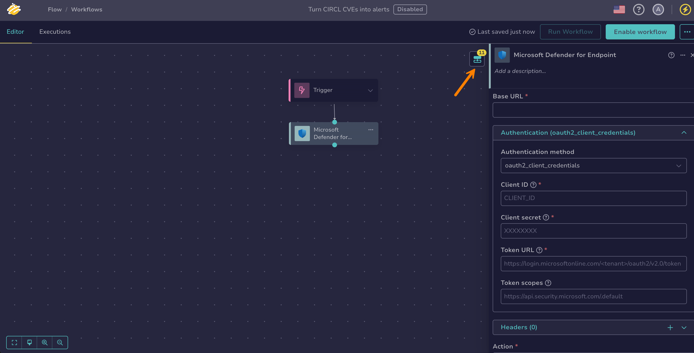

    These outputs can then be reused as output variables in subsequent nodes, using the **$var** button or by typing `$` and selecting the output from the suggestions. Inserted references are displayed in the following form:

    * `$<node_name>.body.<field_name>`: to get a value from the response body, for example the identifier of a created indicator
    * `$<node_name>.code`: to get the HTTP status code, for example to check whether the request succeeded
    * `$<node_name>.headers.<header_name>`: to get a specific response header

## Configure a *Microsoft Defender (Graph Security API)* integration node

A *Microsoft Defender (Graph Security API)* integration node runs operations against the [Microsoft Graph security API](https://learn.microsoft.com/en-us/graph/api/resources/security-api-overview?view=graph-rest-1.0){target=_blank}: it can list, retrieve, and update Microsoft Defender XDR alerts and incidents. Each operation is a dedicated action selected within the node.

!!! tip "Choosing between the two Defender nodes"
    Use this node for the Graph security API, which exposes incidents and the `alerts_v2` surface that supersedes the legacy Defender for Endpoint alerts. Use the [*Microsoft Defender for Endpoint*](#configure-a-microsoft-defender-for-endpoint-integration-node) node for device response actions and indicators, which the Graph security API doesn't cover.

1. 

2. Select a workflow from the list.

3. Drag the previous node connector to an empty area of the canvas.

    

4. In the **What is the next step?** drawer, select **Integrations**.

5. Select *Microsoft Defender (Graph Security API)*.

6. In the **Microsoft Defender (Graph Security API)** drawer, enter the following information:

    

    *Fields marked with \* are mandatory.*

    **- Base URL \***

    The URL of Microsoft Graph: `https://graph.microsoft.com`. The node targets the `v1.0` version of the API.

    **- Authentication \***

    In the **Authentication** section, provide the Microsoft Entra ID application credentials. The node authenticates with the OAuth 2.0 client credentials flow, so **Authentication method** is set to *oauth2_client_credentials*:

    | Field | Example |
    | --- | --- |
    | Client ID \* | `$global.graph_client_id` |
    | Client secret \* | `$secret.graph_client_secret` |
    | Token URL \* | `https://login.microsoftonline.com/<tenant>/oauth2/v2.0/token` |
    | Token scopes | `https://graph.microsoft.com/.default` |

    !!! warning "Prerequisite"
        Grant the application the Microsoft Graph permissions matching the actions you use: `SecurityAlert.Read.All` or `SecurityAlert.ReadWrite.All` for alerts, and `SecurityIncident.Read.All` or `SecurityIncident.ReadWrite.All` for incidents. The read-only permission covers the list and get actions. The update actions need the read-write permission.

    **- Headers**

    

    **- Action \***

    The operation to perform through the Graph security API. Available actions:

    | Family | Actions |
    | --- | --- |
    | Alerts | *List Alerts*, *Get Alert by ID*, *Update Alert* |
    | Incidents | *List Incidents*, *Get Incident by ID*, *Update Incident* |

    After you select an action, the drawer displays the fields specific to that action. For the meaning and format of each field, see the [Microsoft Graph security API documentation](https://learn.microsoft.com/en-us/graph/api/resources/security-api-overview?view=graph-rest-1.0){target=_blank}.

    !!! note "Graph enumeration values are lowercase"
        The Graph security API uses lowercase values, such as `new`, `inProgress`, and `resolved` for a status, and `truePositive` or `falsePositive` for a classification. The Defender for Endpoint API uses capitalized values for the same concepts. Match the casing of the node you're configuring.

    **- Editor mode**

    For actions that send a request body, choose how to provide it:

    * *Form*: Fill in one field per body parameter.
    * *Raw*: Provide the whole request body in the **Request body (raw)** field.

    **- Query parameters**

    Optional query parameters sent with the request, entered as key-value pairs. Select :fontawesome-solid-plus: to add a parameter. This section appears only for actions that accept query parameters.

7. Optional: Configure the following settings.

    **- Proxy**

    

    **- SSL/TLS**

    

    **- Error handling**

    

8. Optional: Select **Add options** to configure the following settings.

    **- Timeout & retry**

    Configure how the node handles execution time limits and failure recovery.

    

    **- Execution configuration**

    

!!! info "Execution outputs"

    When executed, the node returns the following outputs. Each output is a JSON value:

    | Output    | Type   | Description                                          |
    |-----------|--------|------------------------------------------------------|
    | `body`    | object | The response body returned by Microsoft Graph.       |
    | `code`    | number | The HTTP status code returned by Microsoft Graph.    |
    | `headers` | object | The response headers returned by Microsoft Graph.    |

    To access outputs, select your *Microsoft Defender (Graph Security API)* node and then select :fontawesome-solid-diagram-next: in the top-right corner of the screen. Hover over each output name to view its details.

    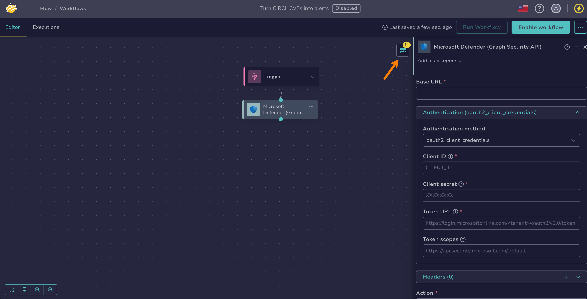

    These outputs can then be reused as output variables in subsequent nodes, using the **$var** button or by typing `$` and selecting the output from the suggestions. Inserted references are displayed in the following form:

    * `$<node_name>.body.<field_name>`: to get a value from the response body, for example the identifier of an incident
    * `$<node_name>.code`: to get the HTTP status code, for example to check whether the request succeeded
    * `$<node_name>.headers.<header_name>`: to get a specific response header

## Configure a *Microsoft Entra ID* integration node

A *Microsoft Entra ID* integration node runs operations against the [Microsoft Graph API](https://learn.microsoft.com/en-us/graph/use-the-api?view=graph-rest-1.0){target=_blank}: it can look up users and their licenses, group memberships, MFA methods, and directory roles, list sign-ins, directory audit logs, managed devices, and risk detections, and take account actions such as disabling a user, revoking sessions, or forcing a password reset. Each operation is a dedicated action selected within the node.

1. 

2. Select a workflow from the list.

3. Drag the previous node connector to an empty area of the canvas.

    

4. In the **What is the next step?** drawer, select **Integrations**.

5. Select *Microsoft Entra ID*.

6. In the **Microsoft Entra ID** drawer, enter the following information:

    

    *Fields marked with \* are mandatory.*

    **- Base URL \***

    The URL of Microsoft Graph: `https://graph.microsoft.com`. The node targets the `v1.0` version of the API.

    **- Authentication \***

    In the **Authentication** section, provide the Microsoft Entra ID application credentials. The node authenticates with the OAuth 2.0 client credentials flow, so **Authentication method** is set to *oauth2_client_credentials*:

    | Field | Example |
    | --- | --- |
    | Client ID \* | `$global.entra_client_id` |
    | Client secret \* | `$secret.entra_client_secret` |
    | Token URL \* | `https://login.microsoftonline.com/<tenant>/oauth2/v2.0/token` |
    | Token scopes | `https://graph.microsoft.com/.default` |

    !!! warning "Prerequisite"
        Grant the application the Microsoft Graph application permissions matching the actions you use. The required permission varies per action—for example, reading user profiles, sign-in logs, or managed devices each needs its own permission. See the [Microsoft Graph permissions reference](https://learn.microsoft.com/en-us/graph/permissions-reference){target=_blank}.

    **- Headers**

    

    **- Action \***

    The operation to perform in Microsoft Entra ID. Available actions:

    | Family | Actions |
    | --- | --- |
    | Users | *Resolve User GUID*, *Get User*, *Get User License Details*, *Get User Group Memberships*, *Get User MFA Methods*, *Get User Directory Roles* |
    | Sign-Ins | *List Sign-Ins* |
    | Audit Logs | *List Directory Audit Logs* |
    | Devices | *List Managed Devices* |
    | Identity Protection | *List Risk Detections* |
    | Account Actions | *Enable User*, *Disable User*, *Revoke Sign-In Sessions*, *Force Password Reset*, *Force Password Reset (with MFA)* |

    After you select an action, the drawer displays the fields specific to that action. For the meaning and format of each field, see the [Microsoft Graph API documentation](https://learn.microsoft.com/en-us/graph/use-the-api?view=graph-rest-1.0){target=_blank}.

    !!! note "Identifying users"
        Actions that take a user identifier accept either the object ID (GUID) or the user principal name (UPN)—but not an email address. When a user's email address differs from their UPN, addressing them by email fails with a `404` response. Use *Resolve User GUID* to resolve an email address or alias to the object ID, and before *List Risk Detections*, which accepts only the GUID.

    **- Editor mode**

    For actions that send a request body, choose how to provide it:

    * *Form*: Fill in one field per body parameter.
    * *Raw*: Provide the whole request body in the **Request body (raw)** field.

    **- Query parameters**

    Optional query parameters sent with the request, entered as key-value pairs. Select :fontawesome-solid-plus: to add a parameter. This section appears only for actions that accept query parameters.

7. Optional: Configure the following settings.

    **- Proxy**

    

    **- SSL/TLS**

    

    **- Error handling**

    

8. Optional: Select **Add options** to configure the following settings.

    **- Timeout & retry**

    Configure how the node handles execution time limits and failure recovery.

    

    **- Execution configuration**

    

!!! info "Execution outputs"

    When executed, the node returns the following outputs. Each output is a JSON value:

    | Output    | Type   | Description                                          |
    |-----------|--------|------------------------------------------------------|
    | `body`    | object | The response body returned by Microsoft Graph.       |
    | `code`    | number | The HTTP status code returned by Microsoft Graph.    |
    | `headers` | object | The response headers returned by Microsoft Graph.    |

    To access outputs, select your *Microsoft Entra ID* node and then select :fontawesome-solid-diagram-next: in the top-right corner of the screen. Hover over each output name to view its details.

    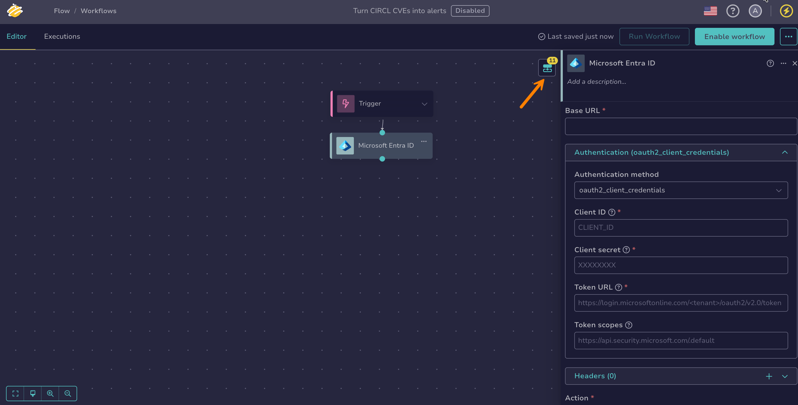

    These outputs can then be reused as output variables in subsequent nodes, using the **$var** button or by typing `$` and selecting the output from the suggestions. Inserted references are displayed in the following form:

    * `$<node_name>.body.<field_name>`: to get a value from the response body, for example a user's object ID
    * `$<node_name>.code`: to get the HTTP status code, for example to check whether the request succeeded
    * `$<node_name>.headers.<header_name>`: to get a specific response header

## Configure a *Microsoft Sentinel* integration node

A *Microsoft Sentinel* integration node runs operations against the [Microsoft Sentinel REST API](https://learn.microsoft.com/en-us/rest/api/securityinsights/){target=_blank}: it can retrieve, list, and update incidents, list and add incident comments, list incident relations, entities, and alerts, and list or write watchlists. Each operation is a dedicated action selected within the node.

1. 

2. Select a workflow from the list.

3. Drag the previous node connector to an empty area of the canvas.

    

4. In the **What is the next step?** drawer, select **Integrations**.

5. Select *Microsoft Sentinel*.

6. In the **Microsoft Sentinel** drawer, enter the following information:

    

    *Fields marked with \* are mandatory.*

    **- Base URL \***

    The URL of the Azure Resource Manager API, which serves the Microsoft Sentinel endpoints: `https://management.azure.com`.

    **- Authentication \***

    In the **Authentication** section, provide the Microsoft Entra ID application credentials. The node authenticates with the OAuth 2.0 client credentials flow, so **Authentication method** is set to *oauth2_client_credentials*:

    | Field | Example |
    | --- | --- |
    | Client ID \* | `$global.sentinel_client_id` |
    | Client secret \* | `$secret.sentinel_client_secret` |
    | Token URL \* | `https://login.microsoftonline.com/<tenant>/oauth2/v2.0/token` |
    | Token scopes | `https://management.azure.com/.default` |

    !!! warning "The token scope is the Azure Resource Manager resource"
        Request the token for the `https://management.azure.com/.default` scope. A token issued for another Microsoft resource is rejected with a `401` response.

    !!! warning "Prerequisite"
        The application registration needs an Azure RBAC role on the Sentinel workspace: *Microsoft Sentinel Reader* for the get and list actions, *Microsoft Sentinel Responder* to update incidents or write watchlists.

    **- Headers**

    

    **- Action \***

    The operation to perform in Microsoft Sentinel. Available actions:

    | Family | Actions |
    | --- | --- |
    | Incidents | *Get Incident by ID*, *List Incidents*, *Update Incident*, *List Incident Comments*, *Create or Update Incident Comment*, *List Incident Relations*, *List Incident Entities*, *List Incident Alerts* |
    | Watchlists | *List Watchlists*, *Create or Update Watchlist* |

    After you select an action, the drawer displays the fields specific to that action. Every action targets a Sentinel workspace, identified by its subscription ID, resource group, and workspace name. For the meaning and format of each field, see the [Microsoft Sentinel REST API documentation](https://learn.microsoft.com/en-us/rest/api/securityinsights/){target=_blank}.

    **- Editor mode**

    For actions that send a request body, choose how to provide it:

    * *Form*: Fill in one field per body parameter.
    * *Raw*: Provide the whole request body in the **Request body (raw)** field.

    **- Query parameters**

    Optional query parameters sent with the request, entered as key-value pairs. Select :fontawesome-solid-plus: to add a parameter. This section appears only for actions that accept query parameters.

7. Optional: Configure the following settings.

    **- Proxy**

    

    **- SSL/TLS**

    

    **- Error handling**

    

8. Optional: Select **Add options** to configure the following settings.

    **- Timeout & retry**

    Configure how the node handles execution time limits and failure recovery.

    

    **- Execution configuration**

    

!!! info "Execution outputs"

    When executed, the node returns the following outputs. Each output is a JSON value:

    | Output    | Type   | Description                                          |
    |-----------|--------|------------------------------------------------------|
    | `body`    | object | The response body returned by Microsoft Sentinel.    |
    | `code`    | number | The HTTP status code returned by Microsoft Sentinel. |
    | `headers` | object | The response headers returned by Microsoft Sentinel. |

    To access outputs, select your *Microsoft Sentinel* node and then select :fontawesome-solid-diagram-next: in the top-right corner of the screen. Hover over each output name to view its details.

    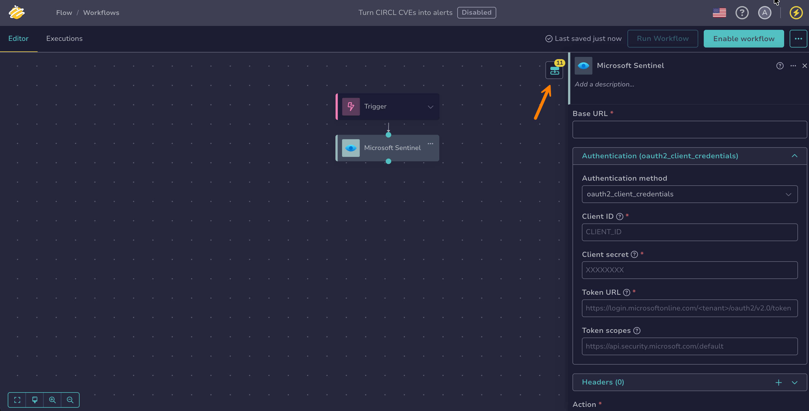

    These outputs can then be reused as output variables in subsequent nodes, using the **$var** button or by typing `$` and selecting the output from the suggestions. Inserted references are displayed in the following form:

    * `$<node_name>.body.<field_name>`: to get a value from the response body, for example the identifier of an incident
    * `$<node_name>.code`: to get the HTTP status code, for example to check whether the request succeeded
    * `$<node_name>.headers.<header_name>`: to get a specific response header

## Configure a *Recorded Future* integration node

A *Recorded Future* integration node runs operations against the [Recorded Future API](https://docs.recordedfuture.com/reference/get-started){target=_blank}: it can enrich and triage indicators in bulk, look up domains, IP addresses, hashes, URLs, and entities, search links and analyst notes, and query threat maps and threat actors. Each operation is a dedicated action selected within the node.

1. 

2. Select a workflow from the list.

3. Drag the previous node connector to an empty area of the canvas.

    

4. In the **What is the next step?** drawer, select **Integrations**.

5. Select *Recorded Future*.

6. In the **Recorded Future** drawer, enter the following information:

    

    *Fields marked with \* are mandatory.*

    **- Base URL \***

    The URL of the Recorded Future API: `https://api.recordedfuture.com`.

    **- API Token \***

    Your Recorded Future API token, sent in the `X-RFToken` request header with every request. The token replaces the standard HTTP authentication schemes, so **Authentication method** is set to *None*. Reference a [secret global variable](manage-global-variables.md) instead of pasting the token directly.

    **- Headers**

    

    **- Action \***

    The operation to perform in Recorded Future. Available actions:

    | Family | Actions |
    | --- | --- |
    | Enrichment & Triage | *Enrich Indicators (Bulk)*, *List Risk Contexts*, *Triage Indicators (Bulk Verdict)* |
    | Entity Enrichment | *Lookup Domain*, *Lookup IP Address*, *Lookup Hash*, *Lookup URL* |
    | Entity Resolution | *Match Entity by Name*, *Lookup Entity by ID* |
    | Links | *Search Links*, *List Link Sections*, *List Link Entity Types*, *List Link Event Types* |
    | Analyst Notes | *Search Analyst Notes*, *Lookup Analyst Note* |
    | Threat Intelligence | *List Available Threat Maps*, *Threat Actor Threat Map*, *Malware Threat Map*, *Search Threat Actors*, *List Threat Actor Categories* |

    After you select an action, the drawer displays the fields specific to that action. For the meaning and format of each field, see the [Recorded Future API documentation](https://docs.recordedfuture.com/reference/get-started){target=_blank}.

    !!! note "Bulk actions"
        The bulk enrichment and triage actions accept up to 1,000 indicators per request.

    **- Editor mode**

    For actions that send a request body, choose how to provide it:

    * *Form*: Fill in one field per body parameter.
    * *Raw*: Provide the whole request body in the **Request body (raw)** field.

    **- Query parameters**

    Optional query parameters sent with the request, entered as key-value pairs. Select :fontawesome-solid-plus: to add a parameter. This section appears only for actions that accept query parameters.

7. Optional: Configure the following settings.

    **- Proxy**

    

    **- SSL/TLS**

    

    **- Error handling**

    

8. Optional: Select **Add options** to configure the following settings.

    **- Timeout & retry**

    Configure how the node handles execution time limits and failure recovery.

    

    **- Execution configuration**

    

!!! info "Execution outputs"

    When executed, the node returns the following outputs. Each output is a JSON value:

    | Output    | Type   | Description                                          |
    |-----------|--------|------------------------------------------------------|
    | `body`    | object | The response body returned by Recorded Future.       |
    | `code`    | number | The HTTP status code returned by Recorded Future.    |
    | `headers` | object | The response headers returned by Recorded Future.    |

    To access outputs, select your *Recorded Future* node and then select :fontawesome-solid-diagram-next: in the top-right corner of the screen. Hover over each output name to view its details.

    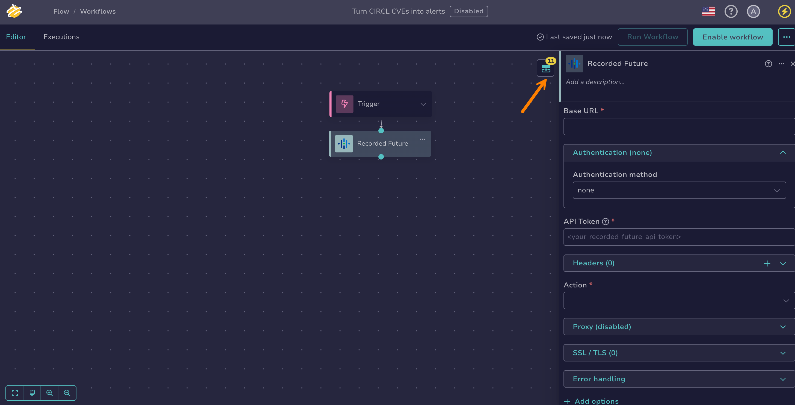

    These outputs can then be reused as output variables in subsequent nodes, using the **$var** button or by typing `$` and selecting the output from the suggestions. Inserted references are displayed in the following form:

    * `$<node_name>.body.<field_name>`: to get a value from the response body, for example an indicator's risk score
    * `$<node_name>.code`: to get the HTTP status code, for example to check whether the request succeeded
    * `$<node_name>.headers.<header_name>`: to get a specific response header

## Configure a *VirusTotal* integration node

A *VirusTotal* integration node runs operations against the [VirusTotal API v3](https://docs.virustotal.com/reference/overview){target=_blank}: it can search across VirusTotal, get and scan URLs, get domain, IP address, and file reports, upload and rescan files, and retrieve analysis results. Each operation is a dedicated action selected within the node.

1. 

2. Select a workflow from the list.

3. Drag the previous node connector to an empty area of the canvas.

    

4. In the **What is the next step?** drawer, select **Integrations**.

5. Select *VirusTotal*.

6. In the **VirusTotal** drawer, enter the following information:

    

    *Fields marked with \* are mandatory.*

    **- Base URL \***

    The URL of the VirusTotal API: `https://www.virustotal.com/api/v3`.

    **- API Key \***

    Your VirusTotal API key, sent in the `x-apikey` request header with every request. The key replaces the standard HTTP authentication schemes, so **Authentication method** is set to *None*. Reference a [secret global variable](manage-global-variables.md) instead of pasting the key directly.

    **- Headers**

    

    **- Action \***

    The operation to perform in VirusTotal. Available actions:

    | Family | Actions |
    | --- | --- |
    | Search | *Search* |
    | URLs | *Get URL Report*, *Scan URL*, *Rescan URL* |
    | Domains | *Get Domain Report* |
    | IP Addresses | *Get IP Report* |
    | Files | *Get File Report*, *Upload & Scan File*, *Rescan File* |
    | Analyses | *Get Analysis* |

    After you select an action, the drawer displays the fields specific to that action. For the meaning and format of each field, see the [VirusTotal API documentation](https://docs.virustotal.com/reference/overview){target=_blank}.

    !!! note "Scans are asynchronous"
        The scan and rescan actions return an analysis identifier. Use *Get Analysis* with that identifier to retrieve the verdict once the analysis completes.

    **- Editor mode**

    For actions that send a request body, choose how to provide it:

    * *Form*: Fill in one field per body parameter.
    * *Raw*: Provide the whole request body in the **Request body (raw)** field.

    **- Query parameters**

    Optional query parameters sent with the request, entered as key-value pairs. Select :fontawesome-solid-plus: to add a parameter. This section appears only for actions that accept query parameters.

7. Optional: Configure the following settings.

    **- Proxy**

    

    **- SSL/TLS**

    

    **- Error handling**

    

8. Optional: Select **Add options** to configure the following settings.

    **- Timeout & retry**

    Configure how the node handles execution time limits and failure recovery.

    

    **- Execution configuration**

    

!!! info "Execution outputs"

    When executed, the node returns the following outputs. Each output is a JSON value:

    | Output    | Type   | Description                                          |
    |-----------|--------|------------------------------------------------------|
    | `body`    | object | The response body returned by VirusTotal.            |
    | `code`    | number | The HTTP status code returned by VirusTotal.         |
    | `headers` | object | The response headers returned by VirusTotal.         |

    To access outputs, select your *VirusTotal* node and then select :fontawesome-solid-diagram-next: in the top-right corner of the screen. Hover over each output name to view its details.

    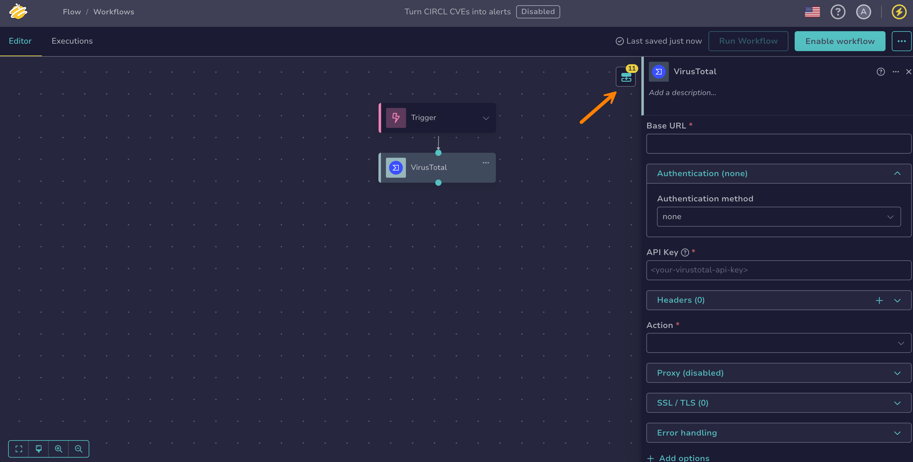

    These outputs can then be reused as output variables in subsequent nodes, using the **$var** button or by typing `$` and selecting the output from the suggestions. Inserted references are displayed in the following form:

    * `$<node_name>.body.<field_name>`: to get a value from the response body, for example the analysis identifier returned by *Scan URL*
    * `$<node_name>.code`: to get the HTTP status code, for example to check whether the request succeeded
    * `$<node_name>.headers.<header_name>`: to get a specific response header

## Configure a *CrowdStrike Falcon* integration node

A *CrowdStrike Falcon* integration node runs operations against the [CrowdStrike Falcon APIs](https://developer.crowdstrike.com/){target=_blank}: it can query devices and vulnerabilities, run response actions on hosts such as network containment, query and update alerts, look up threat intelligence indicators, manage custom indicators of compromise, and detonate file samples in the Falcon sandbox. Each operation is a dedicated action selected within the node.

1. 

2. Select a workflow from the list.

3. Drag the previous node connector to an empty area of the canvas.

    

4. In the **What is the next step?** drawer, select **Integrations**.

5. Select *CrowdStrike Falcon*.

6. In the **CrowdStrike Falcon** drawer, enter the following information:

    

    *Fields marked with \* are mandatory.*

    **- Base URL \***

    The URL of the Falcon API for your CrowdStrike cloud:

    | Cloud | Base URL |
    | --- | --- |
    | US-1 | `https://api.crowdstrike.com` |
    | US-2 | `https://api.us-2.crowdstrike.com` |
    | US-3 | `https://api.us-3.crowdstrike.com` |
    | EU-1 | `https://api.eu-1.crowdstrike.com` |
    | US-GOV-1 | `https://api.laggar.gcw.crowdstrike.com` |
    | US-GOV-2 | `https://api.us-gov-2.crowdstrike.mil` |

    **- Authentication \***

    In the **Authentication** section, provide the credentials of an API client created in the Falcon console, under **API Clients and Keys**. The node authenticates with the OAuth 2.0 client credentials flow, so **Authentication method** is set to *oauth2_client_credentials*:

    | Field | Example |
    | --- | --- |
    | Client ID \* | `$global.crowdstrike_client_id` |
    | Client secret \* | `$secret.crowdstrike_client_secret` |
    | Token URL \* | `https://api.crowdstrike.com/oauth2/token` |

    The token URL is the `/oauth2/token` endpoint on the same host as the **Base URL**.

    !!! warning "Each action requires an API scope"
        CrowdStrike grants permissions per API scope on the API client, not per token. Assign the scopes matching the actions you use: *Hosts* with Read access for the Devices family and Write access for the Host Actions family, *Vulnerabilities* with Read access, *Alerts* with Read access for lookups and Write access for *Update Alert Status*, *Indicators: Falcon Intelligence* with Read access for the Threat Intel family, *IOC Management* for the IOC Management family, and *Sample Uploads* plus *Sandbox: Falcon Intelligence* for the Sandbox family. A missing scope makes the action fail with a `403` response.

    **- Headers**

    

    **- Action \***

    The operation to perform in CrowdStrike Falcon. Available actions:

    | Family | Actions |
    | --- | --- |
    | Devices | *Query Devices by Filter*, *Get Device Details*, *Query Hidden Devices* |
    | Host Actions | *Contain Host*, *Lift Containment*, *Hide Host*, *Unhide Host*, *Suppress Detections*, *Unsuppress Detections* |
    | Vulnerabilities | *Query Vulnerabilities*, *Get Vulnerability Details* |
    | Alerts | *Query Alerts*, *Get Alerts*, *Update Alert Status* |
    | Threat Intel | *Query Threat Intel Indicators* |
    | IOC Management | *Create IOC*, *Search IOCs*, *Delete IOC* |
    | Sandbox | *Upload Sample*, *Submit Sandbox Analysis*, *Get Sandbox Submission Status*, *Get Sandbox Report* |

    After you select an action, the drawer displays the fields specific to that action. For the meaning and format of each field, see the [CrowdStrike developer documentation](https://developer.crowdstrike.com/){target=_blank}.

    !!! note "Sandbox analyses are asynchronous"
        Detonating a sample chains four actions: *Upload Sample*, then *Submit Sandbox Analysis*, then *Get Sandbox Submission Status* until the state is no longer `running`, then *Get Sandbox Report*.

    **- Editor mode**

    For actions that send a request body, choose how to provide it:

    * *Form*: Fill in one field per body parameter.
    * *Raw*: Provide the whole request body in the **Request body (raw)** field.

    **- Query parameters**

    Optional query parameters sent with the request, entered as key-value pairs. Select :fontawesome-solid-plus: to add a parameter. This section appears only for actions that accept query parameters.

7. Optional: Configure the following settings.

    **- Proxy**

    

    **- SSL/TLS**

    

    **- Error handling**

    

8. Optional: Select **Add options** to configure the following settings.

    **- Timeout & retry**

    Configure how the node handles execution time limits and failure recovery.

    

    **- Execution configuration**

    

!!! info "Execution outputs"

    When executed, the node returns the following outputs. Each output is a JSON value:

    | Output    | Type   | Description                                      |
    |-----------|--------|--------------------------------------------------|
    | `body`    | object | The response body returned by CrowdStrike Falcon. |
    | `code`    | number | The HTTP status code returned by CrowdStrike Falcon. |
    | `headers` | object | The response headers returned by CrowdStrike Falcon. |

    To access outputs, select your *CrowdStrike Falcon* node and then select :fontawesome-solid-diagram-next: in the top-right corner of the screen. Hover over each output name to view its details.

    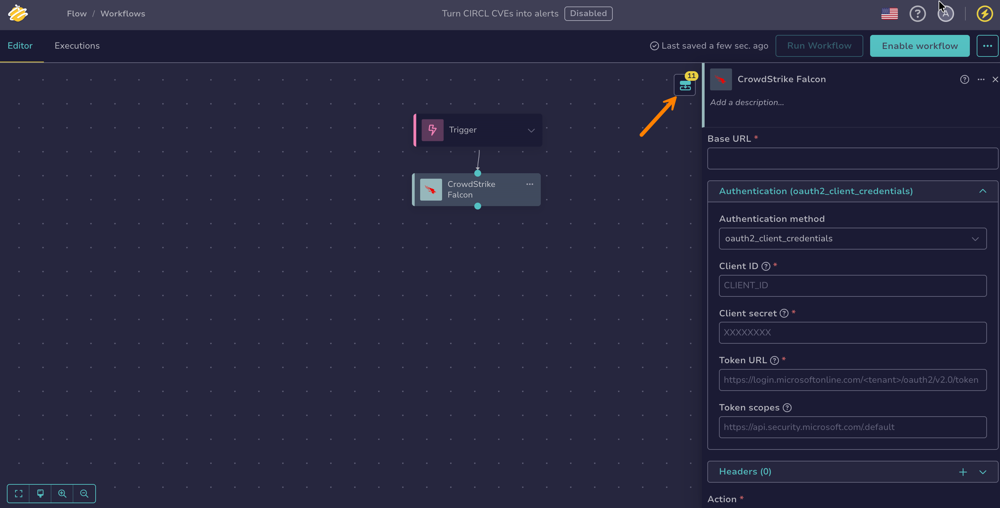

    These outputs can then be reused as output variables in subsequent nodes, using the **$var** button or by typing `$` and selecting the output from the suggestions. Inserted references are displayed in the following form:

    * `$<node_name>.body.<field_name>`: to get a value from the response body, for example the device identifiers returned by *Query Devices by Filter*
    * `$<node_name>.code`: to get the HTTP status code, for example to check whether the request succeeded
    * `$<node_name>.headers.<header_name>`: to get a specific response header

## Configure an *Elastic Security* integration node

An *Elastic Security* integration node runs operations against the [Elasticsearch API](https://www.elastic.co/docs/api/doc/elasticsearch/){target=_blank}: it can search and index documents, retrieve a document by identifier, run ES|QL queries, and list detection alerts from Elastic Security. Each operation is a dedicated action selected within the node.

1. 

2. Select a workflow from the list.

3. Drag the previous node connector to an empty area of the canvas.

    

4. In the **What is the next step?** drawer, select **Integrations**.

5. Select *Elastic Security*.

6. In the **Elastic Security** drawer, enter the following information:

    

    *Fields marked with \* are mandatory.*

    **- Base URL \***

    The URL of the Elasticsearch HTTP endpoint, not the Kibana URL: `https://<elasticsearch_host>:9200`.

    **- Authentication \***

    In the **Authentication** section, select the **Authentication method** and provide its credentials. The *Elastic Security* node supports two methods:

    | Authentication method | Fields |
    | --- | --- |
    | *basic_auth* (default) | **Username \***, **Password** |
    | *None* | — |

    To authenticate with an Elasticsearch API key instead, select *None* and add a header named `Authorization` with the value `ApiKey <base64_key>` in the **Headers** section. Reference a [secret global variable](manage-global-variables.md) instead of pasting the key directly.

    **- Headers**

    

    **- Action \***

    The operation to perform in Elasticsearch. Available actions:

    | Family | Actions |
    | --- | --- |
    | Search | *Search*, *Index Document*, *Get Document by ID*, *Run ES\|QL Query* |
    | Detection Alerts | *List Detection Alerts* |

    After you select an action, the drawer displays the fields specific to that action. For the meaning and format of each field, see the [Elasticsearch API documentation](https://www.elastic.co/docs/api/doc/elasticsearch/){target=_blank}.

    !!! note "Detection alerts are an index search"
        *List Detection Alerts* searches the `.alerts-security.alerts-default` index, where Elastic Security stores its detection alerts. Filter and sort them with the same Query DSL fields as *Search*.

    **- Editor mode**

    For actions that send a request body, choose how to provide it:

    * *Form*: Fill in one field per body parameter.
    * *Raw*: Provide the whole request body in the **Request body (raw)** field.

    **- Query parameters**

    Optional query parameters sent with the request, entered as key-value pairs. Select :fontawesome-solid-plus: to add a parameter. This section appears only for actions that accept query parameters.

7. Optional: Configure the following settings.

    **- Proxy**

    

    **- SSL/TLS**

    

    **- Error handling**

    

8. Optional: Select **Add options** to configure the following settings.

    **- Timeout & retry**

    Configure how the node handles execution time limits and failure recovery.

    

    **- Execution configuration**

    

!!! info "Execution outputs"

    When executed, the node returns the following outputs. Each output is a JSON value:

    | Output    | Type   | Description                                      |
    |-----------|--------|--------------------------------------------------|
    | `body`    | object | The response body returned by Elasticsearch.     |
    | `code`    | number | The HTTP status code returned by Elasticsearch.  |
    | `headers` | object | The response headers returned by Elasticsearch.  |

    To access outputs, select your *Elastic Security* node and then select :fontawesome-solid-diagram-next: in the top-right corner of the screen. Hover over each output name to view its details.

    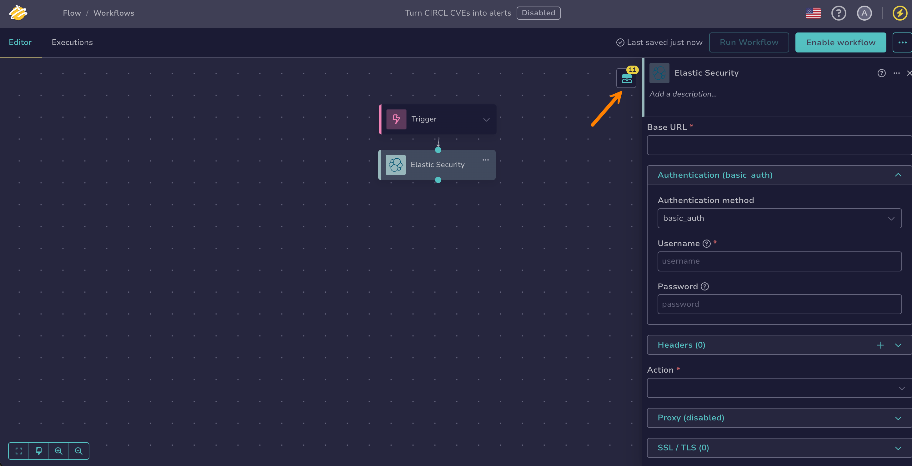

    These outputs can then be reused as output variables in subsequent nodes, using the **$var** button or by typing `$` and selecting the output from the suggestions. Inserted references are displayed in the following form:

    * `$<node_name>.body.<field_name>`: to get a value from the response body, for example the hits returned by *Search*
    * `$<node_name>.code`: to get the HTTP status code, for example to check whether the request succeeded
    * `$<node_name>.headers.<header_name>`: to get a specific response header

## Configure a *HarfangLab EDR* integration node

A *HarfangLab EDR* integration node runs operations against the [HarfangLab API](https://harfanglab.io/connectors/){target=_blank}: it can search and isolate endpoints, list and update alerts, create and follow jobs on agents, search process, network, DNS, event log, and binary telemetry, and manage IOC and Sigma rules. Each operation is a dedicated action selected within the node.

1. 

2. Select a workflow from the list.

3. Drag the previous node connector to an empty area of the canvas.

    

4. In the **What is the next step?** drawer, select **Integrations**.

5. Select *HarfangLab EDR*.

6. In the **HarfangLab EDR** drawer, enter the following information:

    

    *Fields marked with \* are mandatory.*

    **- Base URL \***

    The URL of the HarfangLab manager: `https://<manager_host>`.

    **- Authentication \***

    The HarfangLab API authenticates with a token in the `Authorization: Token <api_key>` scheme, which isn't one of the standard HTTP authentication methods, so **Authentication method** is set to *None*. Add a header named `Authorization` with the value `Token <api_key>` in the **Headers** section. Reference a [secret global variable](manage-global-variables.md) instead of pasting the key directly.

    **- Headers**

    

    **- Action \***

    The operation to perform in HarfangLab. Available actions:

    | Family | Actions |
    | --- | --- |
    | Health | *Get Manager Version* |
    | Endpoints | *Search Endpoints*, *Get Endpoint Info*, *Isolate Endpoints*, *Deisolate Endpoints* |
    | Alerts | *List Alerts*, *Get Alert*, *Update Alert Status* |
    | Jobs | *Create Job*, *Get Job Status*, *List Jobs*, *Get Job Instances*, *Get Job Results* |
    | Telemetry | *Search Process Telemetry*, *Search Network Telemetry*, *Search DNS Telemetry*, *Search Event Log Telemetry*, *Search Binary Telemetry*, *Download Binary*, *Get Process Graph* |
    | Threat Intelligence | *List IOC Sources*, *List IOC Rules*, *Create IOC Rule*, *Delete IOC Rule*, *List Sigma Rules* |

    After you select an action, the drawer displays the fields specific to that action. For the meaning and format of each field, see the [HarfangLab API documentation](https://harfanglab.io/connectors/){target=_blank}.

    !!! tip "Validate the configuration with *Get Manager Version*"
        *Get Manager Version* takes no parameter and validates the base URL, the certificate, and the token in one call. Use it as the first action when setting up the node.

    **- Editor mode**

    For actions that send a request body, choose how to provide it:

    * *Form*: Fill in one field per body parameter.
    * *Raw*: Provide the whole request body in the **Request body (raw)** field.

    **- Query parameters**

    Optional query parameters sent with the request, entered as key-value pairs. Select :fontawesome-solid-plus: to add a parameter. This section appears only for actions that accept query parameters.

7. Optional: Configure the following settings.

    **- Proxy**

    

    **- SSL/TLS**

    

    On-premises managers often run with an internal certificate authority or a self-signed certificate: configure the trusted certificate here rather than disabling verification.

    **- Error handling**

    

8. Optional: Select **Add options** to configure the following settings.

    **- Timeout & retry**

    Configure how the node handles execution time limits and failure recovery.

    

    **- Execution configuration**

    

!!! info "Execution outputs"

    When executed, the node returns the following outputs. Each output is a JSON value:

    | Output    | Type   | Description                                      |
    |-----------|--------|--------------------------------------------------|
    | `body`    | object | The response body returned by HarfangLab.        |
    | `code`    | number | The HTTP status code returned by HarfangLab.     |
    | `headers` | object | The response headers returned by HarfangLab.     |

    To access outputs, select your *HarfangLab EDR* node and then select :fontawesome-solid-diagram-next: in the top-right corner of the screen. Hover over each output name to view its details.

    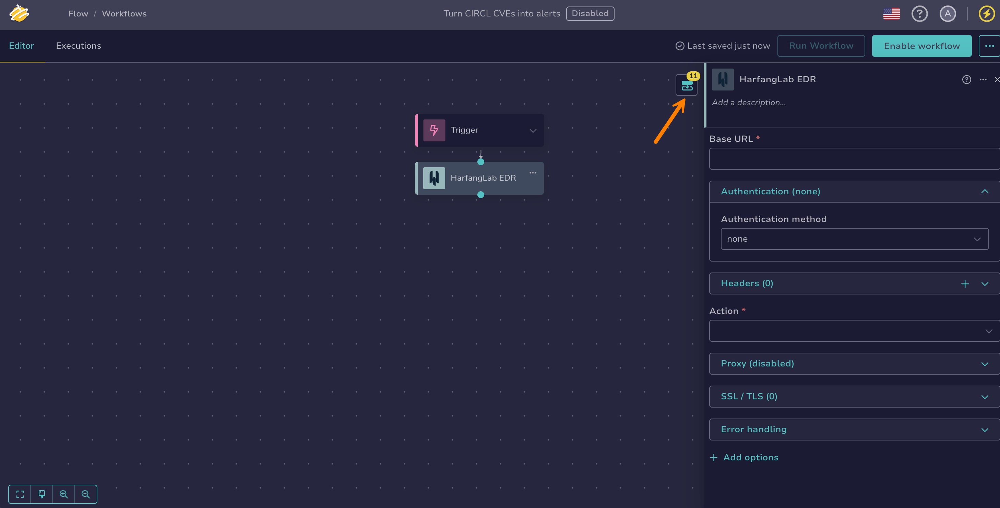

    These outputs can then be reused as output variables in subsequent nodes, using the **$var** button or by typing `$` and selecting the output from the suggestions. Inserted references are displayed in the following form:

    * `$<node_name>.body.<field_name>`: to get a value from the response body, for example the endpoints returned by *Search Endpoints*
    * `$<node_name>.code`: to get the HTTP status code, for example to check whether the request succeeded
    * `$<node_name>.headers.<header_name>`: to get a specific response header

## Configure a *Jira Cloud v3* integration node

A *Jira Cloud v3* integration node runs operations against the [Jira Cloud platform REST API v3](https://developer.atlassian.com/cloud/jira/platform/rest/v3/){target=_blank}: it can create, edit, transition, link, and delete issues, search issues with JQL (Jira Query Language), manage comments, attachments, worklogs, watchers, and votes, and browse projects, issue types, priorities, and resolutions. Each operation is a dedicated action selected within the node.

1. 

2. Select a workflow from the list.

3. Drag the previous node connector to an empty area of the canvas.

    

4. In the **What is the next step?** drawer, select **Integrations**.

5. Select *Jira Cloud v3*.

6. In the **Jira Cloud v3** drawer, enter the following information:

    

    *Fields marked with \* are mandatory.*

    **- Base URL \***

    The URL of your Jira Cloud site: `https://<your_site>.atlassian.net`.

    **- Authentication \***

    In the **Authentication** section, select the **Authentication method** and provide its credentials. The *Jira Cloud v3* node supports two methods:

    | Authentication method | Fields |
    | --- | --- |
    | *basic_auth* (default) | **Username \***, **Password** |
    | *bearer_token* | **Bearer token \*** |

    With *basic_auth*, the username is the Atlassian account email and the password is an [Atlassian API token](https://id.atlassian.com/manage-profile/security/api-tokens){target=_blank}. Use *bearer_token* with an OAuth 2.0 access token.

    **- Headers**

    

    **- Action \***

    The operation to perform in Jira. Available actions:

    | Family | Actions |
    | --- | --- |
    | Issues | *Create Issue*, *Get Issue*, *Edit Issue*, *Transition Issue*, *Get Transitions*, *Assign Issue*, *Bulk Create Issues*, *Bulk Fetch Issues*, *Delete Issue* |
    | Issue Search | *Search Issues (JQL)*, *Search Issues (JQL POST)*, *Count Issues*, *Match Issues to JQL*, *Parse JQL Queries*, *Get Issue Picker Suggestions* |
    | Issue Comments | *Add Comment*, *Get Comments*, *Get Comment*, *Update Comment*, *Get Comments by IDs*, *Delete Comment* |
    | Issue Attachments | *Get Attachment Metadata*, *Get Attachment Content*, *Get Attachment Settings*, *Get Attachment Thumbnail*, *Expand Attachment for Humans*, *Expand Attachment for Machines*, *Delete Attachment* |
    | Issue Links | *Create Issue Link*, *Get Issue Link Types*, *Get Issue Link Type*, *Get Issue Link*, *Delete Issue Link* |
    | Issue Remote Links | *Create or Update Remote Issue Link*, *Get Remote Issue Links*, *Get Remote Issue Link*, *Update Remote Issue Link*, *Delete Remote Issue Link*, *Delete Remote Issue Link by Global ID* |
    | Issue Watchers | *Notify Issue*, *Get Issue Watchers*, *Remove Watcher*, *Get Is Watching Issue Bulk* |
    | Issue History | *Get Changelogs*, *Bulk Fetch Changelogs*, *Get Changelogs by IDs* |
    | Issue Metadata | *Get Create Issue Metadata*, *Get Create Issue Metadata Issue Types*, *Get Create Issue Metadata Issue Type*, *Get Edit Issue Metadata*, *Get Events* |
    | Issue Types | *Get Issue Types*, *Get Issue Type*, *Get Issue Types for Project* |
    | Issue Priorities | *Get Priorities*, *Get Priority*, *Search Priorities* |
    | Issue Resolutions | *Get Resolutions*, *Get Resolution*, *Search Resolutions* |
    | Issue Worklogs | *Add Worklog*, *Get Issue Worklogs*, *Update Worklog*, *Delete Worklog* |
    | Issue Votes | *Get Votes*, *Add Vote*, *Remove Vote* |
    | Projects | *Get All Projects*, *Search Projects*, *Get Project*, *Get Project Statuses*, *Get Project Versions*, *Get Project Components* |
    | User Search | *Find Users*, *Find Assignable Users* |
    | Tasks | *Get Task*, *Cancel Task* |

    After you select an action, the drawer displays the fields specific to that action. For the meaning and format of each field, see the [Jira Cloud REST API v3 documentation](https://developer.atlassian.com/cloud/jira/platform/rest/v3/){target=_blank}.

    **- Editor mode**

    For actions that send a request body, choose how to provide it:

    * *Form*: Fill in one field per body parameter.
    * *Raw*: Provide the whole request body in the **Request body (raw)** field.

    **- Query parameters**

    Optional query parameters sent with the request, entered as key-value pairs. Select :fontawesome-solid-plus: to add a parameter. This section appears only for actions that accept query parameters.

7. Optional: Configure the following settings.

    **- Proxy**

    

    **- SSL/TLS**

    

    **- Error handling**

    

8. Optional: Select **Add options** to configure the following settings.

    **- Timeout & retry**

    Configure how the node handles execution time limits and failure recovery.

    

    **- Execution configuration**

    

!!! info "Execution outputs"

    When executed, the node returns the following outputs. Each output is a JSON value:

    | Output    | Type   | Description                                      |
    |-----------|--------|--------------------------------------------------|
    | `body`    | object | The response body returned by Jira.              |
    | `code`    | number | The HTTP status code returned by Jira.           |
    | `headers` | object | The response headers returned by Jira.           |

    To access outputs, select your *Jira Cloud v3* node and then select :fontawesome-solid-diagram-next: in the top-right corner of the screen. Hover over each output name to view its details.

    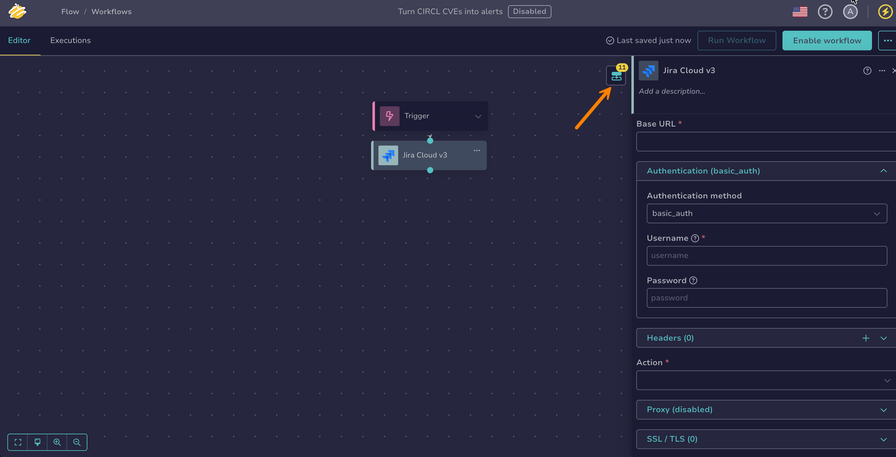

    These outputs can then be reused as output variables in subsequent nodes, using the **$var** button or by typing `$` and selecting the output from the suggestions. Inserted references are displayed in the following form:

    * `$<node_name>.body.<field_name>`: to get a value from the response body, for example the issue key returned by *Create Issue*
    * `$<node_name>.code`: to get the HTTP status code, for example to check whether the request succeeded
    * `$<node_name>.headers.<header_name>`: to get a specific response header

## Configure a *Slack* integration node

A *Slack* integration node runs operations against the [Slack Web API](https://docs.slack.dev/apis/){target=_blank}: it can post, update, and delete messages, manage reactions, read thread replies and channel history, and look up channels and users. Each operation is a dedicated action selected within the node.

!!! tip "Choosing between the two Slack nodes"
    The [*Slack - Send message* action node](configure-action-node.md#configure-a-slack-send-message-action-node) only posts a message. Use this node to update or delete messages, manage reactions, read threads and history, or look up channels and users.

1. 

2. Select a workflow from the list.

3. Drag the previous node connector to an empty area of the canvas.

    

4. In the **What is the next step?** drawer, select **Integrations**.

5. Select *Slack*.

6. In the **Slack** drawer, enter the following information:

    

    *Fields marked with \* are mandatory.*

    **- Base URL \***

    The URL of the Slack Web API: `https://slack.com/api`.

    **- Authentication \***

    In the **Authentication** section, provide a Slack bot token, starting with `xoxb-`, in the **Bearer token** field: **Authentication method** is set to *bearer_token*. The token must carry the OAuth scopes required by the actions you use, such as `chat:write` for the Messages family. Reference a [secret global variable](manage-global-variables.md) instead of pasting the token directly.

    **- Headers**

    

    **- Action \***

    The operation to perform in Slack. Available actions:

    | Family | Actions |
    | --- | --- |
    | Messages | *Post Message*, *Update Message*, *Delete Message* |
    | Reactions | *Get Reactions*, *Add Reaction*, *Remove Reaction* |
    | Threads | *Get Thread Replies*, *Get Channel History* |
    | Channels | *Get Channel Info*, *List Channels* |
    | Users | *Get User Info*, *Lookup User by Email* |

    After you select an action, the drawer displays the fields specific to that action. For the meaning and format of each field, see the [Slack Web API documentation](https://docs.slack.dev/apis/){target=_blank}.

    !!! note "Slack reports errors in the response body"
        The Slack Web API returns most errors with a `200` status code, so the node succeeds even when the operation fails. Check the `ok` field of the `body` output, for example with an [*If* flow node](configure-flow-node.md#configure-an-if-flow-node): it's `false` when the operation failed, and the `error` field carries the reason.

    **- Editor mode**

    For actions that send a request body, choose how to provide it:

    * *Form*: Fill in one field per body parameter.
    * *Raw*: Provide the whole request body in the **Request body (raw)** field.

    **- Query parameters**

    Optional query parameters sent with the request, entered as key-value pairs. Select :fontawesome-solid-plus: to add a parameter. This section appears only for actions that accept query parameters.

7. Optional: Configure the following settings.

    **- Proxy**

    

    **- SSL/TLS**

    

    **- Error handling**

    

8. Optional: Select **Add options** to configure the following settings.

    **- Timeout & retry**

    Configure how the node handles execution time limits and failure recovery.

    

    **- Execution configuration**

    

!!! info "Execution outputs"

    When executed, the node returns the following outputs. Each output is a JSON value:

    | Output    | Type   | Description                                      |
    |-----------|--------|--------------------------------------------------|
    | `body`    | object | The response body returned by Slack.             |
    | `code`    | number | The HTTP status code returned by Slack.          |
    | `headers` | object | The response headers returned by Slack.          |

    To access outputs, select your *Slack* node and then select :fontawesome-solid-diagram-next: in the top-right corner of the screen. Hover over each output name to view its details.

    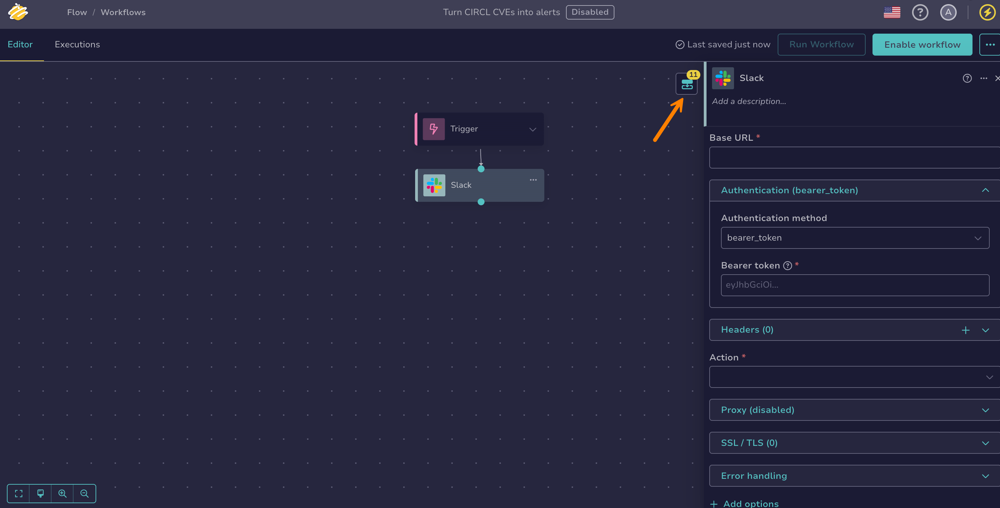

    These outputs can then be reused as output variables in subsequent nodes, using the **$var** button or by typing `$` and selecting the output from the suggestions. Inserted references are displayed in the following form:

    * `$<node_name>.body.<field_name>`: to get a value from the response body, for example the message timestamp `ts` returned by *Post Message*, used to update or delete the message or fetch its replies
    * `$<node_name>.code`: to get the HTTP status code, for example to check whether the request succeeded
    * `$<node_name>.headers.<header_name>`: to get a specific response header

<h2>Next steps</h2>

* [Manage Global Variables](manage-global-variables.md)
* [Add a Trigger](add-trigger.md)
* [Configure an Action Node](configure-action-node.md)
* [Configure a Transformation Node](configure-transformation-node.md)
* [Configure a Flow Node](configure-flow-node.md)
