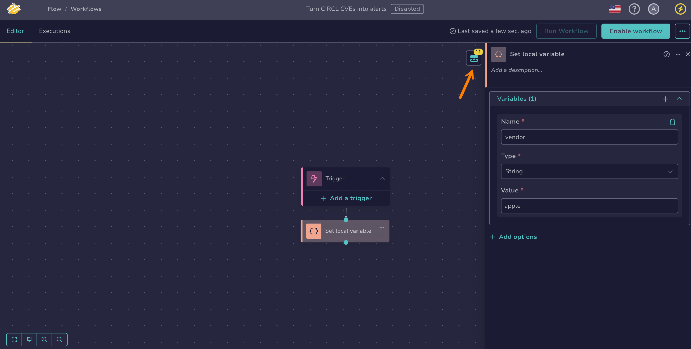
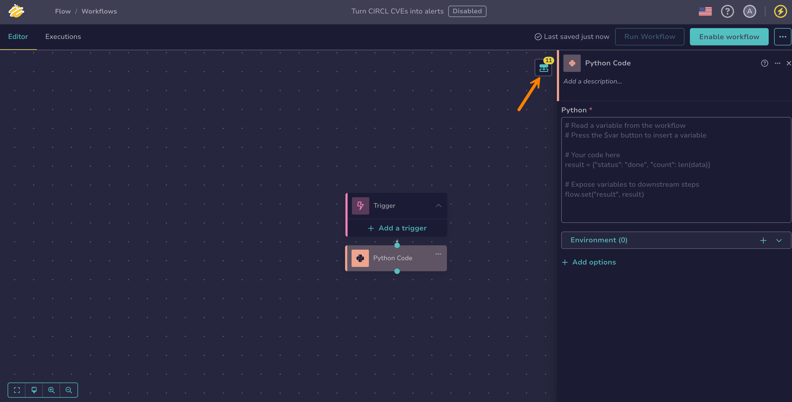
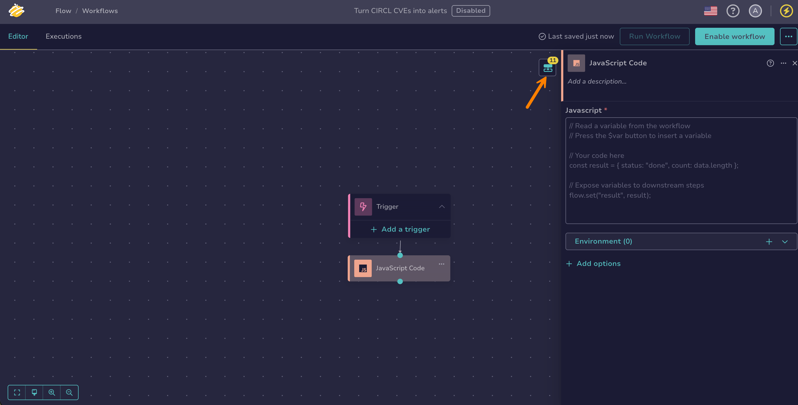

# Configure a Transformation Node

<!-- md:version 6.0 --> <!-- md:permission `manageOrchestrator/writeWorkflows` --> <!-- md:license One -->

Transformation nodes process or manipulate data within workflows in [TheHive Flow](about-flow.md). They allow you to perform custom operations that modify, extract, or format information as it moves through the workflow.

## Configure a *Set local variable* node

A *Set local variable* node creates one or more [local variables](about-flow.md#variables) during workflow execution—it does not modify existing ones. If two nodes declare a variable with the same name, both coexist and are each referenced by their node name. Variables accumulate in the workflow context as execution progresses.

To update a value, add a new *Set local variable* node downstream with the desired variable name, and reference the earlier value.

!!! note "Global variables"
    To reuse the same values across multiple workflows, create global variables from the [**Global variables** tab in the **Flow** view](manage-global-variables.md#create-a-global-variable). These values are defined at the organization level and can't be modified within workflows.

1. 

2. Select a workflow from the list.

3. Drag the previous node connector to an empty area of the canvas.

    

4. In the **What is the next step?** drawer, select **Transformations**.

5. Select *Set local variable*.

6. Select :fontawesome-solid-plus: in the **Variables** section.

7. In the **Set local variable** drawer, enter the following information:

    *Fields marked with \* are mandatory.*

    **- Name \***

    The identifier for the variable.

    **- Type \***

    The data type of the variable: `string`, `number`, `boolean`, `array`, or `json`.

    **- Value \***

    The value assigned to the variable.

    Supported formats include:

    * Static values
    * References to other variables, using the **$var** button
    * [jq expressions](https://jqlang.org/manual/){target=_blank}

    

    !!! warning "Secret global variables"
        The value can't reference a [secret global variable](manage-global-variables.md) because the resolved value would appear in plain text in the [execution logs](display-execution-logs.md).

    Use an online [jq playground](https://www.devtoolsdaily.com/jq_playground/){target=_blank} to validate your expressions before adding them to the workflow.

    !!! example "Examples"
    
        * `"Case $caseNumber – severity $caseSeverity"`
        * `if $caseSeverity >= 3 then "High" else "Low" end`
        * `{number: $caseNumber, assignee: $caseAssignee, title: $caseTitle}`

    You can select :fontawesome-solid-plus: to add multiple variables in the same node.

8. Optional: Select **Add options** to configure the following settings.

    **- Timeout & retry**

    Configure how the node handles execution time limits and failure recovery.

    

    **- Execution configuration**

    

!!! info "Execution output"

    When executed, the node returns the value assigned to the variable as the output.

    To access the output, select your *Set local variable* node and then select :fontawesome-solid-diagram-next: in the top-right corner of the screen. Hover over the output name to view its details.

    
    
    This output can then be reused as an output variable in subsequent nodes, using the **$var** button or by typing `$` and selecting the variable from the suggestions. The inserted reference is displayed as `$<node_name>.<field_name>`.

## Configure a *Python code* node

A *Python code* node executes custom Python scripts within a workflow. Use it for advanced data transformations, integration with external tools, or any logic that can't be handled by standard nodes.

1. 

2. Select a workflow from the list.

3. Drag the previous node connector to an empty area of the canvas.

    

4. In the **What is the next step?** drawer, select **Transformations**.

5. Select *Python code*.

6. In the **Python code** drawer, enter your Python script in the editor.

    * You can use libraries available in the configured execution image. The default image ships the Python standard library only. Providing additional libraries requires a [custom execution image](../configuration/flow-configuration.md#code-transformation-images) configured on the deployment.
    * You can use [variables](about-flow.md#variables).
    * Under **Environment**, you can define environment variables the script can read. Each value can reference a [variable](about-flow.md#variables).

    !!! tip "Using variables in Python scripts"

        To insert a variable, use the **$var** button and assign it to a variable in your script:

        ```python
        <var_name> = $<var>
        ```

        Variables are scoped to the script by default. To make a value available to the workflow and reuse it as an output variable in later nodes, you must explicitly return it as a workflow output using `flow.set()`:

        ```python
        flow.set("<var_name>", <var_name>)
        ```

        For values [stored as files](about-flow.md#files), such as large or binary content, use `flow.get_file()` and `flow.set_file()` instead: they hand you a file path to read from or write to, instead of loading the whole value into the script.

        * `flow.get_file("<variable>")` returns the path of a file made available to the script for a variable holding a file reference. Read it with normal file operations.
        * `flow.set_file("<name>", "<path>")` registers a file written by the script as an output variable. The file is stored after the run, and the output carries its file reference.

        See [Examples](#examples) for real-world use cases.

    

7. Optional: Select **Add options** to configure the following settings.

    **- Timeout & retry**

    Configure how the node handles execution time limits and failure recovery.

    

    **- Execution configuration**

    

!!! info "Execution outputs"

    When executed, the node returns the following outputs. Each output is a JSON value:

    | Output    | Type   | Description                                      |
    |-----------|--------|--------------------------------------------------|
    | `script_out`    | string | The raw output returned by the script.       |
    | `script_code`    | number | The exit code returned by the script. `0` indicates success.     |
    | `script_image`    | string | The Docker image digest used to run the script.     |
    | custom output    | any | Any additional outputs defined using `flow.set()`.   |

    To access outputs, select your *Python code* node and then select :fontawesome-solid-diagram-next: in the top-right corner of the screen. Hover over each output name to view its details.

    
    
    These outputs can then be reused as output variables in subsequent nodes, using the **$var** button or by typing `$` and selecting the output from the suggestions. Inserted references are displayed in the following form:
    
    * `$<node_name>.script_out`: to get the raw script output
    * `$<node_name>.script_code`: to get the exit code
    * `$<node_name>.script_image`: to get the Docker image digest used to run the script
    * `$<node_name>.<custom_output>`: to get a value you exposed with `flow.set()`

## Configure a *JavaScript code* node

A *JavaScript code* node executes custom JavaScript scripts within a workflow. Use it for advanced data transformations, integration with external tools, or any logic that can't be handled by standard nodes.

1. 

2. Select a workflow from the list.

3. Drag the previous node connector to an empty area of the canvas.

    

4. In the **What is the next step?** drawer, select **Transformations**.

5. Select *JavaScript code*.

6. In the **JavaScript code** drawer, enter your JavaScript script in the editor.

    * You can use libraries available in the configured execution image. The default image ships the Node.js built-in modules only. Providing additional libraries requires a [custom execution image](../configuration/flow-configuration.md#code-transformation-images) configured on the deployment.
    * You can use [variables](about-flow.md#variables).
    * Under **Environment**, you can define environment variables the script can read. Each value can reference a [variable](about-flow.md#variables).

    !!! tip "Using variables in JavaScript scripts"

        To insert a variable, use the **$var** button and assign it to a variable in your script:

        ```javascript
        let <var_name> = $<var>;
        ```

        Variables are scoped to the script by default. To make a value available to the workflow and reuse it as an output variable in later nodes, you must explicitly return it as a workflow output using `flow.set()`:

        ```javascript
        flow.set("<var_name>", <var_name>);
        ```

        For values [stored as files](about-flow.md#files), such as large or binary content, use `flow.get_file()` and `flow.set_file()` instead: they hand you a file path to read from or write to, instead of loading the whole value into the script.

        * `flow.get_file("<variable>")` returns the path of a file made available to the script for a variable holding a file reference. Read it with normal file operations.
        * `flow.set_file("<name>", "<path>")` registers a file written by the script as an output variable. The file is stored after the run, and the output carries its file reference.

        See [Examples](#examples) for real-world use cases.

    

7. Optional: Select **Add options** to configure the following settings.

    **- Timeout & retry**

    Configure how the node handles execution time limits and failure recovery.

    

    **- Execution configuration**

    

!!! info "Execution outputs"

    When executed, the node returns the following outputs. Each output is a JSON value:

    | Output    | Type   | Description                                      |
    |-----------|--------|--------------------------------------------------|
    | `script_out`    | string | The raw output returned by the script.       |
    | `script_code`    | number | The exit code returned by the script. `0` indicates success.     |
    | `script_image`    | string | The Docker image digest used to run the script.     |
    | custom output    | any | Any additional outputs defined using `flow.set()`.   |

    To access outputs, select your *JavaScript code* node and then select :fontawesome-solid-diagram-next: in the top-right corner of the screen. Hover over each output name to view its details.

    
    
    These outputs can then be reused as output variables in subsequent nodes, using the **$var** button or by typing `$` and selecting the output from the suggestions. Inserted references are displayed in the following form:
    
    * `$<node_name>.script_out`: to get the raw script output
    * `$<node_name>.script_code`: to get the exit code
    * `$<node_name>.script_image`: to get the Docker image digest used to run the script
    * `$<node_name>.<custom_output>`: to get a value you exposed with `flow.set()`

## Examples

The following examples demonstrate common use cases for the *Python code* node.

### Multi-criteria alert scoring

Calculates a priority score (0–100) and a priority level (P1–P4) based on severity, asset criticality, and enrichment results.

```python
severity = $severity
asset_criticality = $asset_criticality
vt_verdict = $vt_verdict
ioc_matched = $ioc_matched

severity_scores = {"low": 10, "medium": 30, "high": 60, "critical": 90}
score = severity_scores.get(severity, 0)
score += min(int(asset_criticality or 1) * 5, 25)
if vt_verdict == "malicious":
    score += 40
if ioc_matched:
    score += 30
score = min(score, 100)
priority = "P1" if score >= 80 else "P2" if score >= 60 else "P3" if score >= 40 else "P4"
flow.set("score", score)
flow.set("priority", priority)
```

### SIEM/EDR payload normalization

Maps source-specific field names from SIEM or EDR payloads to a consistent set of output fields, regardless of the source system.

```python
source_type = $source_type
raw_payload = $raw_payload

mapping = {
    "siem": ("SourceIP", "UserName", "ComputerName"),
    "edr":  ("local_ip", "user_name", "device_name")
}

ip_k, user_k, host_k = mapping.get(source_type, ("src_ip", "user", "hostname"))

src_ip = raw_payload.get(ip_k, "")
user = raw_payload.get(user_k, "")
hostname = raw_payload.get(host_k, "")

flow.set("src_ip", src_ip)
flow.set("user", user)
flow.set("hostname", hostname)
```

<h2>Next steps</h2>

* [Manage Global Variables](manage-global-variables.md)
* [Add a Trigger](add-trigger.md)
* [Configure a Flow Node](configure-flow-node.md)
* [Configure an Action Node](configure-action-node.md)
* [Configure an Integration Node](configure-integration-node.md)
* [Manually Run a Workflow](manually-run-workflow.md)