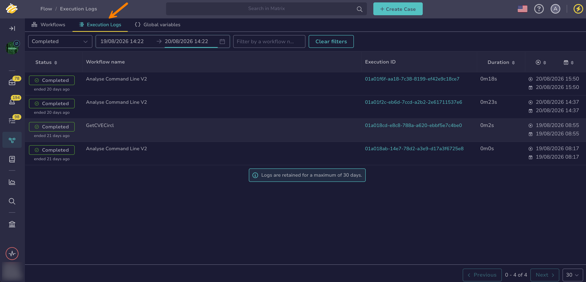
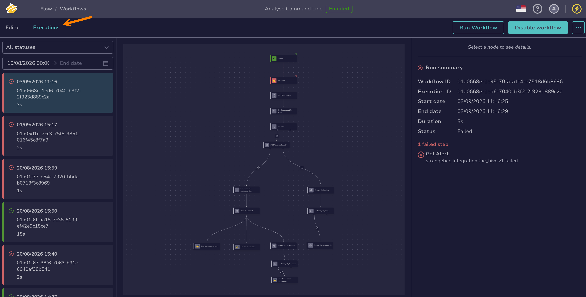
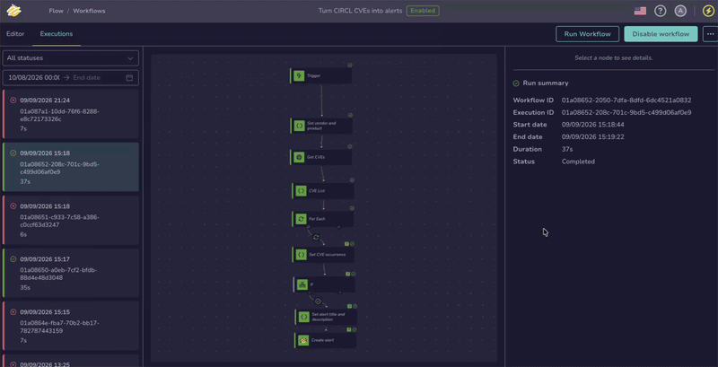
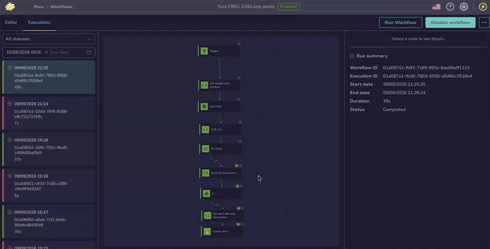
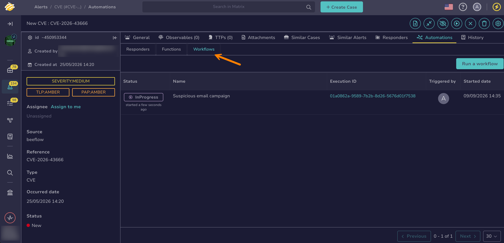

# Display Workflow Execution Logs

<!-- md:version 6.0 --> <!-- md:permission `manageOrchestrator/readWorkflows` --> <!-- md:permission `manageOrchestrator/writeWorkflows` --> <!-- md:license One -->

Use execution logs to inspect how a workflow ran for each node. This is particularly useful for debugging a workflow that isn't behaving as expected.

Execution logs are available in three places:

* The **Execution logs** tab in the **Flow** view gives an organization-wide overview of every workflow's runs.
* The **Executions** tab inside a specific workflow shows that workflow's runs in detail and lets you run it and inspect each node.
* The **Automation** tab of a case or alert in TheHive lists the runs launched on that case or alert.

## Display execution logs for all workflows

The **Execution logs** tab in the **Flow** view lists the executions of every workflow in the organization from the past 30 days, wherever they were launched from, whether a trigger, the workflow editor, or a case or alert. Use it as a starting point to spot failures and jump into a specific run.

1. 

2. Go to the **Execution logs** tab.

    The tab lists the executions of all workflows, with the following columns:

    * Status: whether the execution completed, failed, was canceled, terminated, timed out, or is still in progress
    * Workflow name: the workflow the execution belongs to
    * Execution ID: the unique identifier of the run
    * Duration: how long the execution took
    * Start date and end date: when the execution started and finished

    Select the **Status**, **Duration**, **Start date**, or **End date** column header to sort the list. You can also filter the list by status, date range, or workflow name.

    

3. Select an **Execution ID** to open the detailed execution view for that run, where you can inspect each node as described in [Display execution logs for a specific workflow](#display-execution-logs-for-a-specific-workflow).

This tab is a read-only overview. To run a workflow or step through its nodes, open the workflow and use its **Executions** tab.

## Display execution logs for a specific workflow

The **Executions** tab inside a workflow lists that workflow's runs, wherever they were launched from, whether a trigger, the workflow editor, or a case or alert. Use it when you know which workflow to inspect. It lets you run the workflow and inspect the execution node by node on the canvas.

1. 

2. Select the workflow whose execution logs you want to review.

3. Go to the **Executions** tab.

    The tab lists all past executions of the workflow. Each run is identified by its date and a unique ID. You can filter by status and date range.

    

4. Select **Run workflow** to follow the execution of each node in real time.

    

5. Select a node to view its execution details:

    * Start date, end date, and duration: how long the node took to run
    * Status: whether the node completed, failed, was canceled, or timed out. Nodes that didn't run stay grey on the canvas.
    * Error message: displayed if the node encountered an error
    * Input and output data: the data passed into and returned by the node. The value of a [secret global variable](manage-global-variables.md) never appears in the execution data.

6. For a node that runs inside a *For each* loop, select an iteration from the **Select an execution** dropdown to inspect a single run of that node.

    Each iteration is listed as **Execution 1**, **Execution 2**, and so on. Selecting or hovering over an iteration highlights the nodes and edges that ran during that iteration on the canvas. For nested loops, drill down into an iteration to reach its inner iterations.

    

Executions can't be resumed from a failed node. Fix the issue, then re-run the workflow from the beginning using **Run workflow**. While an execution is still running, select it and use **Cancel** to stop it early.

## Display execution logs from a case or alert

Workflows can be run from the **Flow** view or [from a case or alert page in TheHive](manually-run-workflow.md#run-a-workflow-from-a-case-or-alert). The **Automation** tab of a case or alert lists the workflow runs launched on that entity. Use it when the workflow was run from the case or alert. Runs started from the **Flow** view or a trigger aren't tied to a case or alert and appear only in the **Flow** view logs.

1. Open a case or an alert.

2. Go to the **Automation** tab.

3. Select the **Workflows** tab.

    The tab lists the workflow runs launched on the case or alert, with the following columns:

    * Status: whether the run completed, failed, was canceled, terminated, timed out, or is still in progress
    * Name: the workflow the run belongs to
    * Execution ID: the unique identifier of the run
    * Triggered by: who started the run
    * Started date: when the run started

    The list refreshes automatically while a run is in progress.

    

<h2>Next steps</h2>

* [Manage Workflows](manage-workflows.md)
* [Manually Run a Workflow](manually-run-workflow.md)
