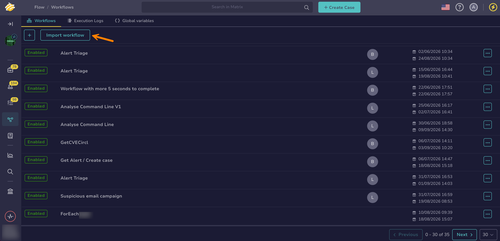

# Export or Import a Workflow

<!-- md:version 6.0 --> <!-- md:license One -->

Workflows in [TheHive Flow](about-flow.md) exist at the organization level. You can transfer workflows between different TheHive instances or organizations by exporting and importing them.

Since TheHive Flow has no native versioning, exporting workflows and committing them to a Git repository is also the recommended strategy for maintaining a change history.

## Export a workflow

<!-- md:permission `manageOrchestrator/writeWorkflows` -->

Share a workflow with another organization or TheHive instance.

1. 

2. In the workflow list, select :fontawesome-solid-ellipsis: next to the workflow you want to export.

3. Select **Export**.

Your workflow downloads as a YAML file.

## Import a workflow

<!-- md:permission `manageOrchestrator/writeWorkflows` -->

Use a workflow from another organization or TheHive instance.

1. 

2. Select **Import workflow**.

    

3. In the **Import workflow** drawer, drop a YAML file or select it from your computer. Use the file you obtained from [exporting a workflow](#export-a-workflow).

4. Select **Import**.

<h2>Next steps</h2>

* [Workflow Templates](workflow-templates.md)
* [Manage Workflows](manage-workflows.md)