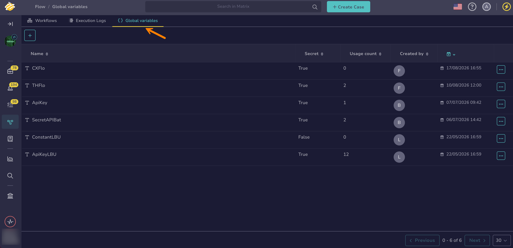

# Manage Global Variables

<!-- md:version 6.0 --> <!-- md:license One -->

Global variables allow you to share fixed values across all workflows within an organization in [TheHive Flow](about-flow.md). These values are centrally managed and can't be modified within workflows.



## Create a global variable

<!-- md:permission `manageOrchestrator/writeVariables` -->

1. 

2. Select the **Global variables** tab.

    

3. Select :fontawesome-solid-plus:.

4. In the **Create a variable** drawer, enter the following information:

    *Fields marked with \* are mandatory.*

    **- Name \***

    A unique name for your global variable within the organization.

    **- Secret**

    Turn this on to hide confidential information like API keys, passwords, or SSL/TLS certificate files. The value of a secret variable is never displayed in the interface and never appears in execution logs or API responses. Leave it off for visible values such as API URLs or team identifiers.

    **- Value \***

    The global variable type and its value. The available types are Boolean, JSON, List, Number, and String.

    **- Description**

    A description of the global variable.

5. Select **Save**.

Once created, a global variable can be referenced in any node field that supports variables. Insert the reference with the **$var** button, or type `$` in the field and start typing the variable name to filter the suggestions. In both cases, select one of the suggestions to insert the reference: it can't be typed in full manually. Inserted references are displayed in the following form:

* `$global.<variable_name>`: for a visible variable
* `$secret.<variable_name>`: for a secret variable

## Modify a global variable

<!-- md:permission `manageOrchestrator/writeVariables` -->

!!! info "Variables used in workflows"
    While a variable is used in a workflow, you can modify its name, value, and description, but not its type or its secret setting. Renaming a variable automatically updates its references in the workflows that use it. The **Usage count** column in the **Global variables** tab shows how many times a variable is used.

1. In the **Global variables** tab, select the name of the global variable you want to modify.

2. In the **Edit a variable** drawer, update the fields.

    If you turn off the **Secret** toggle, enter the value again. The existing value stays hidden and isn't carried over to the visible variable.

3. Select **Save**.

## Delete a global variable

<!-- md:permission `manageOrchestrator/deleteVariables` -->

!!! info "Variables used in workflows"
    A global variable that's used in a workflow can't be deleted. Remove its references from all workflows first. The **Usage count** column in the **Global variables** tab shows how many times a variable is used.

1. In the **Global variables** tab, select :fontawesome-solid-ellipsis: next to the global variable you want to delete.

2. Select **Delete**.

3. Select **OK**.

<h2>Next steps</h2>

* [Manage Workflows](manage-workflows.md)