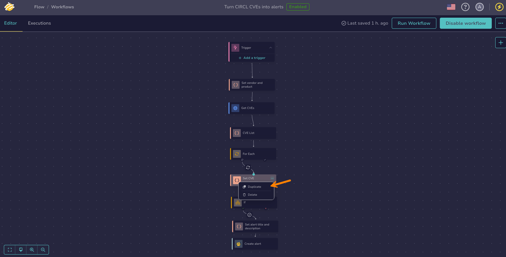
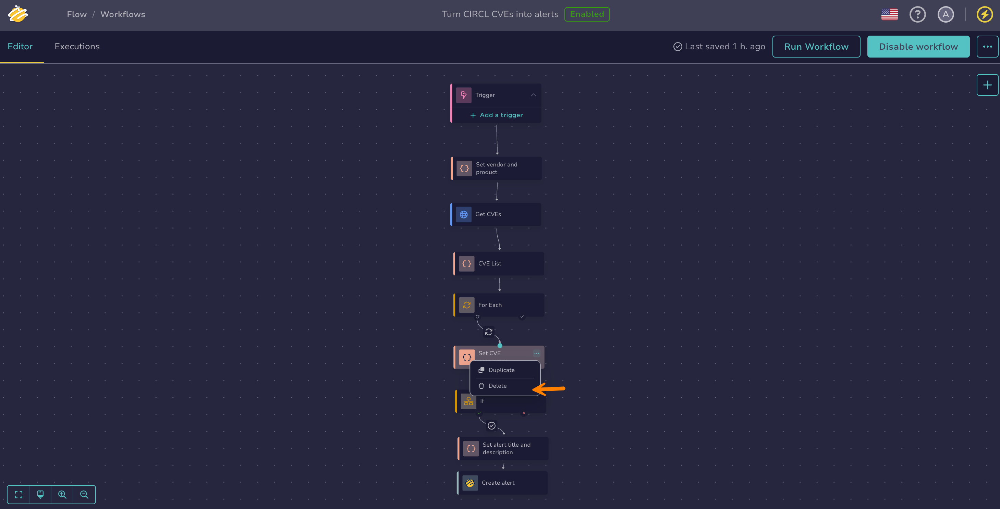
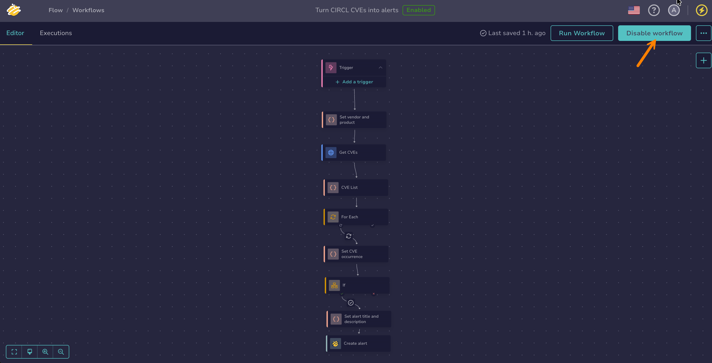

# Manage Workflows

<!-- md:version 6.0 --> <!-- md:license One -->

Workflows in [TheHive Flow](about-flow.md) consist of interconnected nodes that define automated processes. They begin with a trigger and can include flow, transformation, action, and integration nodes. Workflows are scoped to the organization and shared among all members with sufficient permissions. There's no personal or user-isolated workspace.



!!! tip "Reusing workflows"
    You can [import workflows from other TheHive instances or organizations](import-export-workflows.md) if needed.

## Create a workflow

<!-- md:permission `manageOrchestrator/writeWorkflows` -->

Create workflows in [TheHive Flow](about-flow.md) to automate operations when specific events occur.

1. 

2. Select :fontawesome-solid-plus:.

3. In the **Workflow information** drawer, enter the following information:

    *Fields marked with \* are mandatory.*

    **- Name \***

    The name of your workflow.

    **- Description**

    A description of your workflow.

    **- Tags**

    Free text tags to categorize and filter workflows.

    **- Timeout**

    The maximum allowed execution time for the entire workflow. Defaults to 1 hour if left blank. The minimum allowed value is 30 seconds.

    You can also configure different timeout values at the node level, if needed. In that case, the shortest timeout value is applied.

    The timeout also prevails over the duration of a [*Sleep* flow node](configure-flow-node.md#configure-a-sleep-flow-node): if the duration exceeds the workflow timeout, the execution times out before the pause completes.

4. Select **Save**.

    TheHive creates a workflow with a default trigger node. The trigger node is the entry point that initiates workflow execution.

5. Optional: To declare the [workflow's entry and exit variables](about-flow.md#variables), select :fontawesome-solid-ellipsis:, then **Settings**, and fill in the **Input variables** and **Output variables** sections.

    Once declared, input variables can be assigned values when [configuring a *Webhook* trigger](add-trigger.md#add-a-webhook-trigger). A [run from a case or alert page](manually-run-workflow.md#run-a-workflow-from-a-case-or-alert) assigns the case or alert identifier to an entry variable named `case_id` or `alert_id`.

6. Optional: Create [global variables](about-flow.md#variables) to store fixed values shared across workflows. See [Manage Global Variables](manage-global-variables.md#create-a-global-variable) for detailed instructions.

    

7. Select **Add a trigger** to configure one or more triggers in the [trigger node](about-flow.md#trigger-nodes).

    For configuration instructions, see [Add a Trigger](add-trigger.md).

    

8. Add nodes to build your workflow by dragging the previous node connector to an empty area of the canvas.

    

9. Select the node you want to add:

    * [Flow nodes](about-flow.md#flow-nodes) to control workflow branching and loops
    * [Transformation nodes](about-flow.md#transformation-nodes) to process and manipulate data
    * [Action nodes](about-flow.md#action-nodes) to perform generic operations such as sending requests or messages, running Cortex analyzers and responders, or calling an LLM
    * [Integration nodes](about-flow.md#integration-nodes) to perform operations in TheHive or third-party products through their APIs

    For configuration instructions, see [Configure a Flow Node](configure-flow-node.md), [Configure a Transformation Node](configure-transformation-node.md), [Configure an Action Node](configure-action-node.md), or [Configure an Integration Node](configure-integration-node.md).

Once created, the workflow is automatically saved.

## Duplicate a workflow

<!-- md:permission `manageOrchestrator/writeWorkflows` -->

Duplicate a workflow to reuse its structure, or to keep a copy before making significant changes, as workflows have no versioning.

1. In the workflow list, select :fontawesome-solid-ellipsis: next to the workflow you want to duplicate.

2. Select **Duplicate**.

The copy takes the name of the original workflow followed by `- Copy`. To rename it, select :fontawesome-solid-ellipsis: next to the copy, then **Settings**.

## Duplicate a node

<!-- md:permission `manageOrchestrator/writeWorkflows` -->



1. In a workflow, select :fontawesome-solid-ellipsis: on the node you want to duplicate.

2. Select **Duplicate**.

    

## Delete a node

<!-- md:permission `manageOrchestrator/writeWorkflows` -->

!!! info "Trigger node can't be deleted"
    The trigger node is mandatory and can't be deleted from a workflow. However, you can delete individual triggers inside the trigger node.

!!! danger "Deleting a node invalidates references to its outputs"
    Later nodes can reference the deleted node's [output variables](about-flow.md#variables). After the deletion, these references become invalid and the affected nodes report errors. Until you update or remove these references, a disabled workflow can't be [enabled](#enable-a-workflow), and an already enabled workflow rejects every run attempt, whether triggered or manual.



1. In a workflow, select :fontawesome-solid-ellipsis: on the node you want to delete.

2. Select **Delete**.

    

## Enable a workflow

<!-- md:permission `manageOrchestrator/writeWorkflows` -->

Enable a workflow to run it automatically when triggered. An enabled workflow can also be [run manually from the workflow editor or from a case or alert page](manually-run-workflow.md).

!!! warning "Resolve errors before enabling"
    You can't enable a workflow that contains errors. Errors are marked in the workflow with :fontawesome-solid-triangle-exclamation:. Resolve all errors before enabling the workflow.

In the workflow editor, select **Enable workflow**.

## Turn off a workflow

<!-- md:permission `manageOrchestrator/writeWorkflows` -->

Turn off a workflow to edit it without affecting production operations. A disabled workflow never runs: its triggers are ignored and manual runs are unavailable.

In the workflow editor, select **Disable workflow**.

## Delete a workflow

<!-- md:permission `manageOrchestrator/deleteWorkflows` -->

!!! danger "Permanent action"
    Deleting a workflow is permanent and can't be undone. To temporarily deactivate a workflow, [turn it off](#turn-off-a-workflow) instead.

1. In the workflow list, select :fontawesome-solid-ellipsis: next to the workflow you want to delete.

2. Select **Delete**.

3. Select **OK**.

<h2>Next steps</h2>

* [Build your First Workflow](build-your-first-workflow.md)
* [Workflow Templates](workflow-templates.md)
* [Manage Global Variables](manage-global-variables.md)
* [Manage Entry and Exit Variables](manage-entry-exit-variables.md)
* [Add a Trigger](add-trigger.md)
* [Configure a Flow Node](configure-flow-node.md)
* [Configure a Transformation Node](configure-transformation-node.md)
* [Configure an Action Node](configure-action-node.md)
* [Configure an Integration Node](configure-integration-node.md)
* [Manually Run a Workflow](manually-run-workflow.md)