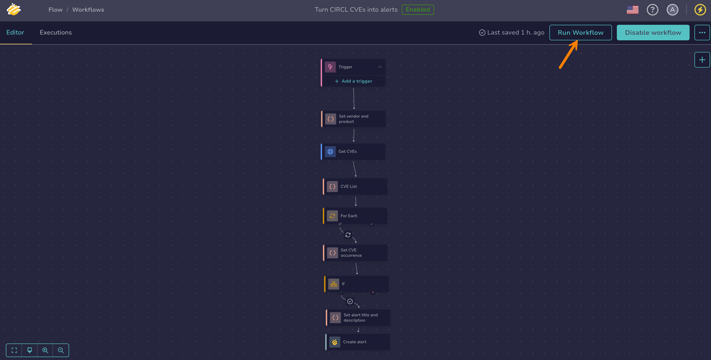
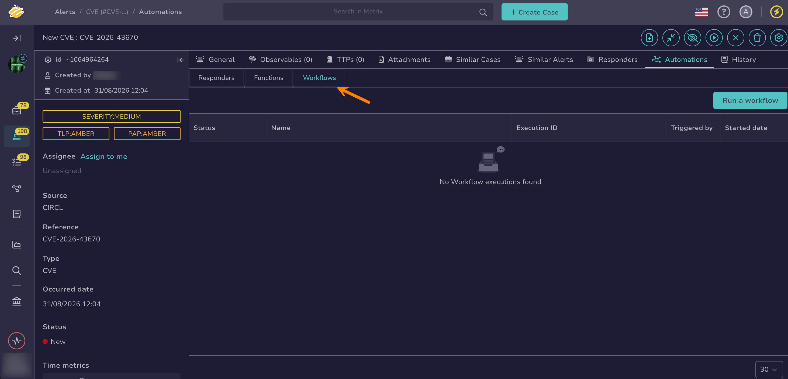

# Manually Run a Workflow

<!-- md:version 6.0 --> <!-- md:permission `manageOrchestrator/writeWorkflows` --> <!-- md:license One -->

Execute your workflow on demand, regardless of its trigger configuration: from the workflow editor while building it, or from a case or alert page in TheHive.

!!! warning "Prerequisite"
    You must enable a workflow, and resolve any errors marked with :fontawesome-solid-triangle-exclamation:, before you can run it manually.



## Run a workflow from the workflow editor

1. 

2. Select a workflow.

3. In the workflow editor, select **Run workflow**.

    

## Run a workflow from a case or alert

<!-- md:permission `manageOrchestrator/readWorkflows` --> <!-- md:permission `manageOrchestrator/writeWorkflows` -->

1. Open a case or an alert.

2. Go to the **Automation** tab.

3. Select the **Workflows** tab.

    

    The tab [lists the workflow runs already launched on the case or alert](display-execution-logs.md#display-execution-logs-from-a-case-or-alert).

4. Select **Run a workflow**.

5. Select one or more workflows, then select **Launch action(s)**.

Each selected workflow runs once. TheHive passes the identifier of the case or alert to the run as a variable named `case_id` or `alert_id`. To use it in the workflow, [declare an entry variable](manage-entry-exit-variables.md) with that exact name: the identifier is then available in the nodes as `$input.case_id` or `$input.alert_id`.

<h2>Next steps</h2>

* [Add a Trigger](add-trigger.md)
* [Export or Import a Workflow](import-export-workflows.md)
