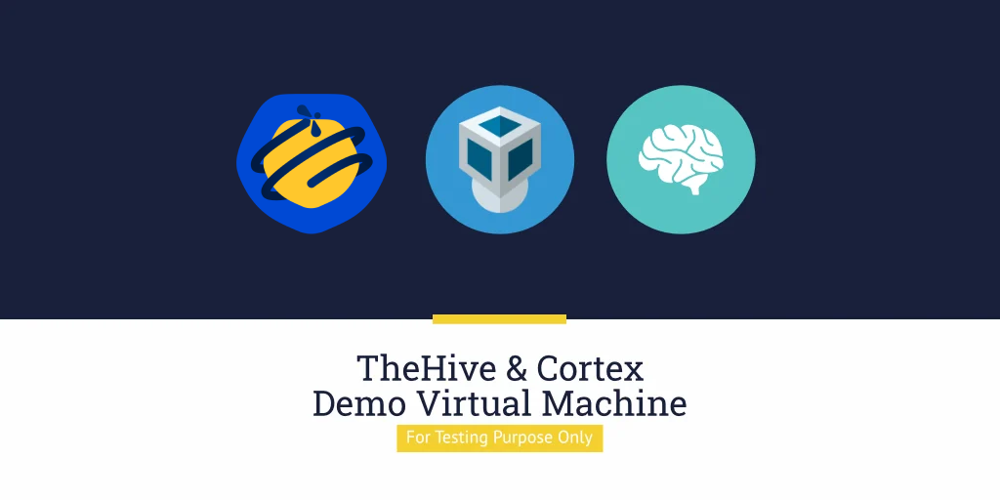

# Download the Demo Virtual Machine



Download the ready-to-use VM from the [StrangeBee website](https://www.strangebee.com/tryit).

This VM is prepared and updated by StrangeBee and includes the latest versions of:

- TheHive: Security incident response and case management platform
- Cortex: Extendable analysis, enrichment, and response automation framework

For detailed instructions, see [Use the Demo Virtual Machine](howto-vm-demo.md).