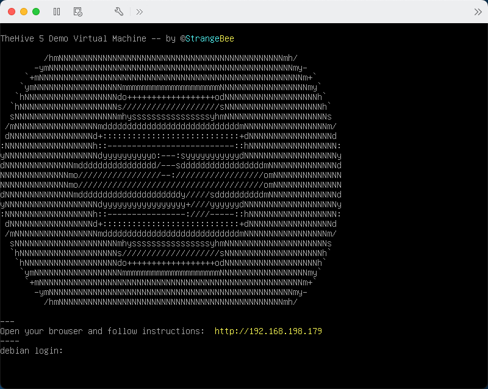
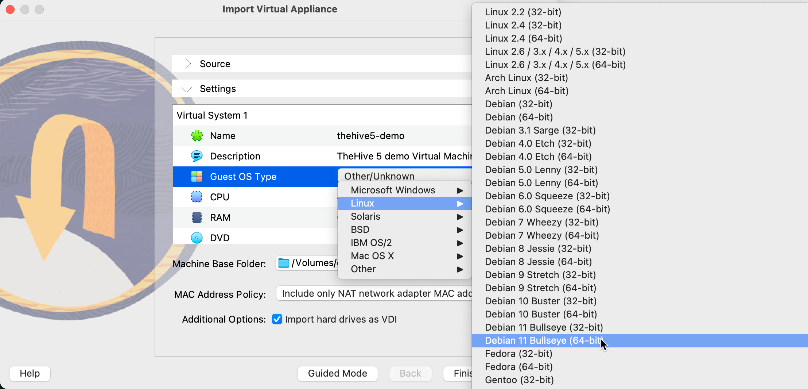
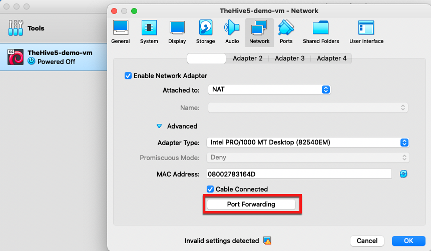
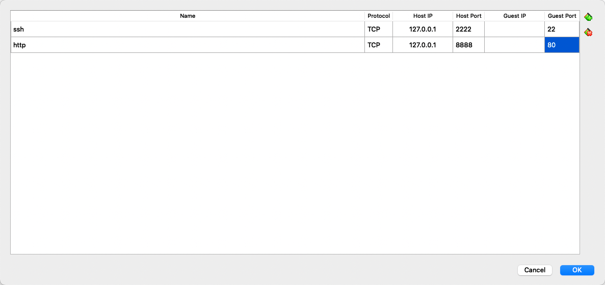

# Use the Demo Virtual Machine

!!! warning "Memory requirement"
    Allocate at least 6 GB of RAM to this virtual machine (VM) for stable performance. Assigning less may cause errors or degraded performance.

!!! tip "Platinum trial"
    The VM installation of TheHive with Cortex includes a 14-day Platinum trial license. After the trial ends, TheHive switches to read-only mode.

## Start the virtual machine



=== "Using VMWare"
    1. Start the VM and follow the on-screen instructions.
    2. In your browser, open the URL displayed by the VM.

=== "Using VirtualBox"
    1. During import, set the Guest OS type information.
    
    2. After import, update the network settings of the VM before starting it.
    
    3. Add the required port forwarding rules (adjust as needed) and save.
    
    4. Start the VM and open the following URL in your browser: [http://127.0.0.1:8888](http://127.0.0.1:8888)
    5. If needed, adjust the Display settings and set the graphical controller to `VMSVGA` before starting the VM.

## Quick connect

!!! note "Following instructions are also available on the web page displayed by the virtual machine" 

{ width="200" }

!!! question "TheHive credentials"
    This VM comes with two accounts in TheHive:

    Administrator:

    * Login: `admin@thehive.local`
    * Password: `secret`


    A user named `thehive` has been created and is `org-admin` of the organization named `demo`: 

    * Login: `thehive@thehive.local`
    * Password: `thehive1234`

TheHive database comes with several samples of data, like [custom fields](../thehive/administration/custom-fields/about-custom-fields.md), [MISP taxonomies](https://github.com/MISP/misp-taxonomies), [MITRE Att&ck](https://attack.mitre.org/) data, a [case template](../thehive/user-guides/organization/configure-organization/manage-templates/case-templates/about-case-templates.md) and an [alert](../thehive/user-guides/analyst-corner/alerts/about-alerts.md).

{ width="200" }

!!! question "Cortex credentials"
    This VM comes with 2 accounts in Cortex:

    Administrator: 

    * Login: `admin`
    * Password: `thehive1234` 

    An organization is also created with an `orgadmin` account: 

    * Login: `thehive`
    * Password: `thehive1234`

{!includes/vm-testing-only.md!}

## Content

The VM runs Ubuntu 24.04 and includes:

* TheHive {!includes/thehive-latest-version.md!lines=2}, with Cassandra, Elasticsearch, and local file storage
* Cortex {!includes/cortex-latest-version.md!lines=2}, with Elasticsearch
* TheHive4py
* Cortex4py
* Public Cortex analyzers and responders running in Docker

### Configuration details

Applications are launched with Docker Compose as containers, with volumes attached under `/opt/thp`.

!!! example "Directory structure"
    ```
    .
    ├── cassandra
    ├── cortex
    ├── docker-compose.yml
    ├── elasticsearch
    ├── nginx
    └── thehive
    ```

#### TheHive

TheHive is configured to use Cassandra as its database and Elasticsearch to index data. Files are stored locally on disk.

!!! example "TheHive directory structure"
    ```
    thehive
    ├── config
    ├── files
    └── log
    ```

- `config`: configuration files
- `files`: files storage
- `log`: application logs

### Cortex

Cortex uses Elasticsearch as its database, which also runs as a Docker Compose container. Dedicated volumes are configured for Elasticsearch: `/opt/thp/elasticsearch/data` to store data, and `/opt/thp/elasticsearch/log` for logs.

!!! example "Cortex directory structure"
    ```
    cortex
    ├── config
    ├── jobs
    └── log
    ```

- `config`: Cortex configuration files
- `jobs`: shared volume for analyzers and responders jobs
- `log`: application logs

## Operations

### VM

You can use the system account `thehive/thehive1234` to operate the VM.

All applications run as Docker containers managed with Docker Compose. The `docker-compose.yml` file is located in `/opt/thp`.

### TheHive 

After modifying TheHive configuration, restart the service.

* Configuration file: `/opt/thp/thehive/config/application.conf`

* Restart command:
 
!!! example ""
    ```bash
    cd /opt/thp
    docker compose restart thehive
    ```

### Cortex

After modifying Cortex configuration, restart the service.

* Configuration file: `/opt/thp/cortex/config/application.conf`

* Restart command:

!!! example ""
    ```bash
    cd /opt/thp
    docker compose restart cortex
    ```

### Documentation

You can find the full documentation for TheHive at [https://docs.strangebee.com](https://docs.strangebee.com).

## Troubleshooting

* TheHive service logs: `/opt/thp/thehive/log/application.log`
* Cortex service logs: `/opt/thp/cortex/log/application.log`