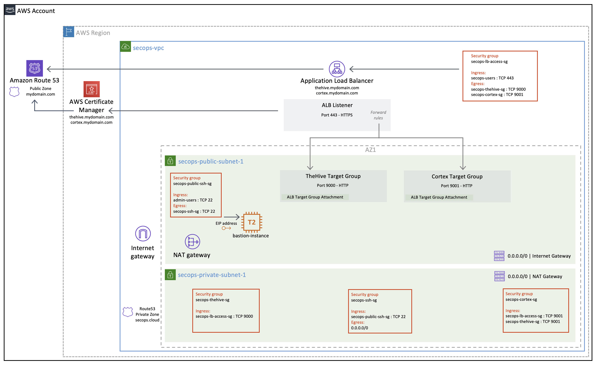

# Creating a new SecOps VPC

If you do not already have a VPC at hand to deploy TheHive and Cortex into, using our sample code will allow you to build a production-ready VPC very easily.
 
!!! Example "Files"

    * [main.cf](https://github.com/StrangeBeeCorp/cloud-distrib-resources/blob/master/aws/ug-secops-vpc/main.tf)
    * [providers.cf](https://github.com/StrangeBeeCorp/cloud-distrib-resources/blob/master/aws/ug-secops-vpc/providers.cf)
    * [outputs.cf](https://github.com/StrangeBeeCorp/cloud-distrib-resources/blob/master/aws/ug-secops-vpc/outputs.cf)
    * [variables.cf](https://github.com/StrangeBeeCorp/cloud-distrib-resources/blob/master/aws/ug-secops-vpc/variables.cf)
    * [samples.tfvars](https://github.com/StrangeBeeCorp/cloud-distrib-resources/blob/master/aws/ug-secops-vpc/samples.tfvars)
    * [files/bastion-cloud-config-new.tpl](https://github.com/StrangeBeeCorp/cloud-distrib-resources/blob/master/aws/ug-secops-vpc/files/bastion-cloud-config-new.tpl)

## Overview
The reference architecture VPC consists of the following resources

The VPC will include:

+ Two **public subnets** (only one is depicted - two public subnets will be created in different availability zones since they are required for the Application Load Balancer configuration)
+ Two **private subnets** (only one is depicted - we will not be using the second private subnet but it will be ready to use if you need it and it does not incur additional costs)
+ Five **security groups** 
+ An **internet gateway** (IG)
+ A **NAT gateway** in the first public subnet
+ **Route tables** for both public and private subnets
+ An **Application Load Balancer** (ALB) with a listener on port 443  using ACM-managed public certificates and two target groups for TheHive and Cortex
+ **Public Route53 DNS records** for TheHive and Cortex to point to the ALB
+ A **private Route53 DNS zone** for internal VPC name resolution
+ A **bastion host** for remote SSH administration

Since we will be building a new VPC from scratch, we will use AWS-managed services to expose our TheHive and Cortex instances:

+ **Application Load Balancer** to handle secured TLS sessions with end-users. A single load balancer with a single listener on port 443 can forward traffic to both TheHive and Cortex instances based on forward rules.
+ **AWS Certificate Manager** to issue and renew valid public certificates to enable TLS sessions between end-users and the load balancer. Once attached to an AWS-managed service such as the Application Load Balancer, public certificates are automatically renewed when nearing expiration. If you operate both TheHive and Cortex, you can share a single certificate for both services by including multiple hostnames in the certificate. You can also use separate certificates as the ALB supports attaching several certificates to a listener.
+ **Amazon Route53** to manage your public DNS records. You will need Route53 to manage at least one public DNS zone, but not necessarily a whole domain name. It can be a subdomain of an existing domain, such as *aws.mydomain.com*. Having Route53 manage your DNS records enables a lot of automation such as automatic certificate validation and renewal, automatic DNS registration of your load balancer and so on. We also recommend you use Route53 to manage a private DNS zone attached to your VPC to enable local name resolution within the private subnet (this is how TheHive can easily find its Cortex instance and it allows to SSH into private instances without having to bother with their private IPs).

### Security Groups
There are no default iptables rules implemented in the AMIs for either TheHive or Cortex (no OS-based IP filtering). Since we built the AMIs to be replaceable at each application update, somewhat like containers, we recommend limiting OS customisations to benefit from the easy update process. For that reason, filtering should be based on security groups or Network ACLs only.

Keep in mind that the applications are listening on http, *not https*. Even though the default AMI security groups allow incoming traffic on the http ports (TCP 9000 for TheHive, TCP 9001 for Cortex), be careful not to expose them on a public-facing network interface.

The required security groups depicted above are created automatically along with the SecOps VPC.

### Bastion host
We launch a small instance to act as a bastion host. **Bastion host hardening is not performed automatically** but you should definitely harden this host going forward if you will use it in a production context. We do however strictly limit access to and from this host.

The bastion host will run the latest Ubuntu AMI from Canonical. The default sudoer user is *ubuntu*.

## SecOps VPC prerequisites

While most VPC resources will be provisioned with Terraform, there is **one exception that should be created beforehand**:

* The Route53 public DNS zone to register the load balancer and to automatically validate the ACM certificates

You must provide the DNS hosted zone name before creating the VPC (set the `secops_r53_public_dns_zone_name` Terraform variable with the zone name).

!!! Info

    We will use a single load balancer, a single https listener and a single certificate for both TheHive and Cortex. Since the default configuration is to route TheHive and Cortex queries based on the host name, make sure you provide both TheHive and Cortex host names in the `secops_r53_records_san` Terraform variable so they are provisionned both in the load balancer listener certificate and DNS records.

---
Terraform compatibility: v1.x