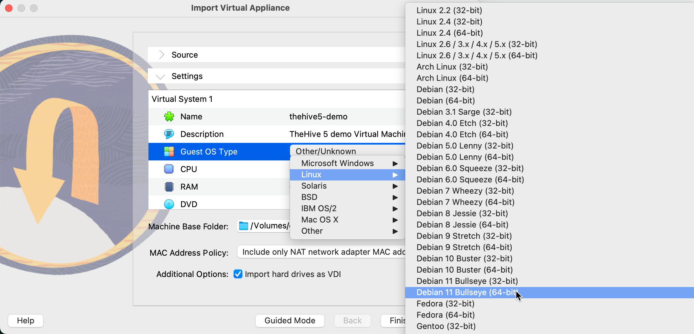
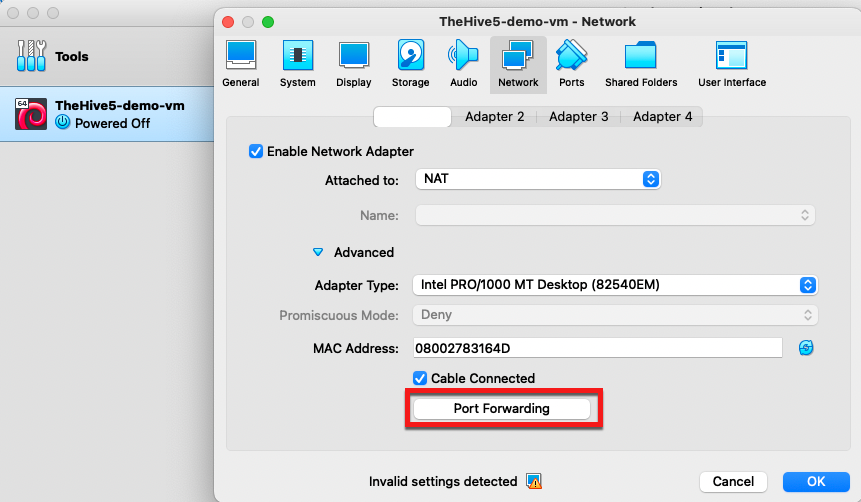
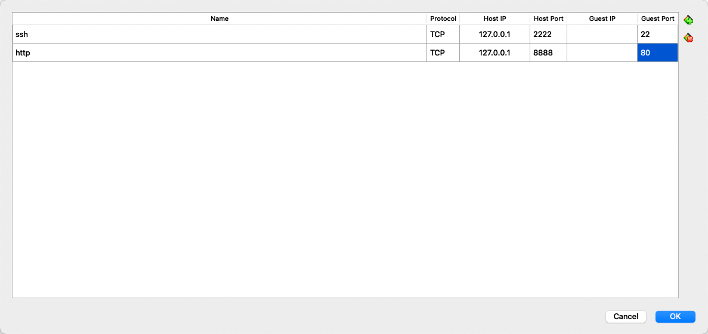

# Set Up a Demo Virtual Machine Environment

Deploy a demo environment to trial TheHive and Cortex with sample data using a Virtual Machine (VM). Download a ready-to-use image and open it in [VMware](https://www.vmware.com/){target=_blank} or [VirtualBox](https://www.virtualbox.org/){target=_blank}.

For a setup running Docker Compose directly on a Linux host, see [Deploy a Demo Docker Environment](docker-demo.md).

!!! danger "Testing only"
    This VM is provided for testing purposes only. Don't use it in production.

!!! warning "Memory requirement"
    Allocate at least 6 GB of RAM to this virtual machine (VM) for stable performance. Assigning less may cause errors or degraded performance.

!!! tip "Platinum trial"
    The VM installation of TheHive with Cortex includes a 14-day Platinum trial license. After the trial ends, TheHive switches to read-only mode.

## Step 1: Download the VM

Download the ready-to-use VM from the [StrangeBee website](https://www.strangebee.com/tryit).

This VM is prepared and updated by StrangeBee and includes:

- TheHive: Security incident response and case management platform
- Cortex: Extendable analysis, enrichment, and response automation framework

## Step 2: Start the VM

=== "Using VMWare"
    1. Start the VM and follow the on-screen instructions.
    2. In your browser, open the URL displayed by the VM.

=== "Using VirtualBox"
    1. During import, set the Guest OS type information.
    
    2. After import, update the network settings of the VM before starting it.
    
    3. Add the required port forwarding rules (adjust as needed) and save.
    
    4. Start the VM and open the following URL in your browser: [http://127.0.0.1:8888](http://127.0.0.1:8888)
    5. If needed, adjust the display settings and set the graphical controller to `VMSVGA` before starting the VM.

## Step 3: Log in to TheHive and Cortex

The VM comes pre-loaded with sample data and configuration:

* A `Demo` organization and `thehive` user account in Cortex and TheHive
* Free analyzers enabled
* Cortex integrated with TheHive
* Sample data including an alert, a case template, custom fields, MISP taxonomies, and MITRE ATT&CK data

Use the following credentials to log in:

| Application | User type | Username | Password |
| ----------- | --------- | -------- | -------- |
| TheHive | Admin | `admin@thehive.local` | `secret` |
| TheHive | Org Admin | `thehive@thehive.local` | `thehive1234` |
| Cortex | Admin | `admin` | `thehive1234` |
| Cortex | Org Admin | `thehive` | `thehive1234` |

## Application stack

The VM runs Ubuntu 24.04 and includes:

* TheHive, with Cassandra, Elasticsearch, and local file storage
* Cortex, with Elasticsearch
* TheHive4py
* Cortex4py
* Public Cortex analyzers and responders running in Docker

### Configuration details

Applications are launched with Docker Compose as containers, with volumes attached under `/opt/thp`.

!!! example "Directory structure"
    ```
    .
    ├── cassandra
    ├── cortex
    ├── docker-compose.yml
    ├── elasticsearch
    ├── nginx
    └── thehive
    ```

#### TheHive

TheHive is configured to use Cassandra as its database and Elasticsearch to index data. Files are stored locally on disk.

!!! example "TheHive directory structure"
    ```
    thehive
    ├── config
    ├── files
    └── log
    ```

- `config`: Configuration files.
- `files`: Files storage.
- `log`: Application logs.

#### Cortex

Cortex uses Elasticsearch as its database, which also runs as a Docker Compose container. Dedicated volumes are configured for Elasticsearch: `/opt/thp/elasticsearch/data` to store data, and `/opt/thp/elasticsearch/log` for logs.

!!! example "Cortex directory structure"
    ```
    cortex
    ├── config
    ├── jobs
    └── log
    ```

- `config`: Cortex configuration files.
- `jobs`: Shared volume for analyzers and responders jobs.
- `log`: Application logs.

## Operations

### VM

You can use the system account `thehive/thehive1234` to operate the VM.

All applications run as Docker containers managed with Docker Compose. The `docker-compose.yml` file is located in `/opt/thp`.

### Configure TheHive



After modifying TheHive configuration, restart the service.

* Configuration file: `/opt/thp/thehive/config/application.conf`

* Restart command:

```bash
cd /opt/thp
docker compose restart thehive
```

The following documentation pages explain how to configure specific settings in `application.conf`:

* [Update TheHive Service Configuration](../thehive/configuration/update-service-configuration.md)
* [Configure Database and Index Authentication](../thehive/configuration/configure-authentication-cassandra-elasticsearch.md)
* [TheHive Database and Index Connection Settings](../thehive/configuration/cassandra-elasticsearch-connection-settings.md)
* [Turn Off the Cortex Integration](../thehive/configuration/turn-off-cortex-connector.md)
* [Turn Off the MISP Integration](../thehive/configuration/turn-off-misp-connector.md)

### Configure Cortex



After modifying Cortex configuration, restart the service.

* Configuration file: `/opt/thp/cortex/config/application.conf`

* Restart command:

```bash
cd /opt/thp
docker compose restart cortex
```

The following documentation pages explain how to configure specific settings in `application.conf`:

* [Database Configuration](../cortex/installation-and-configuration/database.md)
* [Authentication](../cortex/installation-and-configuration/authentication.md)
* [Proxy Settings](../cortex/installation-and-configuration/proxy-settings.md)
* [Analyzers and Responders](../cortex/installation-and-configuration/analyzers-responders.md)
* [Advanced Configuration](../cortex/installation-and-configuration/advanced-configuration.md)

## Troubleshooting

* TheHive service logs: `/opt/thp/thehive/log/application.log`
* Cortex service logs: `/opt/thp/cortex/log/application.log`

<h2>Next steps</h2>

* [TheHive Troubleshooting](../thehive/operations/troubleshooting.md)
* [TheHive Installation Methods](../thehive/installation/installation-methods.md)
* [Cortex Installation Methods](../cortex/download/index.md)