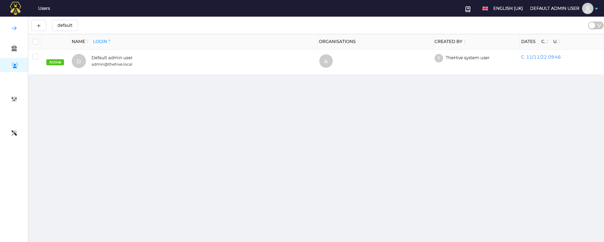
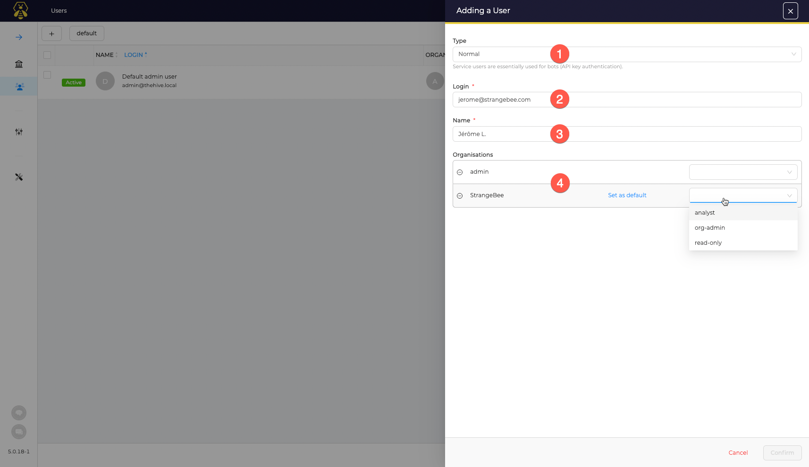
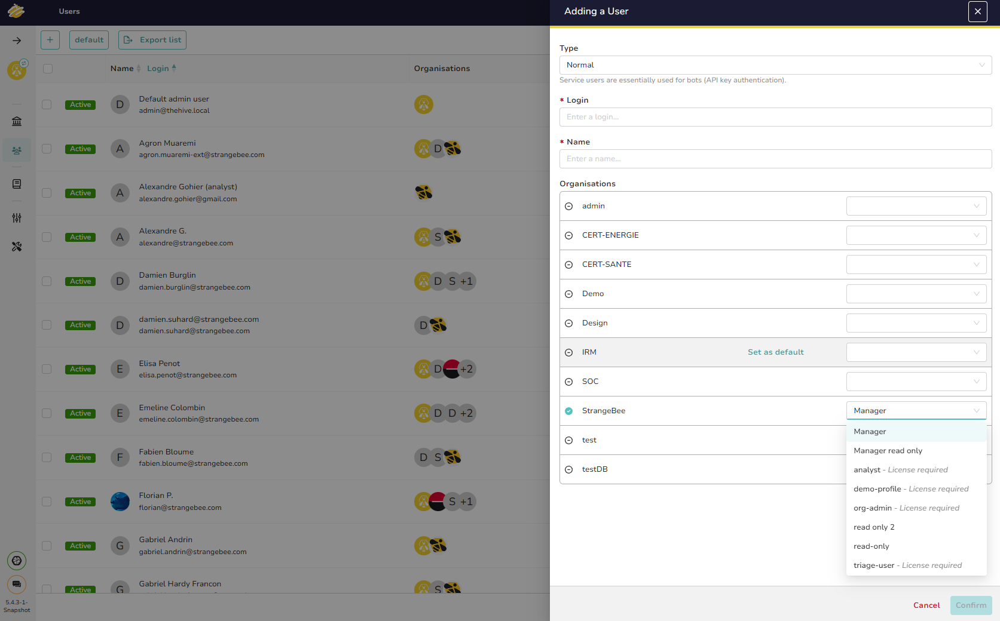
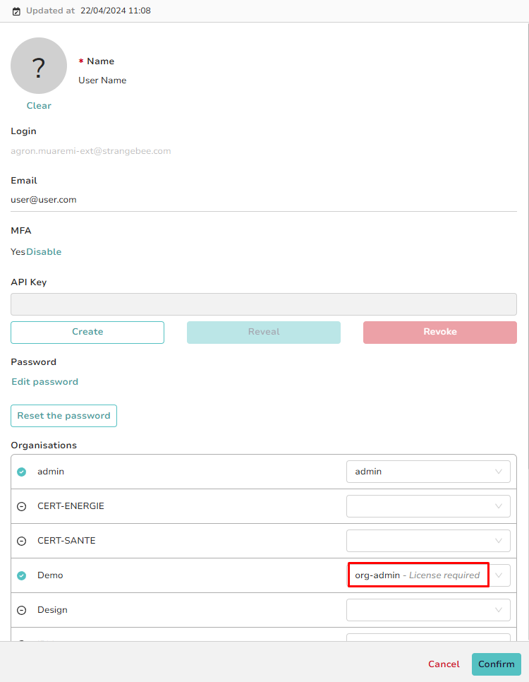

# Manage Accounts

Accounts can be created or edited in TheHive from multiple locations:

- As an **Administrator**, in the **Users** view
- As an **Administrator**, on the detailed page of an Organization
- As an **Org-admin**, on the Organization configuration page

As a platform Administrator, go to the **Users** page to manage accounts.

## Types of Accounts

Starting from TheHive 5.0, there are two types of accounts:

### **Normal Accounts**
These are intended for standard users, such as analysts. Normal accounts support logging in via the web UI, use of all available authentication methods, and API key generation if enabled.

### **Service Accounts**
These accounts are designed for automation tasks within the application, such as creating alerts. Service accounts can only authenticate via the API using an API key and cannot log into the web UI.

## Creating an Account

To create a new account, follow these steps:

1. Click the :fontawesome-regular-square-plus: button to add an account.

   

2. Select the account type, either *Normal* or *Service*.
3. Enter a login name formatted as an *email address*.
4. Provide a name for the account.
5. Assign organizations and set an associated profile for each. To establish the default organization, click *Set as default*.

Once completed, click *Confirm*.

---

## Updating an Account

To modify an existing account:

1. In the account list, click *Preview* to open the account details.

   

2. You can add an avatar to the account by clicking the :fontawesome-solid-circle-question: icon and selecting a file.[^1]
3. Update the email address, which is used for notifications and password resets.
4. Verify if the user has enabled MFA (Multi-Factor Authentication).
5. To change the account password, click *Set a new password*. An email informing the user of the change is sent to their registered email address.
6. Click *Reset the password* to email the user a magic link for password reset. For more information, refer to [Password Reset Guide](./../user-guides/forgot-password.md).
7. Update *Roles* and *Organizations* as needed.
8. To delete the account, select the *Delete* option.

[^1]: Accepted formats are PNG or JPG files only.

---

## License Management for User Profiles (Version 5.4.3 Update)

In version 5.4.3, TheHive introduces a new feature for license management in user profiles. During user creation or editing, administrators can now see which profiles require a license, as indicated by a **"License Required"** label in the profile selection dropdown. This label, displayed next to profiles with permissions that consume licenses, helps administrators manage license usage effectively.

This enhancement is available in both the **Org-admin** and **Global Users** views, providing consistent visibility across user management settings.

