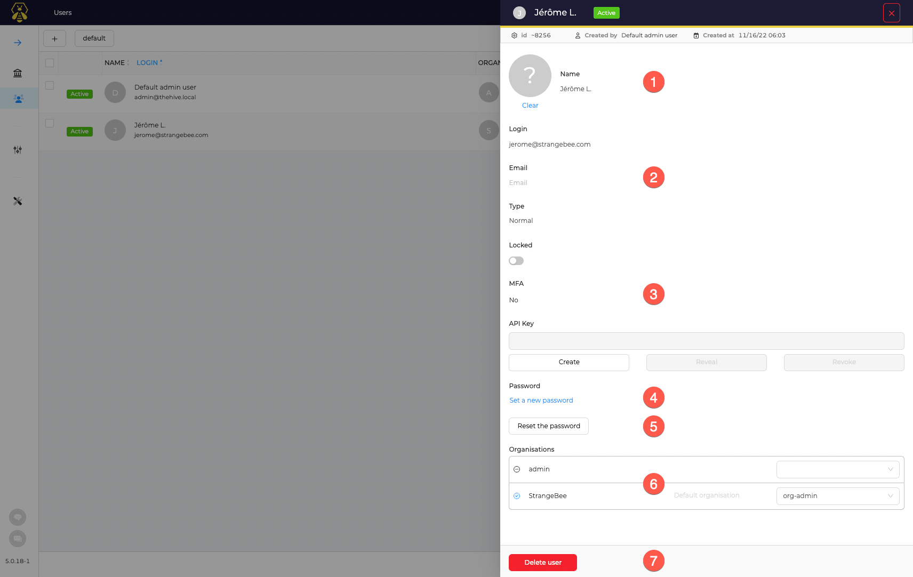

# Manage Accounts

Accounts can be created or edited from several places in TheHive:

* As Administrator, in the *Users* view
* Ad Administrator in the detailed page of an Organisation
* As Org-admin, in the Organisation configuration page

As Administrator of the platform, open the *Users* page.

## Types of accounts

Starting with TheHive 5.0, two types of accounts exist in the application:

***Normal* accounts**

: They are used for standard users, like analysts. This accounts can be used to open a session on the web UI, use all available authentication methods, and API keys if enabled.

***Service* accounts**

: They are recommended to be used by accounts in charge of automation in the application, like the ones used by to created Alerts. These accounts can only be used to authicate the application though the API, with an API key.

## Create an account

Click the :fontawesome-regular-square-plus: button to add an account.

1. Choose the type of account, *Normal* or *Service*
2. Fill the login name (formatted as an *email address*)
3. Specify a name for the account
4. Select the organisations and associated profile in each of them applied for this account. And Click on *Set as default* to define the default organisation for the account

Then, click *Confirm*.

## Update an account

In the list of accounts, click *Preview* to open accounts details view.

1. an Avatar can be added to the account. Click on the :fontawesome-solid-circle-question: to choose the file[^1]
2. Specify the email address for the account. This is used to send notifications or reset password links to users
3. Verify if the user has activated MFA (multi-factor authentication)
4. Click on *Set a new password* to define a new password for the account
5. Click *Reset the password* to send an email to the user. He will receive an email with a magic link to change his password. See  for more details.
6. Update *Roles* and *Organisations*
7. Delete the account

[^1]:
    PNG or JPG files only.