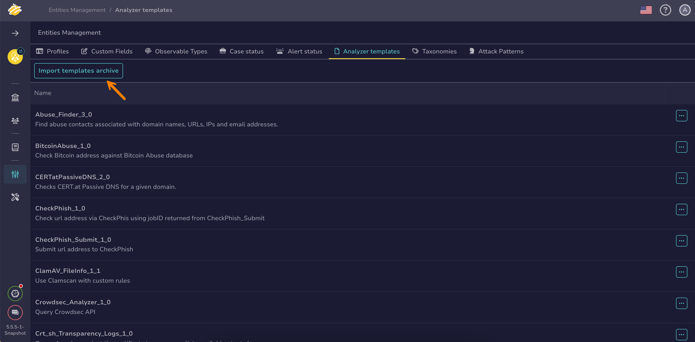

# How to Import Analyzer Templates

This topic provides step-by-step instructions for importing [analyzer templates](about-analyzer-templates.md) in TheHive.

Use this procedure to define templates for reports generated after [running an analyzer on an observable](../../user-guides/analyst-corner/cases/observables/run-analyzers-on-an-observable.md).

{!includes/administrator-access-manage-analyzer-templates.md!}

<h2>Procedure</h2>

1. {!includes/entities-management-view-go-to.md!}

2. {!includes/analyzer-templates-go-to.md!}

3. Select **Import templates archive**.

    

4. In the **Import templates archive** drawer, download the official templates archive.

5. Drop the ZIP file directly into the **Templates archive** section or select the ZIP file from your computer.

6. Select **Import**.

<h2>Next steps</h2>

* [Customize an Analyzer Template](customize-an-analyzer-template.md)