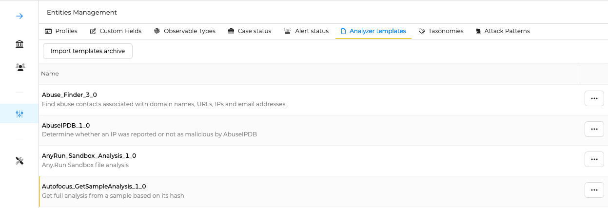
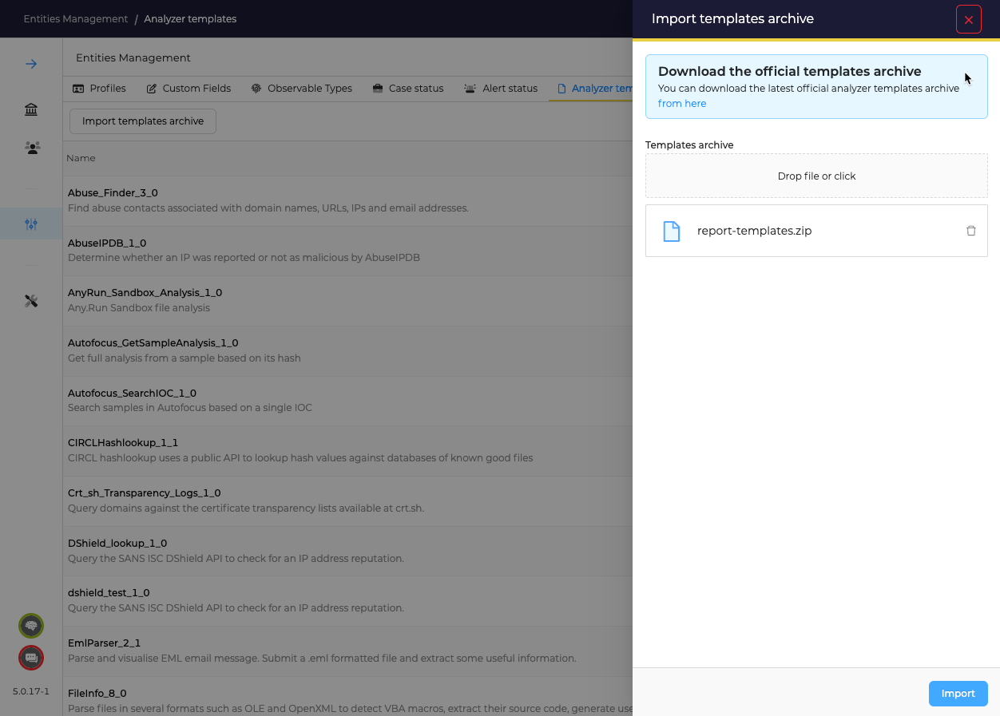
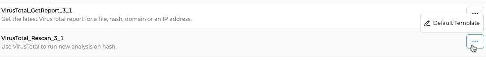

# Analyzer templates

TheHive requires HTML templates to diplay Analyzers reports. 

## Install or update templates of public Analyzers
    
1. As Administrator, go to _Entities Management_ menu, and _Analyzer templates_

    

2. Download the ZIP archive, add it, and click on the _Import_ button

    

## Edit templates
As soon as a new Analyzer is enabled in Cortex, and is available for TheHive, a template line is added in this list.

1. Find the template to edit

    

2. Edit and save

    

Running the associated analyzer should display results with the new template applied.