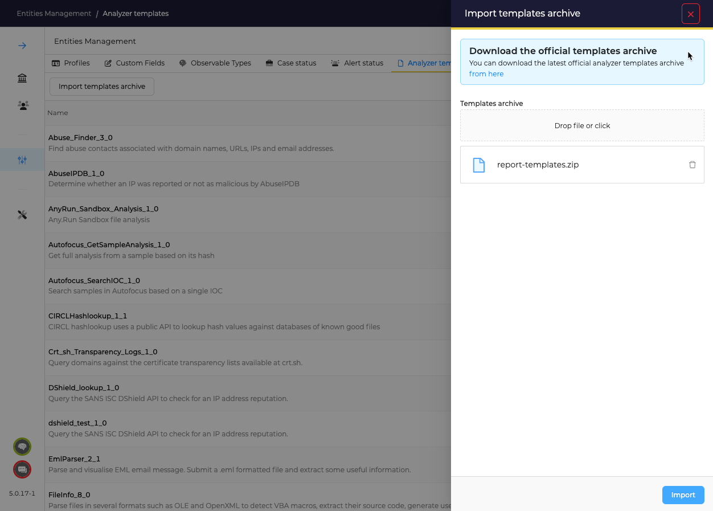

# Analyzer templates

TheHive requires HTML templates to diplay Analyzers reports. 

1. As Administrator, go to _Entities Management_ menu, and _Analyzer templates_

2. Download the ZIP archive, add it, and click on the _Import_ button

