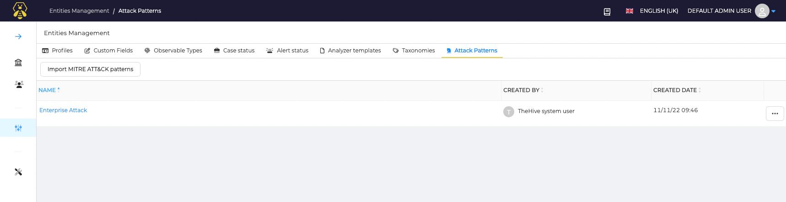
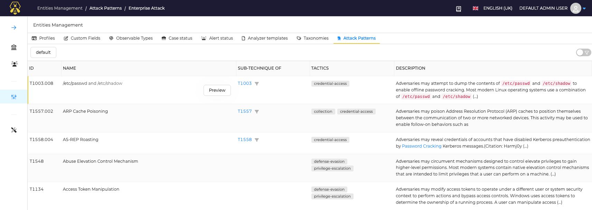
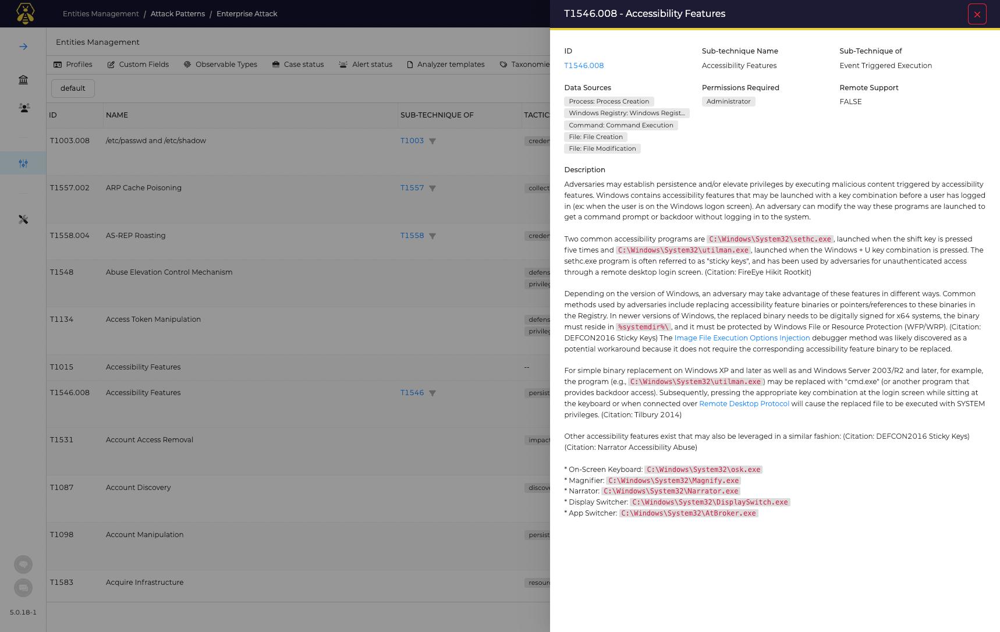
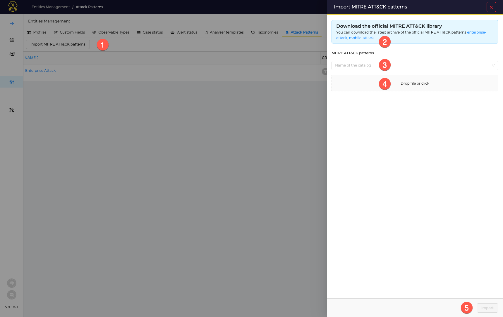

# Att&ck patterns

The Att&ck patterns configuration is available in the Administrators space: open *Entities Management*, then click on *Att&ck Patterns* tab.

## Introduction

By default, TheHive comes with [Enterprise ATT&CK patterns](https://attack.mitre.org/matrices/enterprise/) from MITRE. This is installed during the installation process, and de catalog name *Enterprise Attack* is created with all of the related techniques.

## View patterns

To view details of patterns included in a catalog, click on a catalog. 

full details of each pattern can be reviewed by click on a technique ID (*TXXXX*)

## Add or Update Catalogs
The catalogs are not updated automatically, neither the Enterprise catalog cominng during the installation process. Sso if you want to benefits from last versions of the framework, you have to update it.

To add a new catalog:

1. Click on the *Import MITRE ATT&CK patterns*
2. Choose the patterns you want to install
3. Add a catalog name if *creating a new catalog*, or select the name of an existing one to *update it*
4. Drop le downloaded file
5. Click the *Import* button

!!! Tip ""
    This action can take some time.
