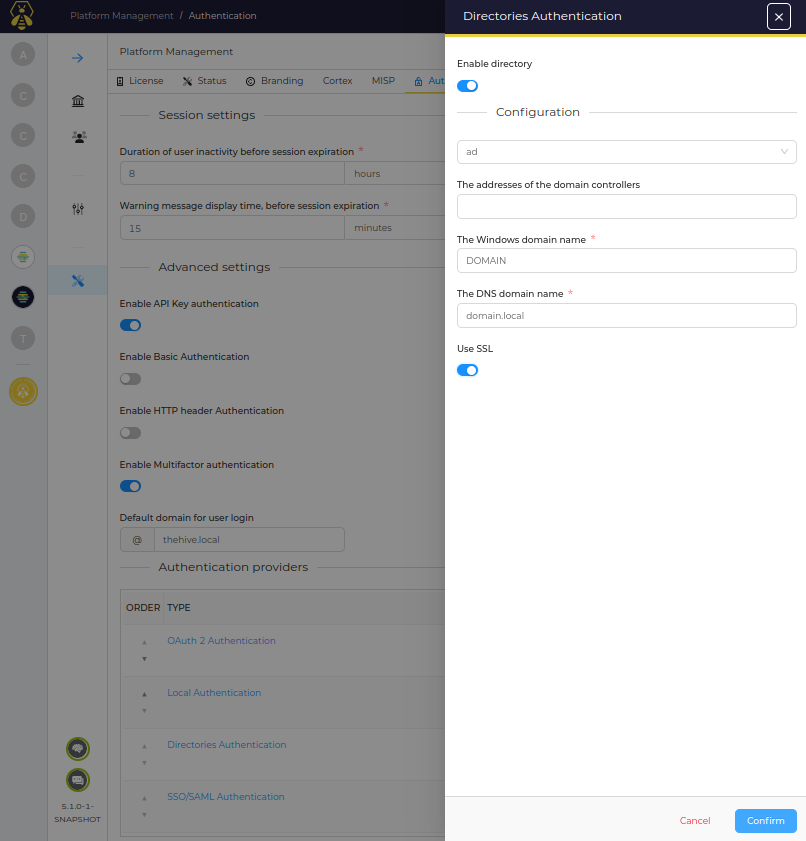

# Active Directory

!!! Info ""
    A license is required to configure Active Directory authentication

Following information are required to configure AD authentication:

* The addresses of the domain controllers
* The Windows Domain Name
* The DNS domain name
* if you are using SSL or not