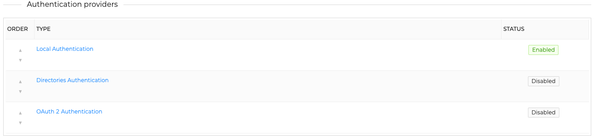
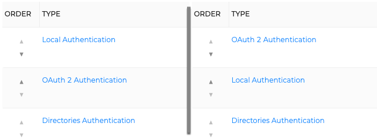

# How to Configure Authentication

This topic provides step-by-step instructions for configuring authentication in TheHive.

{!includes/access-authentication.md!}

## Procedure

1. Go to the **Platform management** view from the sidebar menu.

    

2. Select the **Authentication** tab.

    

3. Enter the values for each session setting:

    **Session expiration auto-logout**

    The amount of time before you are automatically signed out when your session expires.

    **Session expiration warning time**

    The amount of time remaining before session expiration when you receive a warning. This must be equal to or less than the session expiration auto-logout time.

    **Inactivity auto-logout**

    The amount of time before you are automatically signed out due to inactivity.

    **Inactivity warning time**

    The amount of time remaining before automatic sign-out due to inactivity when you receive a warning. This must be equal to or less than the inactivity auto-logout time.

4. Turn the toggles on or off for advanced settings based on your preferences:

    **Enable API key authentication**

    Authenticates HTTP requests using an API key.

    **Enable basic authentication**

    Authenticates HTTP requests using a login and password.

    **Enable HTTP header authentication**

    Authenticates HTTP requests using a HTTP header that cointains a user login.

    **Enable multi-factor authentication**

    Enables multi-factor authentication (MFA), allowing users to activate it.

    **Default domain for user login**

    By default, logins use email addresses. This allows users to sign in without specifying the email domain. Instead of entering *user@domain.com*, users only need to enter *user*.

## Next steps

## Manage Authentication Providers

Several options exist to authenticate users: 

- [local accounts](local.md): manage a local user database where you can configure the password policy
- [Using LDAP directory](ldap.md): configure TheHive to use a LDAP server 
- [Using Active directory](ad.md): configure TheHive to use a LDAP server
- [SAML](saml.md): Use single sign-on through on or more SAML providers to authenticate users
- [Oauth2](oauth2.md): Use single sign-on through external Oauth2 server to authenticate users

Oauth2 limité par la license voire même les autres

!!! Info "Use several providers"
    
    TheHive can use several providers to authenticate users, use the arrows to change the priority order (for example: try the Oauth2 authentication, then the local database).