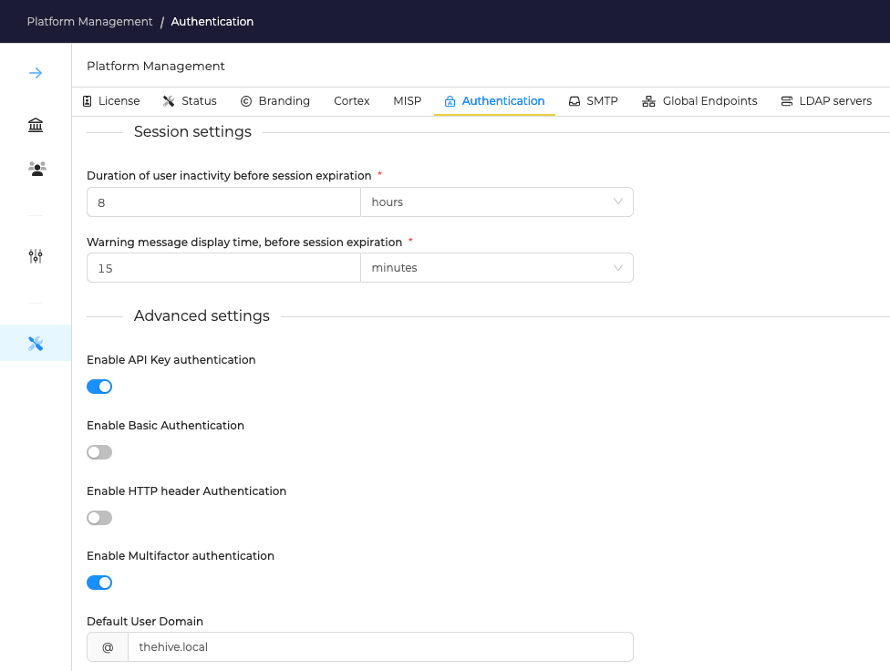

# General Settings

!!! Info
    * _Privileges required_: administrator
    * _Organisation_: admin
    * _Location_: 
        * Menu: Plateform Management
        * Tab: Authentication

## Session settings

* **Duration of user inactivity before session expiration**: time before logging out a user if inactive
* **Warning message display time, before session expiration**: duration of displaying a warning message before logging out 

Several options are available:

1. **Enable Basic Authentication**: Authenticates HTTP requests using the login and password provided
2. **Enable API Key authentication**: Authenticates HTTP requests using an API key provided
3. **Enable HTTP Header Authentication**: Authenticates HTTP requests using a HTTP header containing the user login
4. **Enable Multifactor authentication**: Multi-Factor Authentication is enabled by default. This means users can configure their MFA through their User Settings page
5. **Default user domain**: By default, users log in with an email address for example: _user@domain.com_. When set up, users are allowed to log in without the domain (for example _user_).

## Manage Authentication Providers

Several options exist to authenticate users: 

- [local accounts](local.md): manage a local user database where you can configure the password policy
- [Using LDAP directory](ldap.md): configure TheHive to use a LDAP server 
- [Using Active directory](ad.md): configure TheHive to use a LDAP server
- [SAML](saml.md): Use single sign-on through on or more SAML providers to authenticate users
- [Oauth2](oauth2.md): Use single sign-on through external Oauth2 server to authenticate users

!!! Info "Use several providers"
    
    TheHive can use several providers to authenticate users, use the arrows to change the priority order (for example: try the Oauth2 authentication, then the local database).