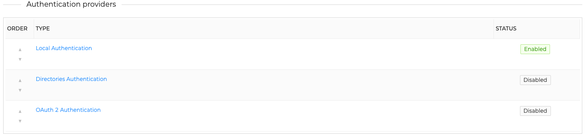
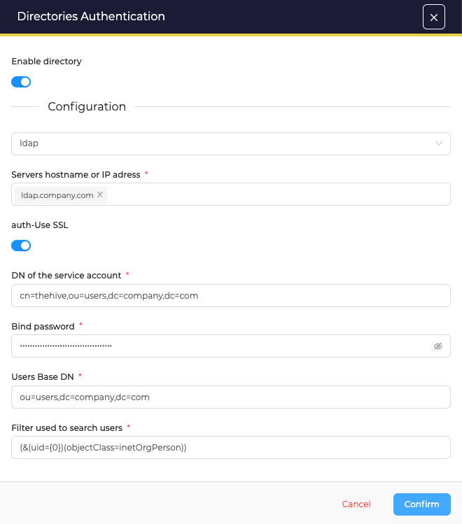

# Setting LDAP Authentication

To setup LDAP authentication:

1. Click on **Directory Authentication**
2. use the switch to enable directory 
3. then choose **LDAP** in the menu ; the list of required parameters appears
  {witdh=400}
4. Confirm and save your changes
5. move the _Directories Authentication_ line to be the first provider to use in the list of authentication providers

!!! Tip "Using SSL with LDAP"
    To setup a custom Certificate Authority in TheHive, please refer to [this guide](../../configuration/ssl.md#use-custom-certificate-authorities).

## Authenticating with LDAP
Users able to authenticate should already have an account created in TheHive local database.