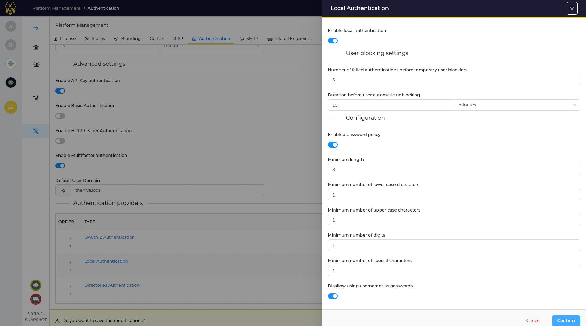

# Local account

This is the default behaviour of TheHive. The applications store usernames and password in a local database.

## Configuration

By default, no policy is activated for local accounts. Nevertheless, a password policy and blocking settings can be adjusted:

* A number of failed attempts to authenticate before a user be temporay blocked
* The related duration before unblock a user

### Password policy
This options is disabled by default. When enabled following items can be configured: 

* Minimum lenght of passwords
* Minimum number of lower cases characters included in the password
* Minimum number of upper cases characters included in the password
* Minimum number of digits included in the password
* Minimum number of special characters included in the password
* Allowing or disollowing the usage of usernames as passwords