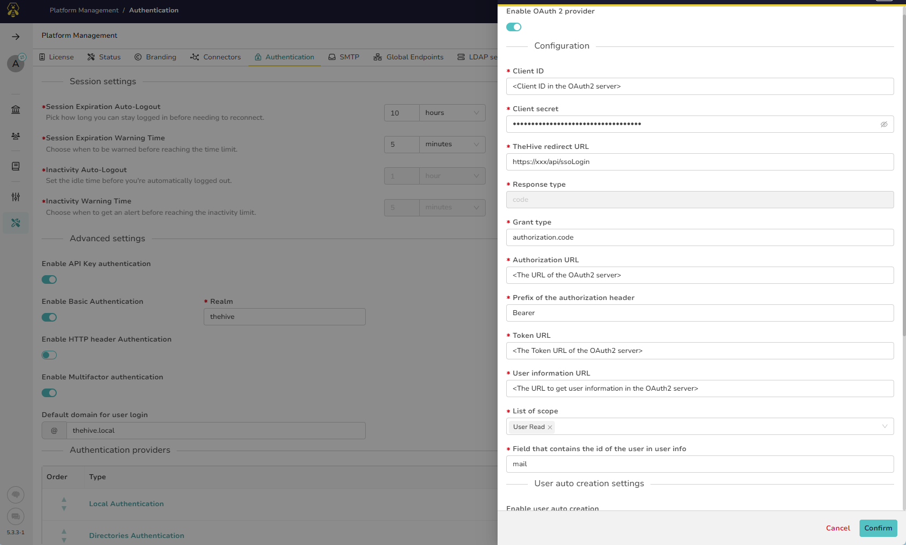
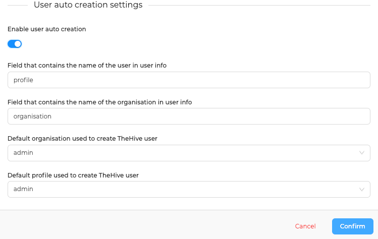

# OAuth2 / OpenID-Connect

## Introduction

OAuth2 and OpenID-Connect are widely used authentication protocols that enable secure and seamless user authentication. This article provides instructions on configuring TheHive to authenticate users using an external OAuth2 authentication server. By following this guide, you will be able to integrate various OAuth2 providers, such as Keycloak, Okta, Github, Microsoft 365, and Google, with TheHive.

---

## Configuration

To authenticate users using an external OAuth2 server, you need to specify the following configuration parameters:

| Parameter                                           | Description                                                   |
|-----------------------------------------------------|---------------------------------------------------------------|
| Client ID                                           | Client ID in the OAuth2 server                                |
| Client Secret                                       | Client Secret in the OAuth2 server                            |
| TheHive Redirect URL                                | The URL of TheHive OAuth2 page (`https://xxx/api/ssoLogin`)   |
| Authorization URL                                   | The URL of the OAuth2 server                                  |
| Token URL                                           | The Token URL of the OAuth2 server                            |
| User Information URL                                | The URL to get user information in the OAuth2 server          |
| List of Scope                                       | List of scopes                                                |
| Field that contains the ID of the user in user info | The field that contains the ID of the user in user info       |

&nbsp;

### Examples

!!! Example ""

    === "Keycloak"

        | Parameter                                           | Value                                                               |
        |-----------------------------------------------------|---------------------------------------------------------------------|
        | Client ID                                           | `CLIENT_ID`                                                         |
        | Client secret                                       | `CLIENT_SECRET`                                                     |
        | TheHive redirect URL                                | https://THEHIVE_URL/api/ssoLogin                                    |
        | Authorization URL                                   | http://KEYCLOAK/auth/realms/TENANT/protocol/openid-connect/auth     |
        | Token URL                                           | http://KEYCLOAK/auth/realms/TENANT/protocol/openid-connect/token    |
        | User information URL                                | http://KEYCLOAK/auth/realms/TENANT/protocol/openid-connect/userinfo |
        | List of scope                                       | `["openid", "email"]`                                               |
        | Field that contains the id of the user in user info | "email"                                                             |
        
    === "Okta"

        | Parameter                                           | Value                            |
        |-----------------------------------------------------|----------------------------------|
        | Client ID                                           | `CLIENT_ID`                      |
        | Client secret                                       | `CLIENT_SECRET`                  |
        | TheHive redirect URL                                | http://THEHIVE_URL/api/ssoLogin  |
        | Authorization URL                                   | https://OKTA/oauth2/v1/authorize |
        | Token URL                                           | http://OKTA/oauth2/v1/token      |
        | User information URL                                | http://OKTA/oauth2/v1/userinfo   |
        | List of scope                                       | `["openid", "email"]`            |
        | Field that contains the id of the user in user info | "email"                          |

    === "Github"

        | Parameter                                           | Value                                       |
        |-----------------------------------------------------|---------------------------------------------|
        | Client ID                                           | `CLIENT_ID`                                 |
        | Client secret                                       | `CLIENT_SECRET`                             |
        | TheHive redirect URL                                | https://THEHIVE_URL/api/ssoLogin            |
        | Authorization URL                                   | https://github.com/login/oauth/authorize    |
        | Token URL                                           | https://github.com/login/oauth/access_token |
        | User information URL                                | https://api.github.com/user                 |
        | List of scope                                       | `["user"]`                                  |
        | Field that contains the id of the user in user info | "email"                                     |
        
        !!! Note
            - `CLIENT_ID` and `CLIENT_SECRET` are created in the _OAuth Apps_ section at [https://github.com/settings/developers](https://github.com/settings/developers).
            - this configuration requires that users set the _Public email_ in their Public Profile on [https://github.com/settings/profile](https://github.com/settings/profile).

    === "Microsoft 365" 

        | Parameter                                           | Value                                                          |
        |-----------------------------------------------------|----------------------------------------------------------------|
        | Client ID                                           | `CLIENT_ID`                                                    |
        | Client secret                                       | `CLIENT_SECRET`                                                |
        | TheHive redirect URL                                | https://THEHIVE_URL/api/ssoLogin                               |
        | Authorization URL                                   | https://login.microsoftonline.com/TENANT/oauth2/v2.0/authorize |
        | Token URL                                           | https://login.microsoftonline.com/TENANT/oauth2/v2.0/token     |
        | User information URL                                | https://graph.microsoft.com/v1.0/me                            |
        | List of scope                                       | `["User.Read"]`                                                |
        | Field that contains the id of the user in user info | "mail"                                                         |
        

        !!! Note
            To create `CLIENT_ID`, `CLIENT_SECRET` and `TENANT`, register a new app at [https://aad.portal.azure.com/#blade/Microsoft_AAD_IAM/ActiveDirectoryMenuBlade/RegisteredApps](https://aad.portal.azure.com/#blade/Microsoft_AAD_IAM/ActiveDirectoryMenuBlade/RegisteredApps).

    === "Google" 

        | Parameter                                           | Value                                            |
        |-----------------------------------------------------|--------------------------------------------------|
        | Client ID                                           | `CLIENT_ID`                                      |
        | Client secret                                       | `CLIENT_SECRET`                                  |
        | TheHive redirect URL                                | https://THEHIVE_URL/api/ssoLogin                 |
        | Authorization URL                                   | https://accounts.google.com/o/oauth2/v2/auth     |
        | Token URL                                           | https://oauth2.googleapis.com/token              |
        | User information URL                                | https://openidconnect.googleapis.com/v1/userinfo |
        | List of scope                                       | `["email", "profile", "openid"]`                 |
        | Field that contains the id of the user in user info | "email"                                          |
        
        !!! Note
            - `CLIENT_ID` and `CLIENT_SECRET` are created in the `_APIs & Services_ > _Credentials_` section of the [GCP Console](https://console.cloud.google.com/apis/credentials)
            - Instructions on how to create Oauth2 credentials at [https://support.google.com/cloud/answer/6158849](https://support.google.com/cloud/answer/6158849)
            - For the latest reference for Google auth URLs please check Google's [.well-known/openid-configuration](https://accounts.google.com/.well-known/openid-configuration)

---

## User Autocreation

To enable users to log in without prior manual creation, you can activate autocreation and specify the following options:

* Field that contains the name of the user in user info
* Field that contains the name of the organisation in user info
* Default organisation applied to new users
* Default profile applied to new users

&nbsp;