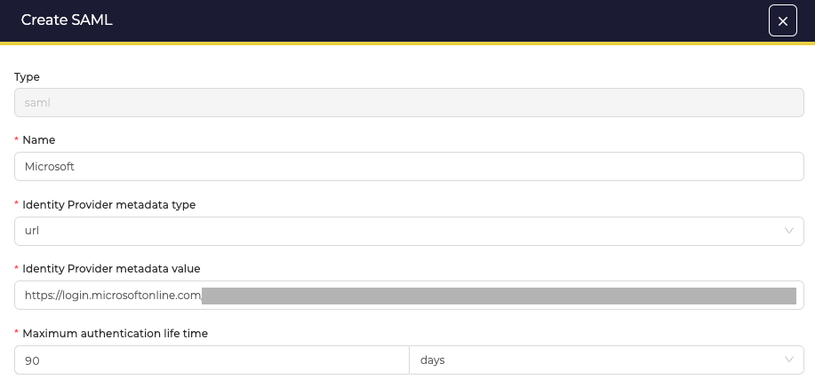
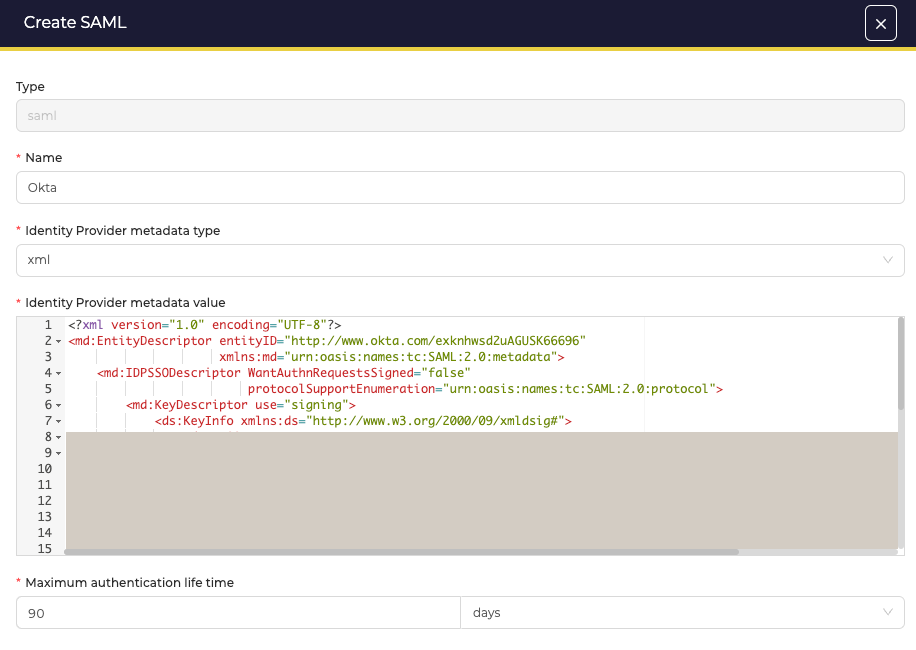
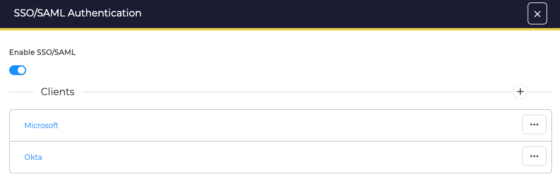

# SAML

TheHive supports SAMLv2.0 authentication providers.

## Configuration

An SAML authentication provider accepts the following configuration parameters:

| Parameter | Description                            |
|-----------|----------------------------------------|
| Name      | Give a name to the provider in TheHive |
| Identity Provider metadata type | Select how TheHive gathers configuration information: `xml` or `url       |
| Identity Provider metadata value | Give the URL or the XML content with service information  |
| Maximum authentication life time | This value must match the value from the identity provider    |

<figure markdown>
{ width ="400" }
<figcaption>Configuration gathered using the URL</figcaption>
</figure>

<figure markdown>
{ width ="400" }
<figcaption>Configuration using XML content</figcaption>
</figure>

## Using several providers

Several providers can be configured. In this case, when a user tries to log in, TheHive queries each provider in the order listed. Queries stops when one replies with the authorization to log in.

<figure markdown>
{ width ="400" }
<figcaption>Using several providers</figcaption>
</figure>