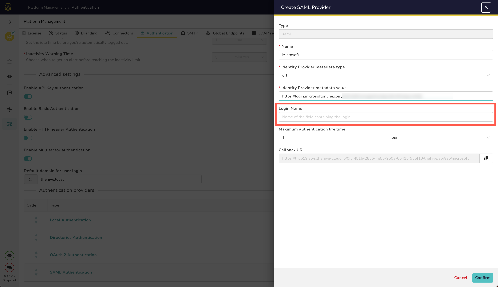
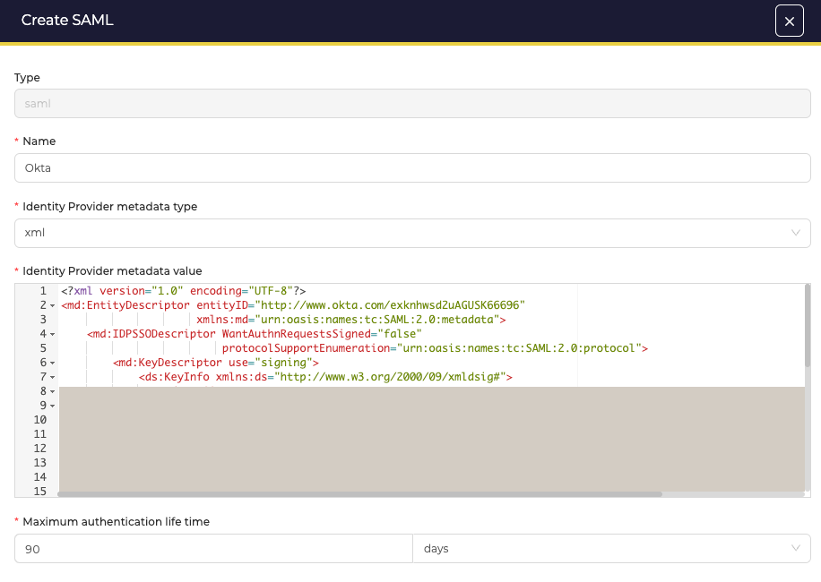
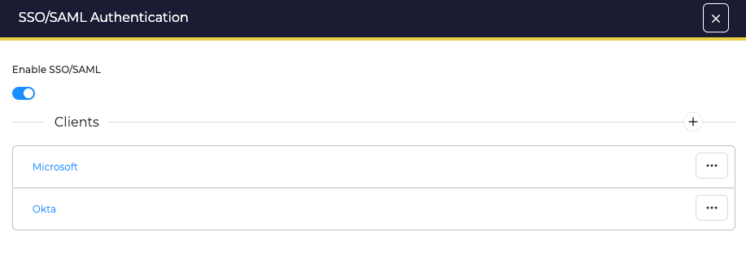

# How to Configure SAML Authentication

This topic provides step-by-step instructions for configuring SAML authentication in TheHive.

## Procedure

1. {!includes/platform-management-view-go-to.md!}

2. {!includes/authentication-tab-go-to.md!}

3. Select **SAML authentication** in the **Authentication providers** section.

4. In the **SAML authentication** drawer, turn on the **Enable SAML** toggle.

5. Select **Add a provider** or select :fontawesome-solid-plus:.

6. Enter the following information:

    **Name**

    Give a name to the provider in TheHive.

    Example: *Microsoft*

    **Identity provider metadata type**

    Select how TheHive gathers configuration information: *xml* or *url*.

    Then enter the **Identity Provider metadata value** to give the URL or the XML content with service information.

    Example: *https://login.microsoftonline.com*

    **User login attribute**

    Indicate the name of the custom attribute containing the user login information.

    **Maximum authentication life time**

    This value must match the value from the identity provider

## Next steps

## Configuration

An SAML authentication provider accepts the following configuration parameters:

| Parameter | Description                            |
|-----------|----------------------------------------|
| Name      | Give a name to the provider in TheHive |
| Identity Provider metadata type | Select how TheHive gathers configuration information: `xml` or `url       |
| Identity Provider metadata value | Give the URL or the XML content with service information  |
| Login Name | Indicate the name of the custom attribute containing the user login information | 
| Maximum authentication life time | This value must match the value from the identity provider    |

<figure markdown>
{ width ="400" }
<figcaption>Configuration using XML content</figcaption>
</figure>

## Using several providers

Several providers can be configured. In this case, when a user tries to log in, TheHive queries each provider in the order listed. Queries stops when one replies with the authorization to log in.

<figure markdown>
{ width ="400" }
<figcaption>Using several providers</figcaption>
</figure>