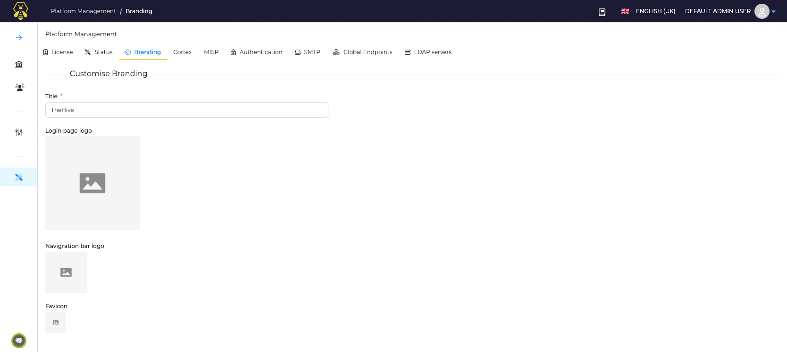

# Branding

!!! Info
    This capability is only available with a license.

In this section you will find information about customizing your brand. You can change the brand name, login page logo, navigation page logo, and the favicon.

To customize branding:

1. On the Platform Management icon, select the Branding tab
2. Make the necessary changes
3. Click **Confirm**

  