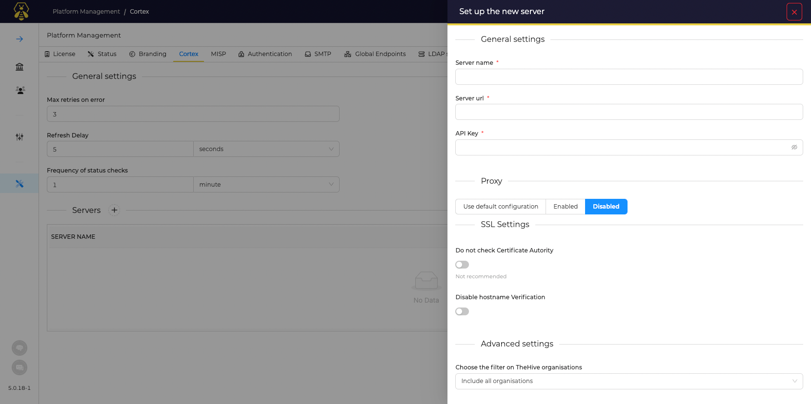
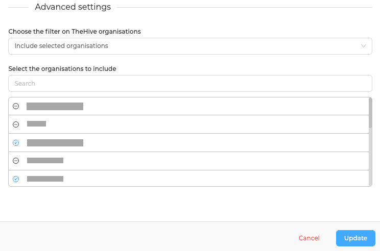
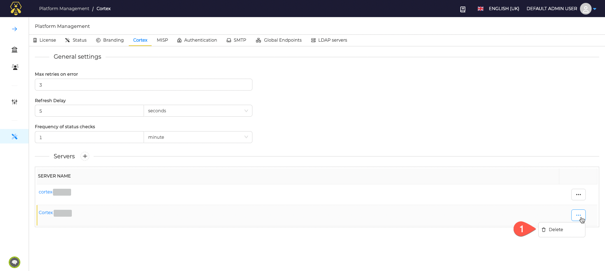

# About Cortex

By default, TheHive is not connected to any Cortex server.

Connect TheHive to Cortex and get benefits from Analyzers to gather information and intelligence about Observables, and run active actions on your network or third party services with Responders.

## Introduction
!!! Info
    An account and an API key are required on a Cortex server to define a connection.

*  Analyzers can be launched against *Observables* to get more details, contextual information, intelligence
* Responders can be launched against *Case*, *Tasks*, *Observables*, *task Logs*, and *Alerts* to run active actions during the investigation and incident response

One or more Cortex instances can be connected to TheHive.

## Manage Cortex connections

### Add a new Cortex server

Specify:

* A name for this connection, for example: `Cortex`[^1]
* The URL of Cortex server to connect with, for example: ` https://cortex.mycompany.com` 
* The API key of the dedicated Cortex account
* Proxy settings if required for TheHive to connect with Cortex

### Advanced settings

By default, all Analyzers and Responders made available by Cortex are available to **ALL** organisations in TheHive.
Additionaly, 2 options are available:

* Make them **available ONLY** to a subset of existing Organisations in TheHive
* Make them **unavailable** to a subset of existing Organisations in TheHive

### Delete a Connection

[^1]:
    If you have several connections, this is useful to give explicit names