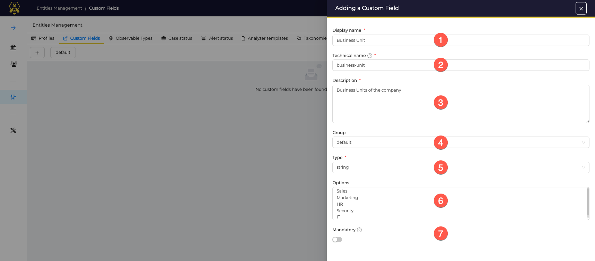

# Custom Fields

Custom Fields are used to enrich a *Case* or *Alert* with custom information used to give more context or be used to create statistics or dashboards.

They are defined in the Administrator view of TheHive, and made available to **all** Organisations on the platform.

This Custom Fields view is available in the Administrator space: ooen the *Entities Management* view, then the *Custom Fields* tab.

## Create a Custom Field

Click the :fontawesome-regular-square-plus: button to create a new *Custom Field*.

Create a new Custom Fields by filling following information: 

1. A name that will be displayed in *Cases *and *Alerts*
2. A technical name. By default. this one is automatically set from the name but can be adjusted id needed. This name is used when using the Custom Field *with the API*
3. Add a description to help analyst use this CF with Cases and Alerts
4. Define a group name for this CF
5. Define the type of the CF; several types are available - *String*, *Boolean*, *Integer*, *Float*, *Date*
6. Fill some predefined values, if exist, or leave it blank if this is a free area
7. Enable this option if the Custom Field is mandatory and has to be valued before closing a Case

Then, click on *Confirm custom field creation*.