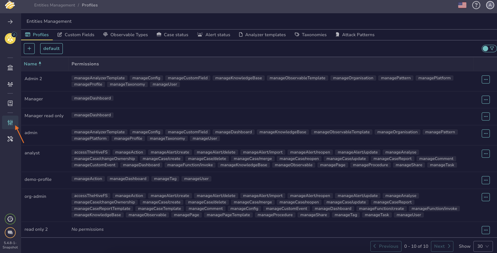
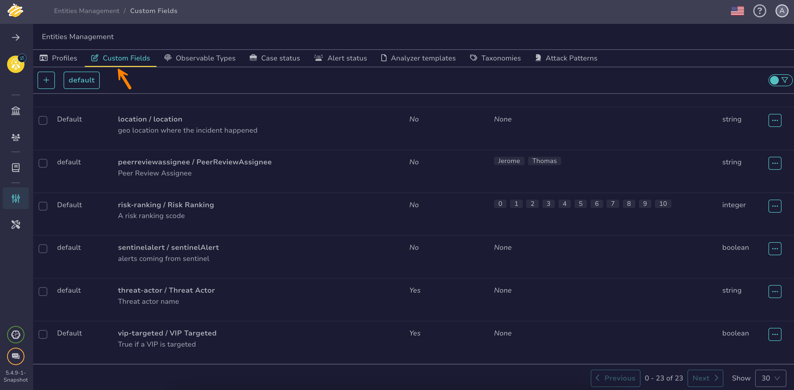

# How to Create a Custom Field

This topic provides step-by-step instructions for creating a [custom field](../custom-fields/about-custom-fields.md) in TheHive.

{!includes/administrator-access-manage-custom-fields.md!}

## Procedure

1. Go to the **Entities management** view from the sidebar menu.

    

    ---

2. Select the **Custom fields** tab.

    

    ---

3. Select :fontawesome-regular-square-plus:.

    ---

4. Enter the following information:

    **- Display name \***

    The name users will see when adding this custom field to their cases or alerts.

    **- Technical name \***

    By default, the technical name is automatically generated from the display name, but you can adjust it if needed. Users don't see the technical name when adding a custom field, but it's used when accessing the custom field via the API.

    **- Description \***

    A description to help users understand and use this custom field appropriately. It appears when users hover over the :fontawesome-solid-circle-question: icon next to the custom field in a case or alert.

    **- Group \***

    Select an existing group name or enter a new one to create a group. It organizes related custom fields when searching and appears as a tab in cases and alerts.

    **- Type \***

    The type of data the custom field will contain:

    {!includes/custom-fields-formats.md!}

    !!! info "Predefined values"
        For the string, integer, and float types, you can define predefined values by entering each value on a separate line in the **Options** field. If you choose to do this, users will only be able to select from the predefined values you specify. This helps maintain data consistency for reporting purposes.

    **- Mandatory** 
    
    Turn on the toggle to require users to enter a value in this custom field.

    ---

5. Select **Confirm custom field creation**.

## Next steps

* [Edit a Custom Field](edit-a-custom-field.md)
* [Delete a Custom Field](delete-a-custom-field.md)
* [Add Custom Fields](../../user-guides/analyst-corner/cases/custom-fields/add-custom-fields.md)
* [Remove Custom Fields](../../user-guides/analyst-corner/cases/custom-fields/remove-custom-fields.md)
* [Enter Values in Custom Fields](../../user-guides/analyst-corner/cases/custom-fields/enter-values-in-custom-fields.md)
