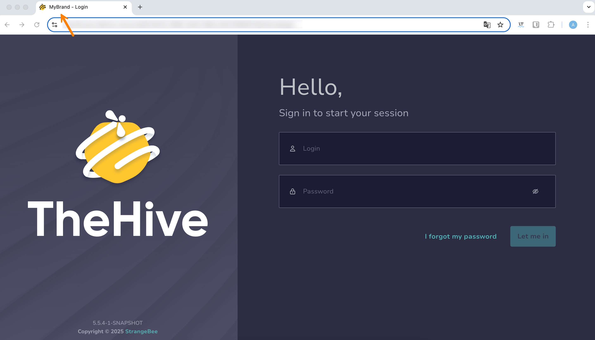
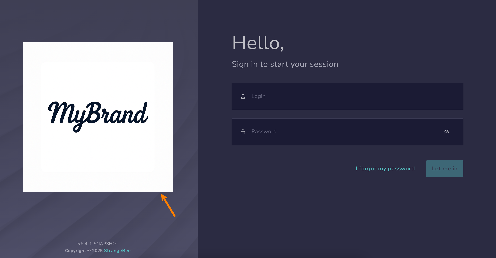
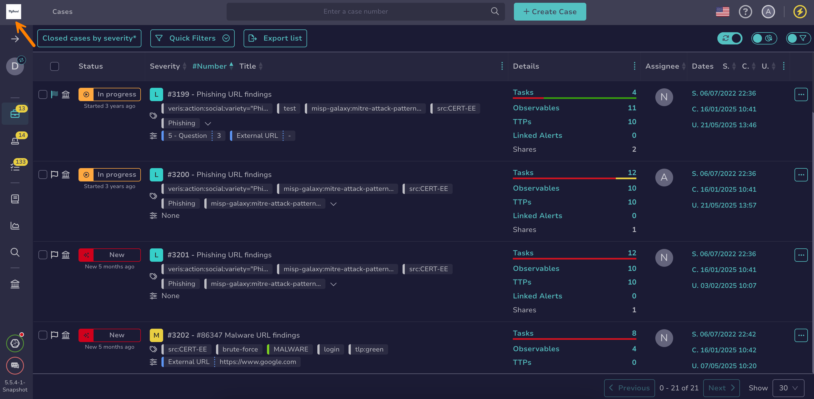
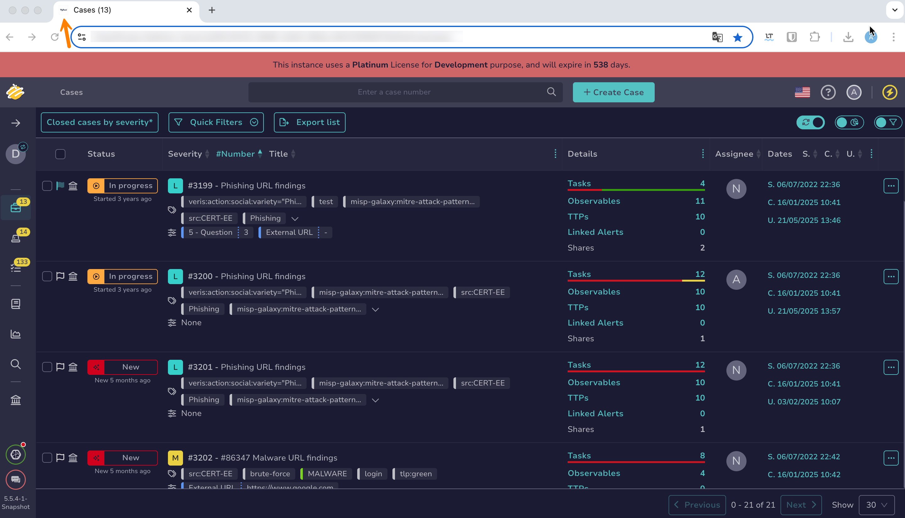

# Customize TheHive Branding

<!-- md:permission `[admin] managePlatform` --> <!-- md:license Platinum -->

Personalize TheHive branding with your brand name and logo across the login page, navigation bar, and browser tab.

## Customize the login page tab title

1. 

2. 

3. Enter a new title in the **Title** field.

4. Select **Confirm**.

## Customize the login page logo

1. 

2. 

3. Select a login page logo.

    Accepted formats: JPEG, JPG, and PNG.

    Recommended size: 200x200 pixels.

4. Select **Confirm**.

## Customize the navigation bar logo

1. 

2. 

3. Select a navigation bar logo.

    Accepted formats: JPEG, JPG, and PNG.

    Recommended size: 84x84 pixels.

4. Select **Confirm**.

## Customize the tab favicon

1. 

2. 

3. Select a favicon.

    Accepted formats: JPEG, JPG, PNG, and ICO.
    
    Recommended size: 42x42 pixels.

4. Select **Confirm**.

<h2>Next steps</h2>

* [Change a Status Color](./status/change-color-of-a-status.md)