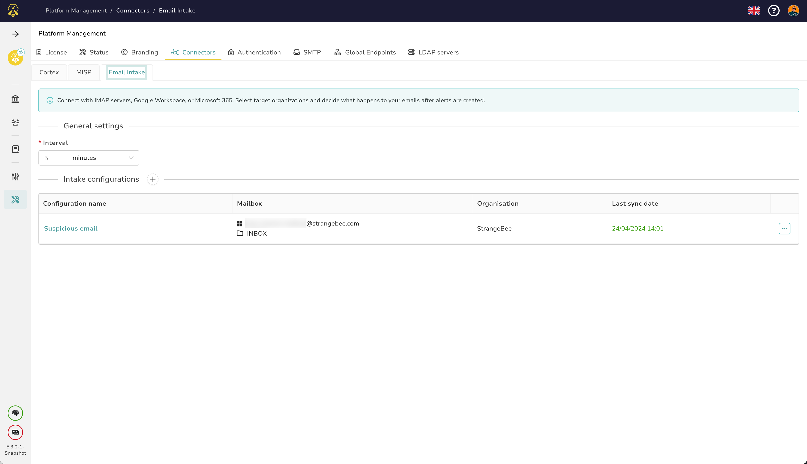
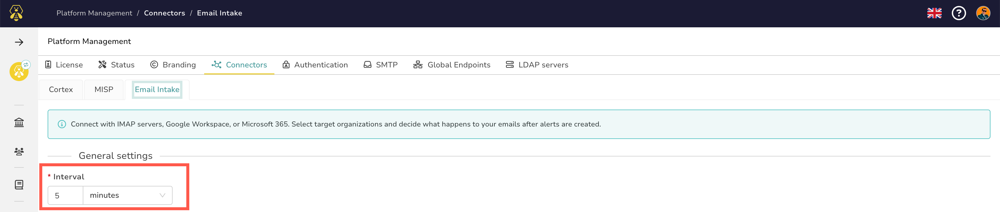
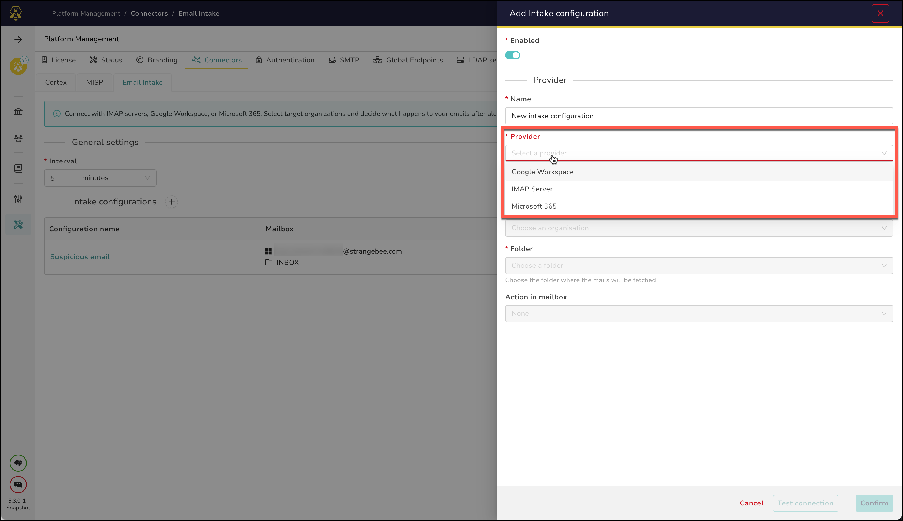
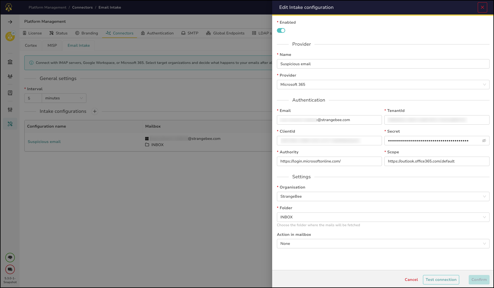
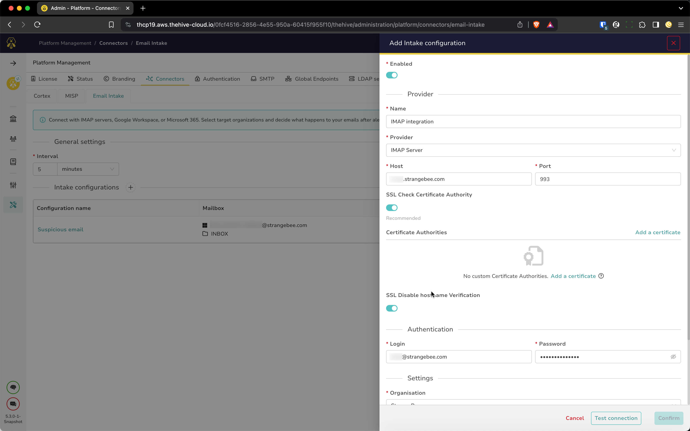
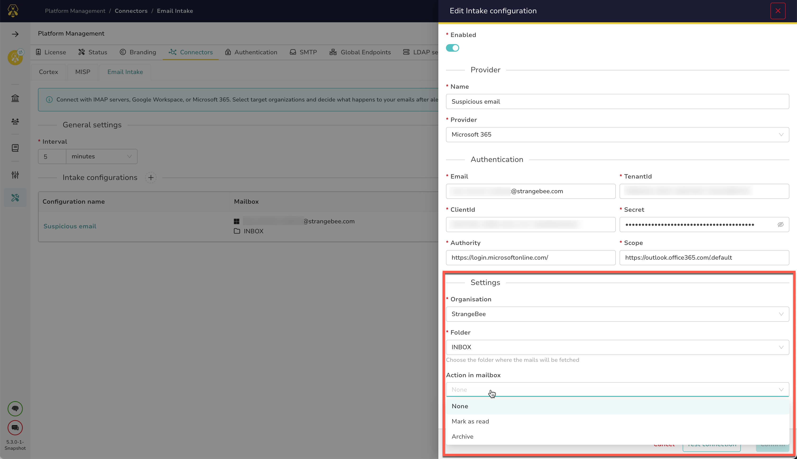

# Email Intake Connector

This documentation outlines the utilization of the Email Intake Connector for automatically generating alerts from a designated mailbox.

The Email Intake Connector facilitates the connection of mailboxes used to receive cybersecurity alerts. It automatically transforms new emails into alerts within TheHive platform. Presently, the primary function supported is the creation of alerts regardless of the received email content.

---

## Configuration

### Global Configuration

The only parameter that requires adjustment is the ``refresh interval``.

&nbsp;

### Adding a Mailbox

Configuration options are available for Microsoft 365 (OAuth2) and Google Workspace (OAuth2). If you use another email provider service, configuration through IMAP is necessary.

&nbsp;

#### Microsoft Configuration

To configure Microsoft settings, the following values need completion:

- `Email address` of the mailbox
- `clientId`
- `tenantId`
- `secret`

Refer to Microsoft documentation for instructions on obtaining these values.

&nbsp;

#### Google Workspace Configuration

For Google Workspace accounts, an authorization request is essential during the configuration process. Complete the following values:

- `Email address` of the mailbox
- `clientId`
- `secret`

Refer to Google documentation for instructions on obtaining these values.

&nbsp;

#### IMAP Configuration

For IMAP configuration, you'll need to input the following information:

- Host: `host`
- Port: `port` (default: 993)

Additionally, provide your mailbox credentials. We recommend enabling SSL Check Certificate Authority.

&nbsp;

### Settings

After testing your mailbox configuration, select the organization to connect, determining where alerts will be created. Define the mailbox folder to monitor (typically INBOX). Finally, specify the action to take on incoming emails: ``archive``, ``mark as read``, or ``no action``.

---

## Generated Alerts and Observables

Following configuration, alerts and observables are generated in the selected organization.

### Alerts

Each alert will contain the following details:

- `alert.type`: "email-intake"
- `alert.source`: The configuration name is formatted as "Google Workspace @strangebee.com" => "googleworkspace-strangebee"
- `alert.sourceRef`: "{message-id}" or "{lastUidValidity}.{uidEmail}" if the message-id is inaccessible
- `alert.title`: The email subject or "no subject"
- `alert.severity`: "low"
- `alert.description`: The content of the email
- `alert.lastSyncDate`: The date the email was received
- `alert.tlp`: "amber"
- `alert.pap`: "amber"
- `alert.follow`: false
- `alert.tags`: ["email-intake", {source}, {Provider Name}, {Inbox Folder Name}]
- `alert.status`: "new"
- `alert.externalLink`: [Link to External Source]
- `alert.summary`: [Summary of Alert]
- `alert.customFields`: [Custom Fields]

&nbsp;

### Observables

The email itself is included as a .eml file, along with its sender and all attached files, which are added to the alert as observables, with the following parameters:

- `observable.message`: The pre-formatted message
- `observable.tlp`: {alert.tlp}
- `observable.pap`: {alert.pap}
- `observable.ioc`: false
- `observable.sighted`: false
- `observable.sightedAt`: [Timestamp]
- `observable.ignoreSimilarity`: false
- `observable.dataType`: "file" if it's an attachment; otherwise, "mail" for the .eml file
- `observable.tags`: {alert.tags}
- `observable.attachmentId`: {attachment.id}

&nbsp;