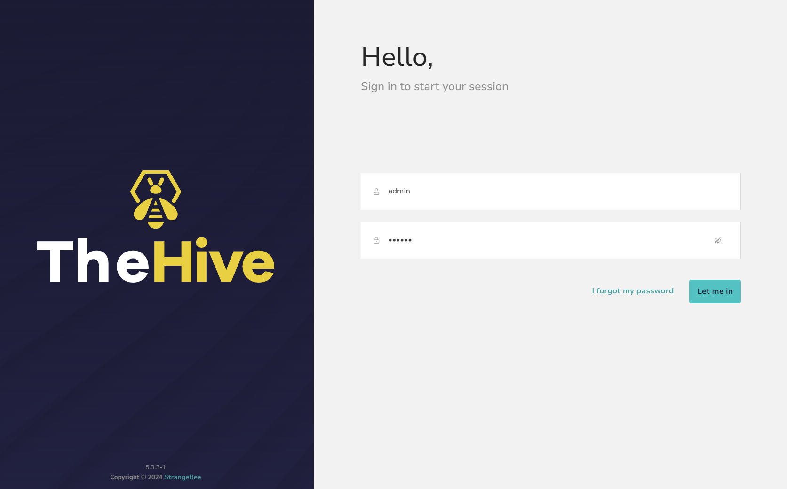
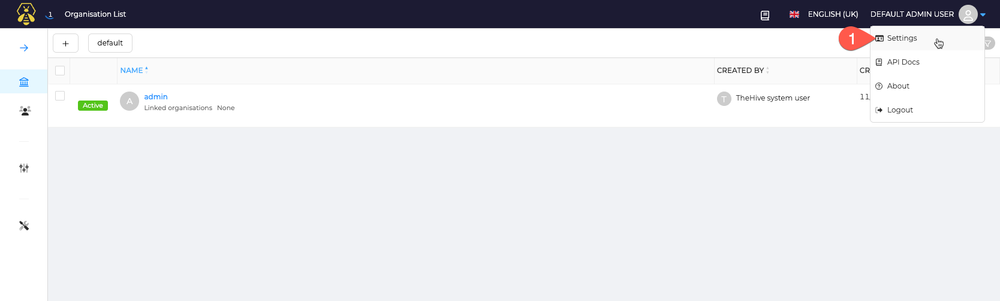
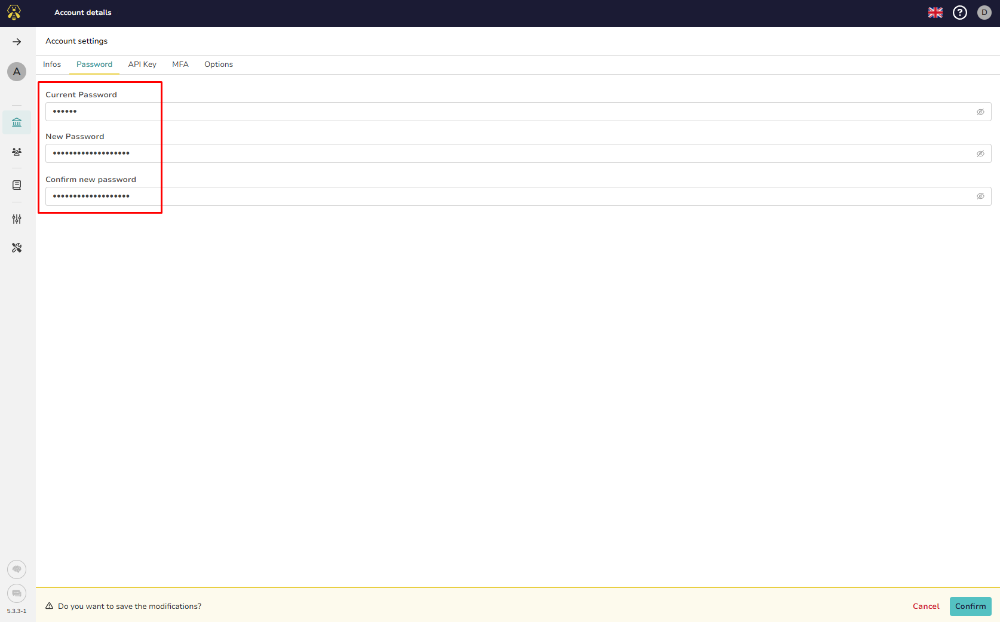
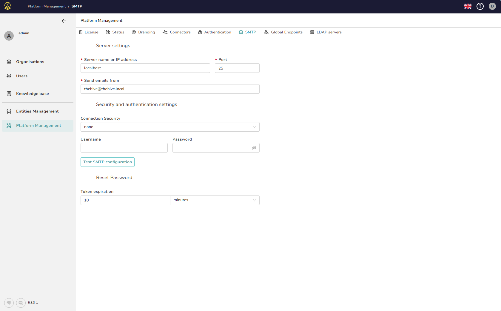
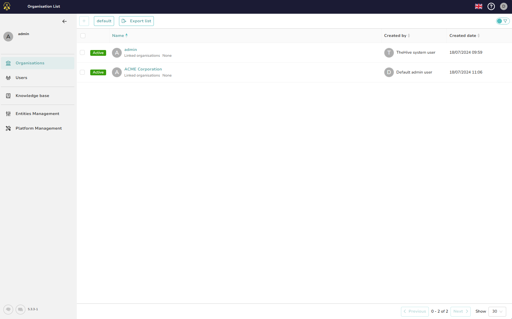
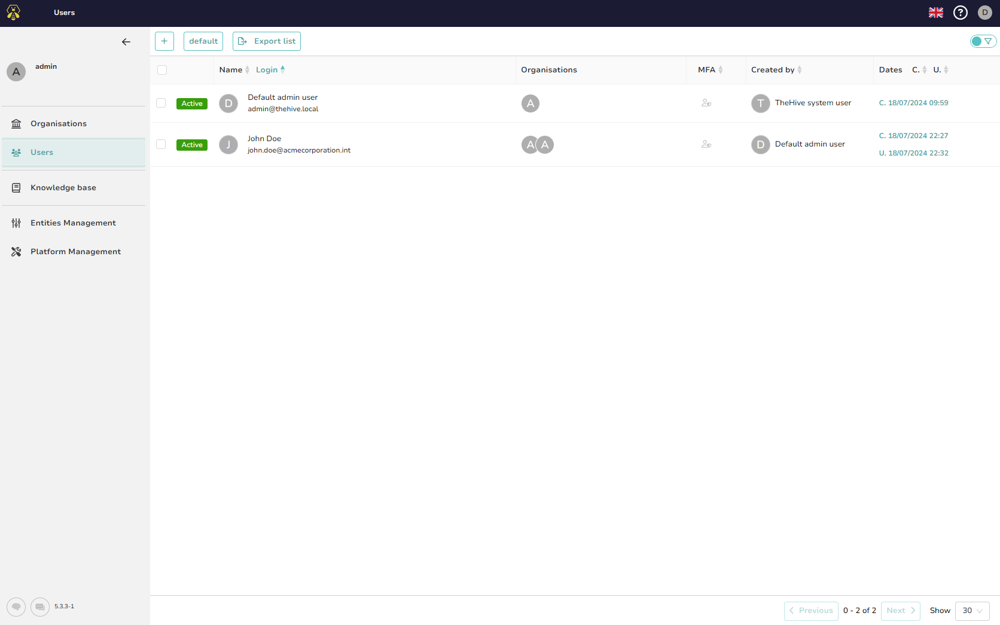
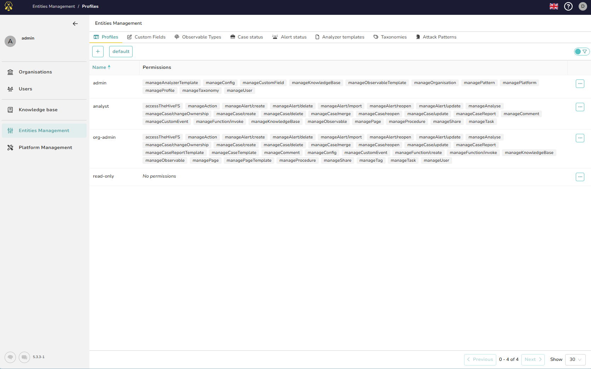

# First start

## First log in

Once TheHive is up and running, with your web browser, connect to *http://IP_ADDRESS:9000*, and log in with the default account: 

| **Login**    | `admin@thehive.local` |
|--------------|-----------------------|
| **Password** | `secret`              |

## Install license

To unlock capabilities and quotas, connect to your account at StrangeBee's customer portal, and follow [this guide](../installation/activate-license.md) to setup the licence.

!!! Tip
    This action is particularly required if you are setting up TheHive as a cluster: 
    
    1. When starting TheHive service, start only one node
    2. setup the license by connecting to the started node
    3. start others TheHive nodes

## Change `Admin` password

### 1. Go to users settings

### 2. change your password

### 3. Confirm for the changes to take effect.

## Configuration

The Administrators space is where all the platform is configured.

* Integrate TheHive with a [SMTP server](./smtp.md), authentication directory servers, Cortex and MISP servers: Go to the **Platform Management page**

    

* Create Organisations

    

* Create users

    

* Customise the application behaviour for users in the **Entity Management page**

    