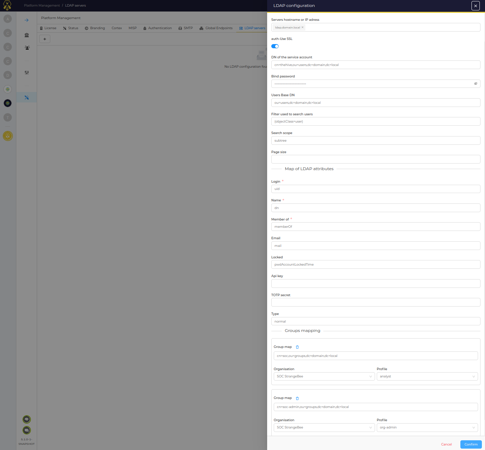

# Synchronise Users and Organization with LDAP

## User synchronisation
Users can be provisionned and deprovisionned automatically based on the content of a directory.
Users data is synchronised periodically. New users in LDAP are created in TheHive, removed users are disabled.

The organization membership and the profile of an user are set using LDAP groups. The configuration contain the mapping of LDAP groups with organization/profile.

