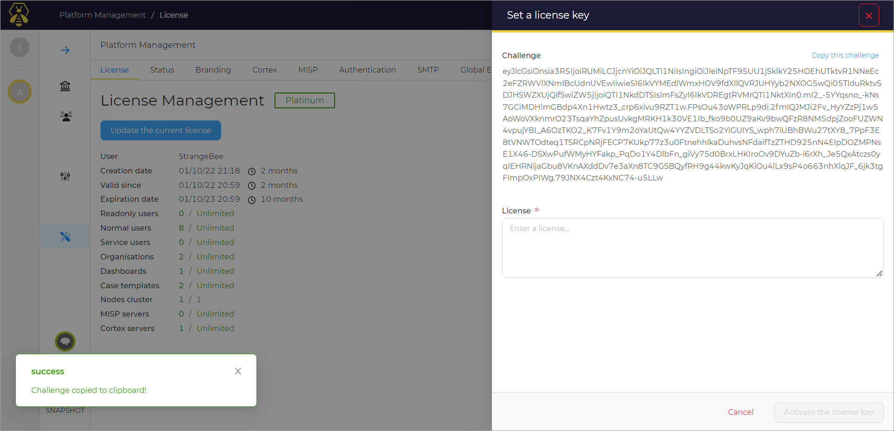
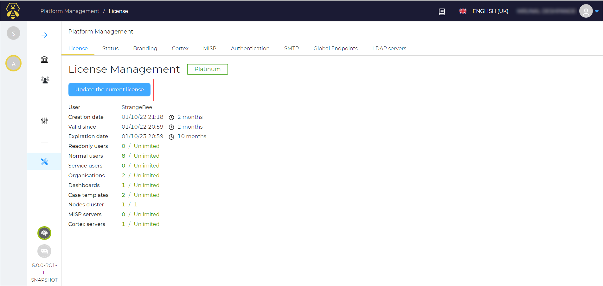

# Install or Update the License

By default TheHive includes the community edition license.

To unlock capabilities[^1] and quotas[^2], a license is required.
  Contact [StrangeBee](https://www.strangebee.com). WHen you buy the license from StrangeBee, StrangeBee will create an account for you on the customer portal that will allow you to activate the license.

## Activate or update the license

1. On the Platform Management page, in the License tab, click the **Update the current license** button

    

    Set a License key window opens. You can see the challenge in the window.
   
2. Click **Copy this challenge**

    You will see the challenge copied message.
    After copying the challenge, go to your account on the StrangeBee customer portal and activate the license using this challenge and the customer portal will give you an activation license key.

3. Enter the activation key in the **License** field
4. Click the **Activate the license key** button

    This will activate the license and update your instance with all the features included with that license.

    

    The license is defined by the following capabilities:

    1. It defines how many users you can create in your platform
    2. The license is based on the number of users and the number of organizations
    3. It has a validation and an expiration date
    4. It allows unlimited number of *ReadOnly* users and *Service* accounts. Service accounts are those who do not have access to the TheHive interface but can use an API key to call all the APIs

<video width="600" controls>
  <source id=mp4 src="/thehive/images/administration-guides/activate-license.mp4" type="video/mp4">
</video>

[^1]:
    Capabilities included in the license: clustering, branding, Active directory, SAML and OAUTH2 authentication, Case timelines.

[^2]:
    Quotas concern Organisations and Users.

