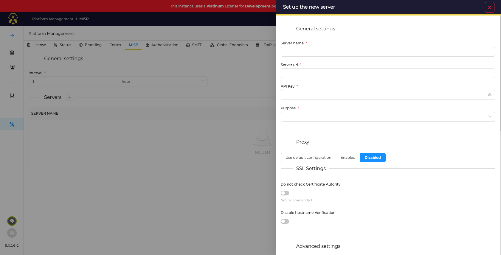
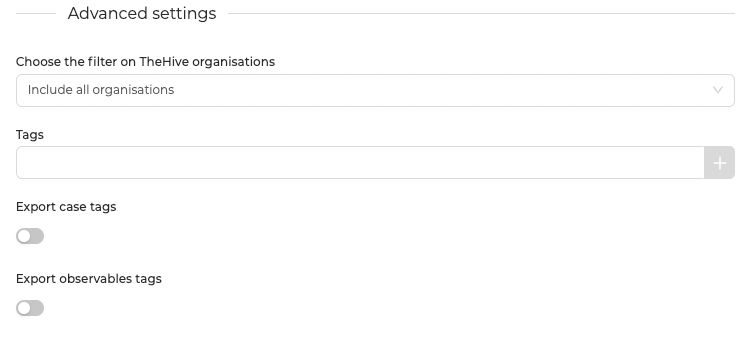
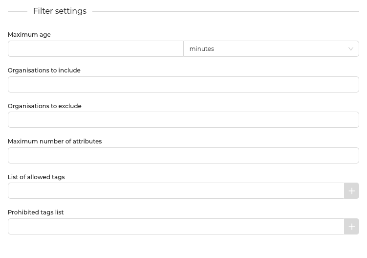
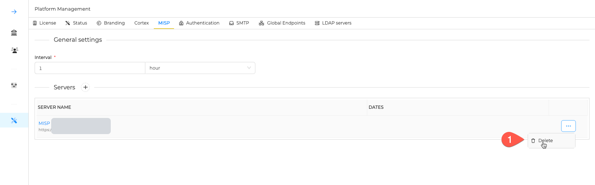

# MISP

## Introduction
!!! Info
    An account and an API key are required on a MISP server to define a connection.

* One or more MISP instances can be connected to TheHive.
* For each one:
  * MISP events can be **imported** as Alerts in TheHive. A set of filter can refine the imported events
  * Observables flagged as IOCs in a Case can be **exported** in a new event in MISP

## Manage MISP connections

### Add a new MISP server

Specify:

* A name for this connection, for example: `misp`[^1]
* The URL of MISP server to connect with, for example: ` https://misp.mycompany.com` 
* The API key of the dedicated MISP account
* The purpose of this connection: *Import only*, *Export Only*, or both, *Import & Export*
* Proxy settings if required for TheHive to connect with MISP

### Advanced settings

By default, **ALL** Organisations in TheHive benefit from this connection.
Additionaly, 2 options are available:

* Make this connection **available ONLY** to a subset of existing Organisations in TheHive
* Make this connection **unavailable** to a subset of existing Organisations in TheHive

Additional options let you:

* Define *tags* that will be appended to Alerts when importing MISP events
* When exporting IOCs in MISP, also export tags from the Case in the new MISP event
* When exporting IOCs in MISP, also export tags from the observables

### Filters

When importing MISP events as TheHive *Alerts*, several options are available:

* Define the maximum age of a MISP event allowed to be imported
* Specify a list of organisations *owner* of the MISP events allowed to be imported
* Specify a list of organisations *owner* of the MISP events that are not allowed to be imported
* Define a limit for the number of attributes (~observables) included in the MISP event to import it
* Specify a list of tags that should exist in the MISP event to import it
* Specify a list of tags that should exist in the MISP event to ignore it

### Delete a Connection

[^1]:
    If you have several connections, this is useful to give explicit names