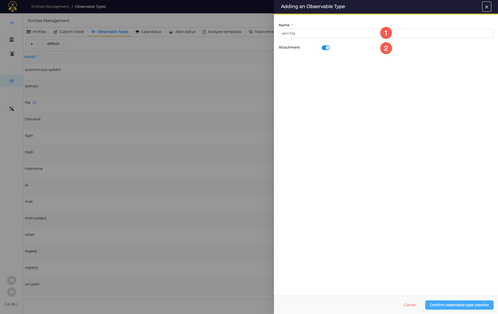

# Observable types

Observables types define the available *dataTypes* of Observables that can be used in the application. TheHive comes with the predefined set of types, and this list can be enriched with custom *datatypes*.

Observable types are configured in the Administrators space: open *Entities Management* and select the *Observable types* tab.

## Create a new Observable Type
Click the :fontawesome-regular-square-plus: button to create a new *Observable Type*.

1. Specify a name for this new type
2. Define if this new Observable Type is defined by a file attachment or not. If yes, the data entered by analysts is a file; if not, this is a text area.

Then click on *Confirm observable type creation*.