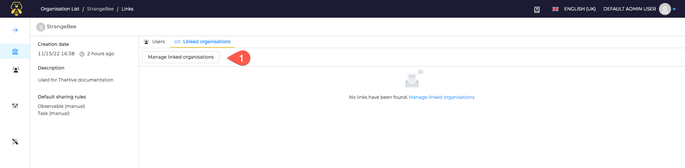
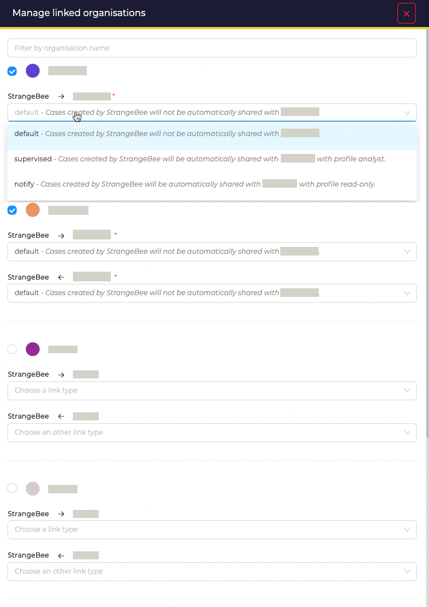

# Link Organisations

By default, organisations are not linked each other: each one does not know about the others on the instance.

## Manage links with other organisation

Start managing links by opening the detailed view of an Organisation:

* Open the *Linked Organisation* tab
* Click on the button named *Manage linked Organisations*

For each other organisations, select:

1. if you want the current Organisation be linked with it
2. The types of link that should be created
  
{ width=500 }

3 types of links are available: 

* `default`: Cases created by the current Organisation will not be shared with the other one
* `supervised`: Cases created by the current Organisation will be automatically shared with the other one, with the profile Analyst
* `notify`: Cases created by the current Organisation will be automatically shared with the other one, with the profile Read-only