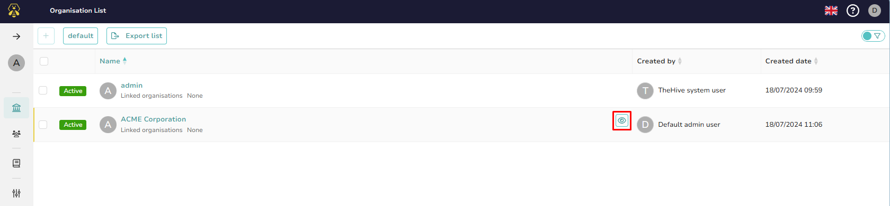
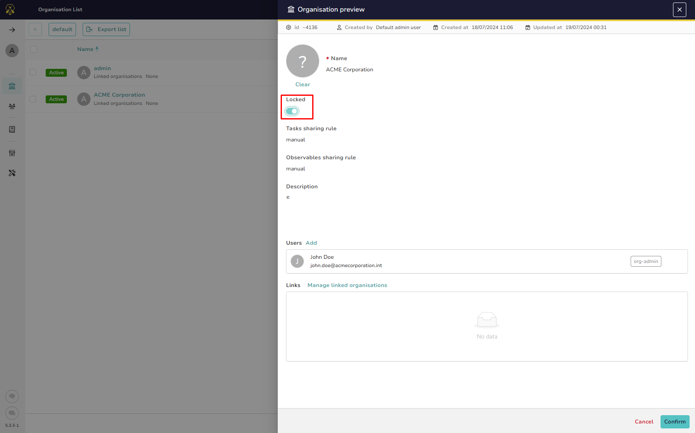
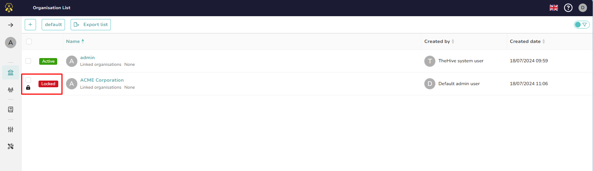

# Managing an Organisation

This section provides guidance on how to manage an organisation within TheHive, including editing the organisation's details and locking the organisation to restrict user access.

---

## Editing Your Organisation

Once your organisation is created, you can further manage its settings and configurations. To edit your organisation, follow these steps:

1. Navigate to the **Organisations** page.
2. Select the organisation you wish to edit.

    

3. In the organisation details, you can:
    - Add [**users**](./accounts.md) to the organisation, allowing them to access and manage its resources 
    - Create [**links**](./organisation-links.md) with other existing organisations to facilitate the sharing of cases and collaboration.
    - Edit the organisation name
    - Edit the organisation description
    - Lock the organisation

    

4. When you are ready to save the changes, click the **Confirm** button.

---

## Locking an Organisation

If necessary, you can lock an existing organisation to prevent all users associated with it from logging in. This can be useful in situations where the organisation needs to be temporarily restricted or deactivated.

To lock an organisation, follow these steps:

1. Navigate to the **Organisations** page.
2. Select the organisation you wish to lock.

    

3. Enable the **Lock** button to restrict access for all users belonging to this organisation.

    

4. When you are ready to save the changes, click the **Confirm** button.

4. You can verify that the organisation has been locked by checking the lock indicator next to the organisation name.

    

&nbsp;