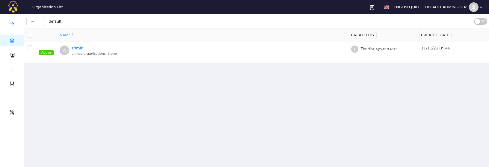
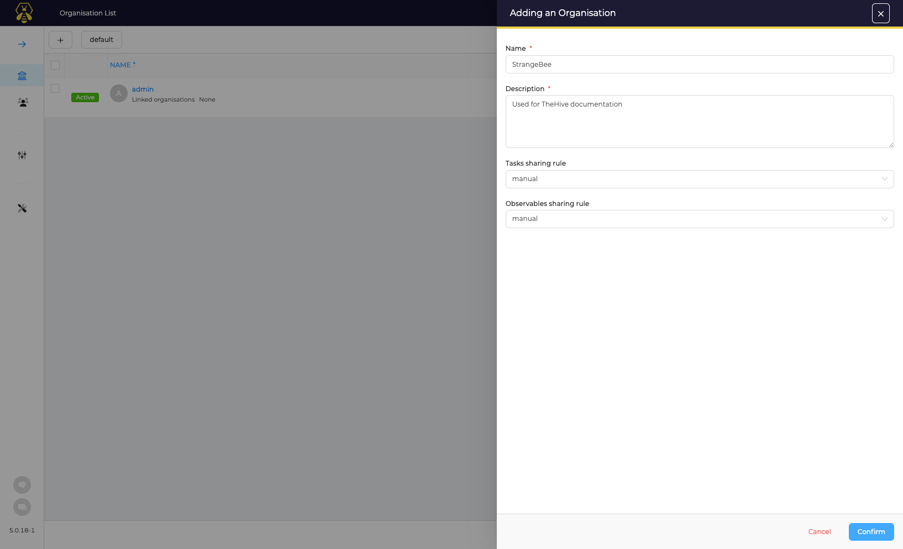
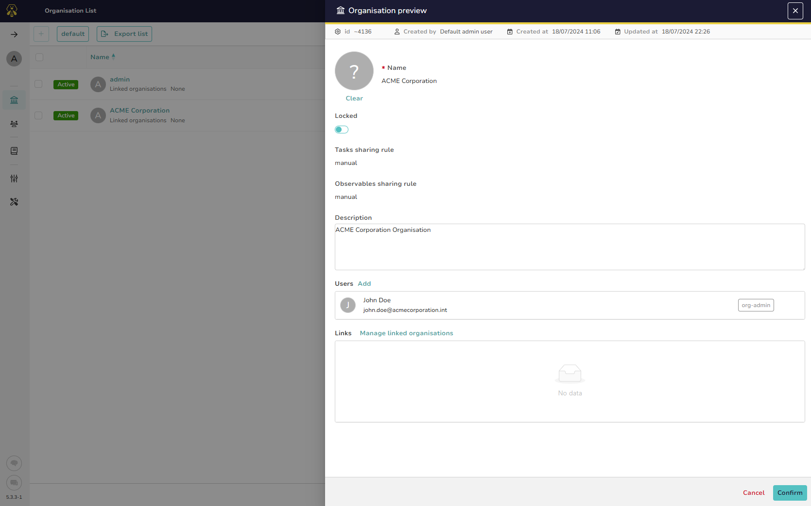
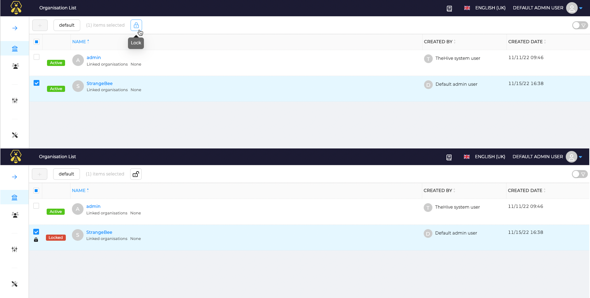

# Manage Organisations

As Administrator, go to the *Organisations* page.

## Add an Organisation

Click on the :fontawesome-regular-square-plus: button and edit the required fields in the drawer: 

* A placeholder exists and a logo of the Organisation can be added
* *Name*: Name of the new Organisation 
* *Description*: Description for the new Organisation
* *Task sharing rule*: default sharing rule for Tasks that will be applied when a Case will be shared with another Organisation
* *Observables sharing rule*: default sharing rule for Observables that will be applied when a Case will be shared with another Organisation

Click **Confirm** to create the organisation. 

## Edit your Organisation

Once your organisation is created:

* [users](./accounts.md) can be added
* [links](./organisation-links.md) with other existing Organisations created for the purpose of sharing Cases.

## Lock an organisation
An existing Organisation can be locked so that all users belonging to this one cannot log into it.

