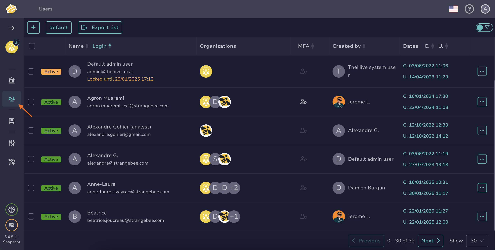

# How to Add Users to an Organization

This topic provides step-by-step instructions for adding new and existing users to an [organization](about-organizations.md) in TheHive.

{!includes/administrator-access-manage-organizations.md!}

## Add an existing user to an organization

1. Go to the **Users** view from the sidebar menu.

    

2. Locate the user you're looking for, hover over it, and select :fontawesome-solid-eye:.

3. In the drawer, go to the **Organizations** section, select the organizations to assign the user to, and choose their [permission profile](../../administration/profiles.md).

4. Select **Confirm**.

## Add a new user to an organization

1. Go to the **Organizations** view from the sidebar menu.

     

2. Select the organization to add the user to, then select :fontawesome-regular-square-plus:. Alternatively, hover over the organization, select :fontawesome-solid-eye:, and select **Add** in the **Users** section.

3. In the **Adding a user** drawer, enter:

    **Type \***

    The user type you want to create.

    Pick an option from the dropdown list:   
        - *Normal*: Allows the user to access TheHive through the user interface.  
        - *Service*: Allows the user to access TheHive through the API.

    **Login \***

    The login used for the user to sign in. It can be an email address or another identifier, depending on [your authentication configuration](../authentication/configure-authentication.md).

    **Name \***

    The user's display name.

    **Profile \***

    Pick a [permission profile](../../administration/profiles.md) for the user from the dropdown list.

4. Select **Confirm**.

5. In the users list, hover over the user you just created and select :fontawesome-solid-eye:.

6. Optional: Select the default user image to modify it, then upload a new image.

7. Optional: If the login isn't an email, add an email address in the **Email** field.

8. Optional: If you set the user's type to *Service*, select **Create** to generate an API key.

9. Select **Set a new password** to create a default password for the user.

10. Select **Confirm**.

## Next steps

* [Link an Organization](link-an-organization.md)
* [Lock an Organization](lock-an-organization.md)