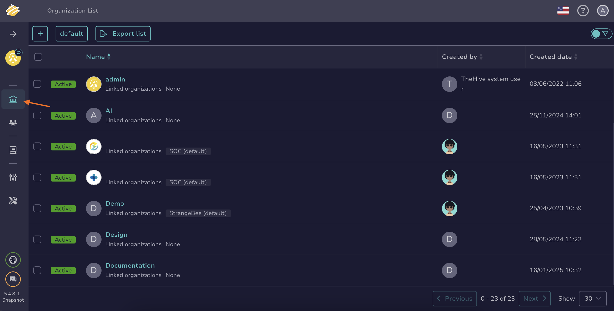

## How to Add Users to an Organization

This topic provides step-by-step instructions for adding new and existing users to an [organization](about-organizations.md) in TheHive.

{!includes/administrator-access-manage-organizations.md!}

## Add an existing user to an organization

1. Go to the **Users** view from the sidebar menu.

    

2. Locate the user you're looking for, hover over it, and select .

3. In the pane, go to the **Organizations** section, select the organizations to assign the user to, and choose their [permission profile](../../administration/profiles.md).

4. Select **Confirm**.

## Add a new user to an organization

1. Go to the **Organizations** view from the sidebar menu.

     

2. Select the organization to add the user to, then select :fontawesome-regular-square-plus:. Alternatively, hover over the organization, select , and select **Add** in the **Users** section.

3. In the **Adding a user** pane, enter:

    **Type**

    The user type you want to create.

    Pick from the options in the dropdown list:   
        - *Normal*: Allows the user to access TheHive through the user interface.  
        - *Service*: Allows the user to access TheHive through the API.

    **Login**

    The user's email address used for login.

    **Name**

    The user's name.

    **Profile**

    Pick a permission profile for the user from the dropdown list.

4. Select **Confirm**, or **Save and add another** if you want to add another new user.

## Next steps

* [Link an Organization](link-an-organization.md)
* [Lock an Organization](lock-an-organization.md)