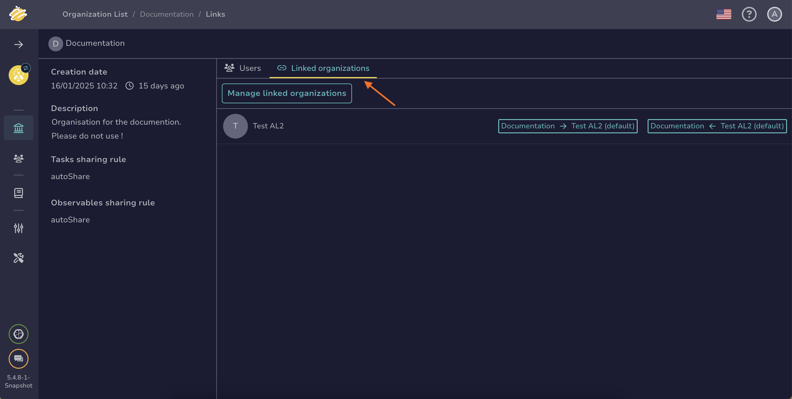

# How to Link an Organization

This topic provides step-by-step instructions for linking an [organization](about-organizations.md) to another in TheHive.

By default, organizations in TheHive aren't linked. Each organization operates independently and can't access others on the instance.

Link organizations to enable data sharing and define the applicable sharing rules.

{!includes/administrator-access-manage-organizations.md!}

## Procedure

1. Go to the **Organizations** view

    

2. Select the organization to link to another, then select **Linked organizations**. Alternatively, hover over the organization and select .

    

3. Select **Manage linked organizations**.

4. Select the organizations you want to link to your organization.

5. Choose the case-sharing rules between the organizations in both directions using the **Choose a link type** dropdown lists.

    Options are the followings:  
    - *default*: Cases aren't automatically shared with the other organization.  
    - *supervised*: Cases are automatically shared with the other organization with an analyst-type permission profile, which grants both read and write access to cases.  
    - *notify*: Cases are automatically shared with the other organization with a read-only permission profile.

    To learn more about how sharing rules function and interact, refer to [About Organizations Sharing Rules](../../../administration/organizations/about-organizations-sharing-rules.md).

6. Select **Confirm**.
    
## Next steps

* [Share a Case](../../user-guides/analyst-corner/cases/share-a-case.md)
* [Share a Task](../../user-guides/analyst-corner/tasks/share-a-task.md)
* [Share an Observable](../../user-guides/analyst-corner/cases/share-an-observable.md)