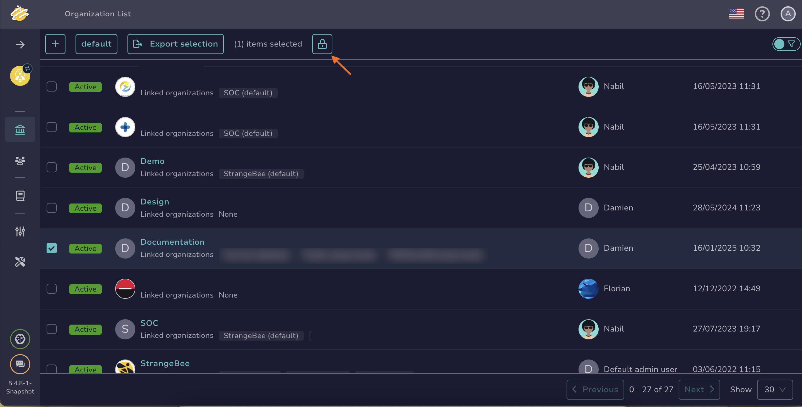

# How to Lock an Organization

This topic provides step-by-step instructions for locking an [organization](about-organizations.md) in TheHive.

Locking an organization is useful when you want to prevent users from logging in with that organization.

!!! info "Deleting an organization"
    In TheHive, organizations cannot be deleted to ensure database integrity and safety.

{!includes/administrator-access-manage-organizations.md!}

## Procedure

1. Go to the **Organizations** view.

    

2. Select the checkbox on the left of the organization to lock and select . Alternatively, hover over the organization, select , and turn on the **Locked** toggle to lock the organization.

    

3. Select **OK** or **Confirm**.

## Next steps

* [Create an Organization](create-an-organization.md)
* [Link an Organization](link-an-organization.md)
* [Add Users to an Organization](add-users-to-an-organization.md)
